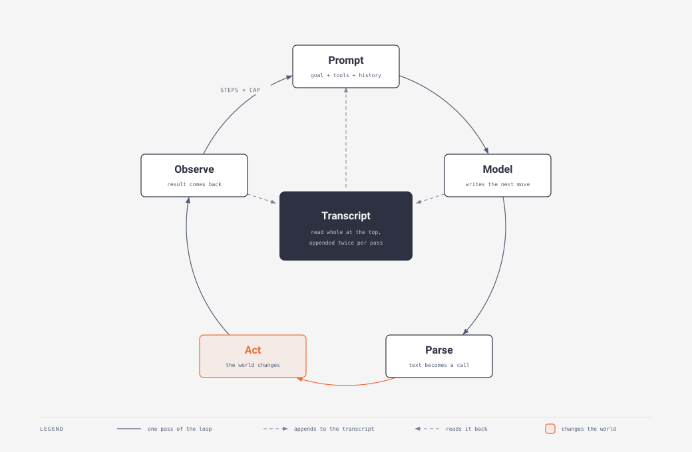
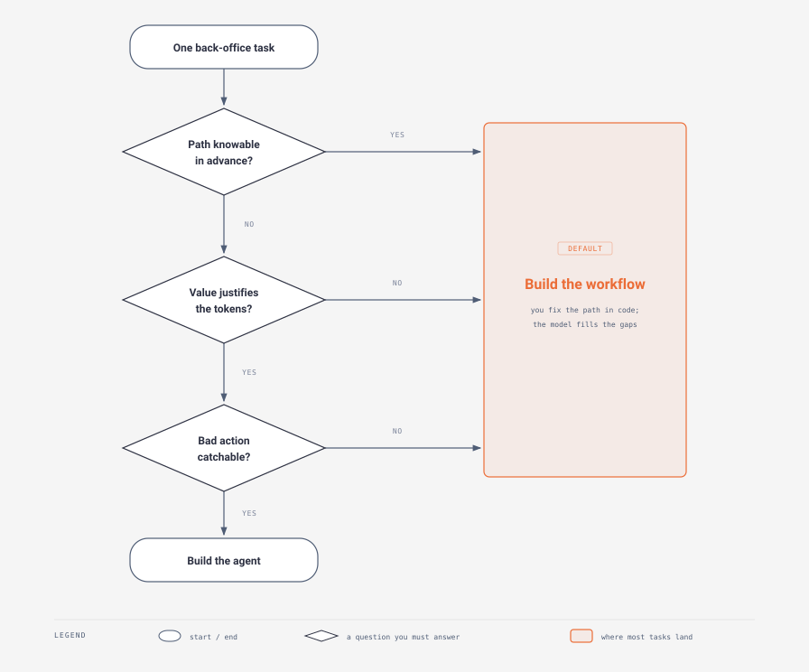

# Day 1 — The agent loop

> **The interview question this day answers:**
> "Walk me through what actually happens when an agent runs. And tell me when you'd choose not to build one."

## 1. Why this day exists

Today you'd answer with a shape, not a mechanism: "the agent takes the request, figures out what to do, calls the tools it needs, and returns an answer." A **tool**, in this field, means one named operation you have made available to the model — look up an invoice, search the web, send an email — and nothing more exotic than that. Every word is true and none of it is load-bearing. An interviewer who builds these for a living hears a diagram you saw on a slide, and asks the follow-up: *what is the model physically doing when it "figures out"?* *Who calls the tool — the model, or your code?* *What stops it?*

Those questions land because an agent is not a clever architecture. It's a loop — four or five steps, repeated, with a hard limit on how many times. The whole engineering discipline sits in that loop and in the decision whether to run one at all. Anthropic's position is that most teams should not: find "the simplest solution possible, and only increasing complexity when needed" ([Building effective agents](https://www.anthropic.com/engineering/building-effective-agents), published 19 December 2024).

By the end of today you'll draw the loop from memory, name what runs at each step, say who owns each part, and answer "should this even be an agent?" That last one is what gets you hired, because it's what a customer pays for.

Two terms before we start, both defined properly in §3: an **LLM** (large language model) is the thing behind ChatGPT and Claude, and a **token** is the unit it reads and writes text in.

## 2. Explain it like I'm five

You have two ovens.

The first oven has a timer. You set forty minutes and walk away. The element runs, then stops. The oven has no idea what's inside it, whether the room is cold, or whether the thing is already burnt. It executes your plan exactly, every time — cheap, fast, perfectly predictable before you press start, and completely wrong the day someone loads a tray twice the usual thickness.

The second oven has a thermostat. It measures the temperature, compares it to the number you asked for, turns the element on or off, and measures again. It does not know in advance how many times it will switch — that depends on the room, the door, the load. It costs more to build. But it handles the day nobody predicted.

That is the distinction you'll be tested on. A **workflow** is the timer: you decide the steps in advance and the machine follows them. An **agent** is the thermostat: you give it a target and a way to measure, and it decides its own next move, repeatedly, until it's done or you stop it.

Here is where the picture leaks, and the leak is the most important thing on this page.

A thermostat's controller is arithmetic. Two or three lines. You can prove on paper that it settles at the setpoint. Its sensor returns a number. Its actuator has one degree of freedom.

An agent's controller is a machine that has read an enormous quantity of text and, given some text, produces the text most likely to come next. Its sensor returns a paragraph. Its actuator can do anything you gave it access to. And there is no proof it settles — it can decide, on step nine of ten, to do something it never did in the eight before. The founding paper on this pattern names exactly that as "one frequent error pattern specific to ReAct, in which the model repetitively generates the previous thoughts and actions" and fails "to reason about what the proper next action to take and jump out of the loop" ([Yao et al., 2022](https://arxiv.org/abs/2210.03629)).

So the analogy stops working here, and naming that limit is what separates you from someone repeating a diagram: an agent has the *architecture* of a feedback controller and none of its *guarantees*. Everything the rest of this course teaches — limits, checks, logs, tests, retries, budgets — buys back some of the certainty the thermostat had for free.

The plain version: an agent is a loop in which a text-prediction machine is shown the situation so far, writes what it wants to do next, your code does it, and the result is added to the situation — repeating until the model says it's finished or your code refuses to go round again.

## 3. The concept, properly

### Tier 1 — The shape of it

Four definitions first, because nothing below makes sense without them.

**A large language model (LLM)** is a very large statistical model of text. Anthropic's glossary defines LLMs as "AI language models with many parameters that are capable of performing a variety of surprisingly useful tasks," trained on "vast amounts of text data" ([glossary](https://platform.claude.com/docs/en/about-claude/glossary), checked July 2026). Mechanically it is narrower than that sounds: it takes a block of text and predicts what comes next — "pretrained to predict the next word, given the previous context of text in the document." It is not a database, it does not look things up, and it has no access to anything except the text you hand it.

**A token** is the unit text gets chopped into before the model sees it. Not a word, not a character — something in between. Anthropic's glossary: "Tokens are the smallest individual units of a language model, and can correspond to words, subwords, characters, or even bytes... For Claude, a token approximately represents 3.5 English characters." Their pricing FAQ gives the working rule: "1 token is approximately 4 characters or 0.75 words in English" — so a thousand tokens is about seven hundred and fifty words. Tokens are the unit of *cost*, the unit of *how much the model can see at once*, and the unit of *how long it takes*. Every number in this business is denominated in them.

One split matters from the start: providers price **input** tokens — what you send — separately from **output** tokens, what the model writes, and output costs several times more per token. A loop is overwhelmingly input-heavy, because every pass re-sends the whole history. That is why the loop is affordable at all, and why re-using that repeated prefix instead of paying for it again becomes the biggest cost lever in Week 3.

**A prompt** is the text you send on one request. All of it: your instructions, the actions available, the history so far, the user's question. There is no hidden channel. If the model needs to know something, it is in the prompt, or it does not know it.

**Inference** is one round trip: you send a prompt, the model generates tokens, you get text back. The model is stateless between round trips — it remembers nothing. The illusion of memory in a chat is your code re-sending the whole conversation every time.

One more word, since it's the hub of the diagram below and line one of the code further down. The **transcript** is the running list your code keeps of everything that happened in this run: the goal, what the model said each pass, what each action returned. Not a log file for humans — it *is* the agent's memory, and it's what gets rendered into the prompt each pass.

With those five, the loop:



*Notice two things. The transcript in the middle is the loop's only memory: Model and Observe each append to it, and Prompt reads the whole thing back at the top of every pass — which is why the dashed arrow there points outward. And the return arc carries a condition: the loop only goes round again if the step count is still under a hard cap you chose in advance. The three questions in the second diagram are a subset of Barry Zhang's four; his fourth, de-risking the capabilities the task depends on, is a prerequisite rather than a branch, so it isn't drawn.*

Read it as five stations:

1. **Prompt** — your code assembles the text: the goal, what the model is allowed to do, and everything that has happened so far.
2. **Model** — one inference call. The model writes what it wants to do next.
3. **Parse** — your code turns that output into something executable.
4. **Act** — your code performs the action. The only station where the outside world changes.
5. **Observe** — the result is appended to the transcript, and the loop returns to station 1.

The thing most people get wrong on first pass: **the model has no effectors.** It decides plenty — which action, which arguments, whether to stop — but it cannot reach anything. It emits a *request*. Every effect is a **function** — a named block of your own code that takes inputs and returns a result — running under credentials you issued. When someone says "the agent looked up the invoice," what happened is that the model asked for the invoice and a function in your codebase called the accounting system over the network.

A vocabulary note: this document says **action** where every quotation and both diagrams say **tool**. Same thing. Day 2 covers designing and describing them.

Station 3 looks thin in 2026, since providers now return the requested action as a structured block rather than prose you must pick apart. It's still yours, and still the gate between "the model asked" and "my code did it, with my credentials" — where every safety control, log line and debuggable failure lives.

### Tier 2 — How it actually works

Here is the loop in ten lines. This is not a framework and not production code; it's the smallest thing that is honestly an agent.

```python
transcript = [user_goal]                          # 1
for step in range(1, MAX_STEPS + 1):              # 2
    reply = model.generate(render(transcript))    # 3
    if reply.is_final_answer:                     # 4
        return reply.text                         # 5
    action = parse(reply)                         # 6
    result = run(action)                          # 7
    transcript.append(reply)                      # 8
    transcript.append(result)                     # 9
raise StepCapExceeded(MAX_STEPS)                  # 10
```

Line by line, in English:

- **1** — Start a list. The user's goal goes first. This list is the agent's entire memory.
- **2** — Loop, but not forever. `MAX_STEPS` is a ceiling you choose, and choosing it defensibly is a real piece of design work — the subsection below gives a method. The loop cannot exceed it, whatever the model wants.
- **3** — `render` turns the list into one block of text; `model.generate` sends it and waits. The expensive line: money and seconds.
- **4–5** — The model ends the loop by saying it's done. The normal exit.
- **6** — Extract the action. If the model wrote something malformed, this is where you find out.
- **7** — Actually do the thing. Your code, your credentials, your consequences.
- **8–9** — Append what the model said and what happened. This is why the prompt grows every pass.
- **10** — Finishing without the model declaring completion is a failure. Not a shrug — an error with a name.

Three consequences of that shape are worth holding onto.

**The prompt grows every pass, and you pay for all of it every time.** Because the model is stateless, pass four re-sends everything from passes one to three. The biggest surprise for people coming from ordinary software, where a loop's tenth iteration costs the same as its first; here the tenth is the most expensive. Day 4 covers what happens to *accuracy* as the text gets long, Day 19 the economics.

**There is a floor cost per pass that isn't your prompt.** Give a model a set of actions and the provider inserts its own instructions explaining how to use them — a few hundred tokens, charged on every pass, before you have written a word ([286 on Claude Opus 5, 406 if you force it to pick an action](https://platform.claude.com/docs/en/about-claude/pricing), checked July 2026).

**The token spend is what makes the build-or-don't decision real.** Barry Zhang of Anthropic's Applied AI team put a number on it in his AI Engineer Summit talk: if your budget is around ten cents per task — say a high-volume customer support system — that buys roughly thirty to fifty thousand tokens, so you should use a workflow for the common scenarios and capture most of the value there ([talk, from transcript at `03:27`](https://www.youtube.com/watch?v=D7_ipDqhtwk)).

He said that in **February 2025**, and rates have moved since, so bind it to a model before you repeat it. Thirty to fifty thousand tokens for ten cents implies about $2.50 per million — Sonnet-or-Haiku territory on a mostly-input workload, which matches the models current at the time. On **Claude Opus 5** the same ten cents buys **20,000 input tokens, or 4,000 output tokens**, at the [published rates](https://platform.claude.com/docs/en/about-claude/pricing) below:

| Model | Input per million tokens | Output per million tokens |
|---|---|---|
| Claude Opus 5 | $5 | $25 |
| Claude Sonnet 5 (introductory rate to 31 Aug 2026) | $2 | $10 |
| Claude Haiku 4.5 | $1 | $5 |

*Rates from [Anthropic's pricing page](https://platform.claude.com/docs/en/about-claude/pricing), checked July 2026. Prices in this industry move; check before you quote one.*

Now put the two halves together, because the collision is the most useful number you have on Day 1. Take a ten-pass run on Opus 5 with a 1,500-token base prompt, roughly 600 tokens added per pass, and 200 output tokens per pass. Total input is not ten times 1,500 — it is `n·B + D·n(n−1)/2`, or 15,000 + 27,000 = 42,000 tokens, plus 2,000 output. At the rates above that is **about 26 cents**, which is **2.6× the ten-cent budget the day just used as its economic anchor**.

Notice the shape. Cost grows **triangularly** in the step count — quadratically, not linearly — because pass *n* carries every earlier pass on its back, so doubling the cap roughly quadruples the input bill. "Non-linear" is the vague version; the quadratic term is the one you can defend, and it's why a step cap is a budget instrument and not only a safety one. The figures will be stale within a year; this shape is what you carry into the room.

#### The taxonomy you will be asked about

Anthropic draws one architectural line and then puts everything on either side of it. Their words, verbatim:

> **Workflows** are systems where LLMs and tools are orchestrated through predefined code paths.
>
> **Agents**, on the other hand, are systems where LLMs dynamically direct their own processes and tool usage, maintaining control over how they accomplish tasks.

Both are **agentic systems** — that's the umbrella term. The distinction is *who decides the path*. In a workflow, you did, at build time, in code. In an agent, the model does, at run time.

They then name five workflow patterns. You should recognise these when a customer describes one, and be able to say which one their existing process already is:

| Pattern | What it does |
|---|---|
| **Prompt chaining** | Break the task into fixed steps; each model call processes the previous one's output. Optional programmatic checks between steps. |
| **Routing** | Classify the input, then send it to a specialised follow-up path. |
| **Parallelisation** | Run several model calls at once and combine the outputs — either splitting a task into independent pieces, or running the same task repeatedly and voting. |
| **Orchestrator-workers** | A central model call breaks the task down on the fly, delegates pieces, and synthesises the results. Subtasks aren't known in advance. |
| **Evaluator-optimizer** | One call generates, another critiques, repeat. |

Underneath all five sits what Anthropic calls the **augmented LLM**: "an LLM enhanced with augmentations such as retrieval, tools, and memory" — the building block, not an architecture. Note that orchestrator-workers and evaluator-optimizer both loop and both let the model decide things. The line is genuinely blurry, and pretending otherwise will cost you (Tier 3).

#### When it earns its cost



*Three questions, and any single "wrong" answer sends you right, into the workflow. That asymmetry is the point — the agent is the narrow case, not the default. The third question is the one that gets skipped: if a bad action is expensive and hard to notice, the answer is a narrower scope or a human in the path, not a better prompt.*

Anthropic's condition for reaching for an agent: they "can be used for open-ended problems where it's difficult or impossible to predict the required number of steps, and where you can't hardcode a fixed path." Barry Zhang's checklist covers four things: task complexity, whether the value justifies the token spend, whether you've de-risked the capabilities it depends on, and the cost of an error together with how hard that error is to *discover* ([from transcript at `02:59`](https://www.youtube.com/watch?v=D7_ipDqhtwk)).

His example of a good fit is coding, useful because it shows all four at once: design document to pull request is genuinely ambiguous, good code is valuable, models are already strong at most of the workflow, and — the part people forget — the output is cheaply verifiable through unit tests and CI. That last property is what to look for in a customer's process. Not "is this hard?" but "if the machine gets it wrong, will anyone find out, and how fast?"

#### The max-step cap

The cap is the least glamorous line in the loop and the one an interviewer will poke at, because it reveals whether you've thought about the failure case. Anthropic's framing: "The task often terminates upon completion, but it's also common to include stopping conditions (such as a maximum number of iterations) to maintain control."

**Say what you are counting before you name a number.** The cap counts passes of the loop. Not every retry is a pass: if an action fails at the transport level and your code retries it *inside* station 4, the model never sees it and no step is consumed; if the failure comes back as an observation the model must react to, that costs a step. So "twenty steps" means nothing until you say which you're counting — two systems with the same cap can differ severalfold in what they'll attempt. Which errors deserve a retry is Day 10's.

**Two reference points, then a method.** ReAct's authors used 7 and 5; `smolagents` defaults to `20` ([reference docs](https://huggingface.co/docs/smolagents/en/reference/agents), checked July 2026). Single digits to low twenties is the observed range — but a range is not a justification. The method: count the minimum actions a clean run needs (invoice reconciliation might be fetch invoice, fetch purchase order, compare, write result — four). That's your floor, and a cap at the floor guarantees truncation. Multiply for the paths you already know: a lookup needing a second query, a document needing a re-read, a dead end to back out of. Two to three times the floor is a defensible opening bid, stated *as* an estimate. Then replace the estimate with data: plot the step count of runs that *succeeded* and set the cap above the tail of that distribution. Below the tail you truncate real work; far above it you only make failures more expensive. That is the answer to "how did you pick 20?", and in a solution-design round the number is the deliverable.

ReAct's own numbers show why that works. Capped at seven steps and five, among trajectories ending in a correct answer only 0.84% and 1.33% used the full budget ([Yao et al., 2022, §3.2](https://arxiv.org/abs/2210.03629)). Treat it as a claim about *shape*, not a constant to import — 2022, PaLM-540B, seven-step cap, and HotpotQA, the benchmark where ReAct lost. Successful runs cluster well below the cap and the tail is thin, which is what you'd verify on a customer's traces.

**The cap can be a router, not just a wall.** ReAct's 7 and 5 doubled as a back-off trigger: when ReAct failed to answer within the given steps, the authors fell back to chain-of-thought with self-consistency and took that answer instead ([Yao et al., 2022, §3.2](https://arxiv.org/abs/2210.03629)). Hitting the cap routed to another strategy and often still recovered the answer. Carry that into customer conversations — "what happens when it gives up?" has a better answer than "it fails": it hands off to the cheaper deterministic path you were building anyway.

**So the cap is a blast-radius and budget control, not a quality control.** It bounds cost (quadratically), latency, and how many actions a confused model can take against a real system before something stops it. Raising it to "give the agent more room" is nearly always wrong.

**It isn't your only bound.** The prompt must fit the model's **context window** — the fixed amount of text it can consider in one pass. Since the transcript grows every pass, a run can exhaust the window before the step cap, so a cap of 20 may be unreachable. Two independent ceilings; the lower wins. Day 4 takes the window properly.

### Tier 3 — What an interviewer digs into

**The founding paper's headline results are mixed, not the sweep its reputation implies — and knowing that is a credibility signal.** ReAct is universally cited as the origin of the reason-act-observe loop.

Before the numbers, the thing they are measured against. **Chain-of-thought prompting** is the technique of having the model write out its reasoning step by step before answering — thinking on paper, with no actions and no access to the world. It is the right baseline here precisely because of that: it reasons without acting, so the gap between it and ReAct isolates what the *loop* contributes rather than what the model knows. If you quote the comparison, expect to be asked what the other side of it is.

Read Table 1 as a scoreboard. A **benchmark** is a fixed set of tasks with known right answers that everyone runs, so methods can be compared on the same footing: HotpotQA asks multi-hop questions, Fever asks whether a claim is supported, ALFWorld and WebShop are simulated environments you act in. *Exact match* is the fraction answered exactly right. *Supervised state-of-the-art* comes from a model trained on that benchmark's own data — a ceiling, not a rival. The *imitation and reinforcement learning* methods ReAct beats on the interactive tasks were trained on thousands of instances rather than prompted with two.

On HotpotQA, ReAct scored 27.4 exact-match against 29.4 for plain chain-of-thought — and against **33.4 for chain-of-thought with self-consistency**, which samples several reasoning paths and takes the majority answer. That second gap is the tougher comparison and the one an interviewer will reach for, so quote it rather than only the closest baseline. On Fever, ReAct's 60.9 beat every single-method prompting baseline in the table. Supervised state-of-the-art was 67.5 and 89.5 ([Table 1](https://arxiv.org/abs/2210.03629)). The wins that made the paper famous were on the interactive benchmarks: on ALFWorld and WebShop, ReAct beat imitation and reinforcement learning methods "by an absolute success rate of 34% and 10% respectively, while being prompted with only one or two in-context examples."

The lesson generalises: **the loop's advantage shows up when the task requires interacting with an environment, not when it requires knowing things.** The move that makes it worth saying is what comes straight after — if a customer's task is really knowledge retrieval, the loop is pure overhead and you should say which cheaper shape you'd build instead; if you have to poke the system to find out the answer, it earns its keep.

**Does the "thinking" part actually help, or is it decoration?** ReAct's technical move is precise: "we augment the agent's action space to  = A ∪ L, where L is the space of language." Alongside the real actions, the model gets one more move — say something. A thought "does not affect the external environment, thus leading to no observation feedback." It's a scratchpad.

The paper's own error analysis says the scratchpad trades one failure mode for another. **Hallucination** is the standard name for a model stating something fluent, specific and false — inventing a citation, a figure or an event with no source behind it, and with the same confidence it uses for true things. It is a failure of grounding, not of grammar. Hand-labelling failures on HotpotQA, they found hallucination accounted for 0% of ReAct's failures against 56% of chain-of-thought's, while reasoning errors accounted for 47% of ReAct's against 16% of chain-of-thought's ([Table 2](https://arxiv.org/abs/2210.03629)). Note what that 47% contains: the authors define the row as a wrong reasoning trace *including* failing to recover from repetitive steps, so the loop-gets-stuck failure from §2 lives inside this number rather than beside it. Repetition has no separate percentage in the paper — if you cite one, you have invented it. Their conclusion, verbatim: "While interleaving reasoning, action and observation steps improves ReAct's groundedness and trustworthiness, such a structural constraint also reduces its flexibility in formulating reasoning steps, leading to more reasoning error rate than CoT."

So grounding the model in real observations stops it inventing facts and makes it reason less freely about the facts it has. That is a trade, not an upgrade.

**Practitioners genuinely disagree about where the line is.** Anthropic draws a binary: predefined code paths versus model-directed. Hugging Face's `smolagents` proposes a spectrum instead — "with this definition, 'agent' is not a discrete, 0 or 1 definition: instead, 'agency' evolves on a continuous spectrum" — and publishes a six-rung ladder from "LLM output has no impact on program flow" up through router, tool call, multi-step agent, multi-agent, and code agent ([conceptual guide](https://huggingface.co/docs/smolagents/en/conceptual_guides/intro_agents), checked July 2026). It doesn't mention Anthropic; the two framings are independent, not a rebuttal.

Do not resolve this — the framings do different jobs. Anthropic's binary is a *design* tool: it forces "did I choose this path, or hand that choice away?" The spectrum is a *diagnostic* tool: it states how much autonomy a system has instead of arguing about a label. In a customer conversation the spectrum is usually more productive, because "how much rope does this thing have?" is a question an operations director can answer.

**Nothing here is repeatable, and you should stop expecting it to be.** This is the hardest adjustment from mechanical engineering, where processes have tolerances: same part, same machine, same result within a known band. That does not hold. Anthropic's glossary: "Even with temperature set to 0, the results will not be fully deterministic and identical inputs may produce different outputs across API calls." An **API** — application programming interface — is the published doorway one program uses to ask another for something over the network. Calling a model's API is how your code sends a prompt and gets tokens back; it is the same thing station 2 of the loop does every pass. **Temperature** controls how much randomness the model uses picking each next token; zero is as deterministic as it goes, and it is still not deterministic.

You cannot test an agent by running it once, and you cannot reproduce a bug by re-running the input. This is why the measurement machinery in Week 3 exists — not a test but a test *rig*, running many cases and reporting a rate, the way you'd characterise a process rather than inspect one part.

**Where the loop's autonomy actually gets bounded.** Anthropic names two bounds beyond the cap: "During execution, it's crucial for the agents to gain 'ground truth' from the environment at each step (such as tool call results or code execution) to assess its progress. Agents can then pause for human feedback at checkpoints or when encountering blockers." **Ground truth** is the real result coming back from the world rather than the model's belief about it — the reason station 5 exists separately. They also recommend "extensive testing in sandboxed environments, along with the appropriate guardrails." Implementing those is Day 3.

## 4. What the resources say

### Anthropic — "Building effective agents"

**What it is:** Engineering essay, ~45 min, free. Published 19 December 2024 by Erik S. and Barry Zhang; the live version has been revised since (it now references Claude 4.5-generation models and the Claude Agent SDK, which did not exist at publication). [Link](https://www.anthropic.com/engineering/building-effective-agents)

**The one idea to take:** The workflow-versus-agent distinction, and the fact that the essay spends most of its length on workflows. Five workflow patterns get detailed treatment; agents get roughly a section. That ratio is the argument. The authors also say directly that "the most successful implementations weren't using complex frameworks or specialized libraries" and recommend starting with the API directly, because frameworks "often create extra layers of abstraction that can obscure the underlying prompts and responses, making them harder to debug."

Read the three principles it closes on, and aim to recognise them in a customer's situation rather than recite them: maintain **simplicity** in the agent's design; prioritise **transparency** by explicitly showing the agent's planning steps; and carefully craft the **agent-computer interface** (they abbreviate it ACI) through thorough tool documentation and testing. Notice that two of the three are about the human being able to see and shape what the agent does, not about making the agent smarter.

**The line worth quoting in an interview:** "They are typically just LLMs using tools based on environmental feedback in a loop."

**Skip if:** nothing. This is the single highest-value item on today's list and it's the document your interviewer has most likely read. If you only have forty-five minutes today, spend them here. Skim Appendix 2 on tool formats — that's Day 2's material and it will land better after you've done Day 2.

### ReAct: Synergizing Reasoning and Acting in Language Models

**What it is:** Academic paper, ~1 hr, free. Yao, Zhao, Yu, Du, Shafran, Narasimhan and Cao; first posted 6 October 2022, published at ICLR 2023 (the version now on arXiv is v3, dated 10 March 2023). [Link](https://arxiv.org/abs/2210.03629)

**The one idea to take:** Figure 1 on page 2, and specifically the four-step trajectory in panel 1d. The model is asked which device besides the Apple Remote can control the program the Apple Remote was designed for. It searches, gets a partial answer, notices what's missing, searches again, and the search finds nothing — returning instead the similar entity names the API falls back to. The model reads that list, corrects its own query, and finishes. Worth noticing: the failed action was still useful, because *how* it failed told the model what to try next. A tool's error output is signal, not just noise. Read that one figure carefully and you have the mental model.

**The line worth quoting in an interview:** "the model uses its own internal representations to generate thoughts and is not grounded in the external world, which limits its ability to reason reactively or update its knowledge" — their diagnosis of what pure reasoning-without-acting gets wrong, and the reason the loop exists at all.

**Skip if:** short on time — read the abstract, Figure 1, Table 1 and Table 2, then stop before §4. §4 covers the interactive benchmarks and §5 is related work; neither will change your answers. Runnable prompts are on the project page, [react-lm.github.io](https://react-lm.github.io/).

### Barry Zhang (Anthropic) — "How We Build Effective Agents"

**What it is:** Conference talk, 15 min, free. Recorded at the AI Engineer Summit, New York, February 2025; posted to the AI Engineer channel 4 April 2025. [Link](https://www.youtube.com/watch?v=D7_ipDqhtwk)

**The one idea to take:** The four-part checklist for whether a task deserves an agent — complexity, value, capability de-risking, and cost of error plus cost of error *discovery*. It turns "should this be an agent?" from taste into four questions you can ask in a discovery call. Note the runtime: 15 minutes, not the 25 the course plan lists.

**The line worth quoting in an interview:** "They're models using tools in a loop." *(from the transcript at `05:51`; the captions are auto-generated, so treat the wording as close rather than certified)* Anthropic's own compression of the whole idea, from the engineer who co-wrote the essay above.

**Skip if:** you've read the essay and are pressed for time — the talk covers, in his words, "three core ideas from the blog post" *(from the transcript at `00:44`)*, so the substance overlaps. The third idea, "think like your agents," appears in the essay only as a single line of tool-design advice — "Put yourself in the model's shoes" in Appendix 2 — and the talk is where it becomes a worked demonstration. That demonstration is the reason to watch. See §7.

### Hugging Face `smolagents`

**What it is:** Open-source library plus conceptual docs, ~1 hr, free, Apache-2.0. [Repo](https://github.com/huggingface/smolagents) · [conceptual guide](https://huggingface.co/docs/smolagents/en/conceptual_guides/intro_agents)

**The one idea to take:** The spectrum-of-agency table — six rungs from "LLM output has no impact on program flow" to "LLM acts in code, can define its own tools / start other agents." It gives you vocabulary for partial autonomy, which is what real deployments have. The repo's claim that "the logic for agents fits in ~1,000 lines of code" is the counterweight to every vendor pitch: the loop is small, and complexity in a framework is a choice someone made, not a requirement.

**The line worth quoting in an interview:** their own guidance against reaching for an agent — "If that deterministic workflow fits all queries, by all means just code everything!... For the sake of simplicity and robustness, it's advised to regularize towards not using any agentic behaviour."

**Skip if:** you're reading only — the tutorial assumes a working Python environment. Read the conceptual guide, the spectrum table, and the `MultiStepAgent` docstring: "Agent class that solves the given task step by step, using the ReAct framework: While the objective is not reached, the agent will perform a cycle of action (given by the LLM) and observation (obtained from the environment)." That is the loop, written as a library docstring, by people who ship it.

## 5. Suggested exercise (optional)

The exercise for today is to write the loop yourself with no framework: prompt, model, parse, act, repeat, with a hard maximum on the number of steps.

Here is what doing it would teach you that reading cannot. The Tier 2 snippet gives you the shape; writing it makes you confront the three things the shape hides. The model will hand you text your parser cannot read, and you will have to decide between retry, reprompt and fail — and you will find you have opinions within ten minutes. You will watch the prompt get longer on every pass, and the cost stops being an abstraction. And you will hit the step cap, probably on run one or two, and see a stuck agent from the inside: the same thought, the same action, over and over, exactly as the ReAct authors described.

Roughly what it involves: an API key, twenty or thirty lines of Python, one real action the model can request, and a `for` loop with a counter. No framework. An hour or two.

**Optional — skip it if you're reading only.** You can hold every conversation in this course without having run it. What you'll lack is the texture of having seen a loop misbehave, which shows up when an interviewer asks "what surprised you?" If you build nothing in these thirty days, say so plainly and lean on §6's failure modes — same lessons second-hand, and far better than implying a build you didn't do.

## 6. Where it breaks

The thesis this course is built on, attributed to Vas of Varick Agents: *"There's only one way something can go right, but there's a thousand different ways something can go wrong. If you're only building for the way it goes right, you're worth nothing."* ⚠️ **Unverified:** this reaches us through `FDE_Report`, which cites secondhand writeups of a podcast rather than a transcript. The sentiment is sound and worth carrying; don't attribute the exact wording to him in a room.

| Failure mode | What it looks like in production | The mitigation |
|---|---|---|
| **The loop won't terminate** | The model repeats the same thought and action, pass after pass. The ReAct authors name this as one frequent error pattern specific to the method. | A hard step cap, sized by the method above. Treat hitting it as a named error, and log the transcript so you can see what it stuck on. |
| **Silent truncation at the cap** | The run stops at the cap and returns the model's last partial answer as though finished. Nobody notices, because it looks plausible. | Distinguish "model said it was done" from "we ran out of steps" — two exits, two different outcomes downstream. |
| **The model's output won't parse** | Prose where you expected a structured action, or nearly-valid structure with one thing off, throwing on a live request. | Catch it and count it. Days 8 and 9 cover constraining the output format and validating it. |
| **The action itself failed** | The API times out, returns a 500, or rejects your credentials — the most common event in a deployed loop. The naive handler crashes the run on something the model could have worked around. | Turn the failure into an observation the model can act on: a short plain sentence saying what failed. Not a raw stack trace, which leaks internal hostnames into a prompt the model then acts on and buries the one useful fact in noise. Which errors deserve a retry is Day 10. |
| **The action succeeded but the model didn't notice** | The result came back and the model's next thought contradicts it — it re-does work it already did, or reports failure on something that worked. | Feed the real result back verbatim as its own observation. This is what Anthropic means by getting "ground truth" from the environment at each step. |
| **Cost grows faster than progress** | Cost rises quadratically in steps, since every pass re-sends the transcript: double the steps, roughly quadruple the input bill. | Measure cost per completed task, not per call. Cap the steps. Choose the model deliberately — the Tier 2 rates differ fivefold across tiers. |
| **It worked on your machine** | You ran it once, it was right, you shipped it. In production the same input produces a different path. | Accept non-determinism as a property of the material. One run is an anecdote. Week 3 builds the rig that turns runs into rates. |
| **An agent where a workflow would do** | Works in the demo. In production it's slower, costs more, and fails unpredictably — for a task whose path was knowable all along. | The three questions in the second diagram, asked before you write anything. |
| **The wrong action, taken confidently, on a real system** | The model does something irreversible against the customer's records because it misread the situation, and nobody finds out for a week. | Barry Zhang's fourth criterion: cost of error *and* cost of error discovery. Mitigate by narrowing scope — read-only access, a human in the path — and accept that this limits how far the agent can scale. |

Two patterns are worth naming across that table.

**The failure you can see is not the dangerous one.** A parse error throws; a step cap fires. The dangerous two look like success — silent truncation and the confidently wrong action — because both produce plausible output. That asymmetry is why the audit trail gets Day 5, enumerating failure modes gets Day 10, and the tagged taxonomy gets Day 16.

**Almost every mitigation above costs autonomy.** Cap the steps and it can't handle the long task; add a human gate and it can't run overnight; narrow to read-only and it can't finish the job. No configuration is both maximally autonomous and maximally safe, and an interviewer asking "how do you make it reliable?" is often asking whether you know that. You pick a point on the trade deliberately, with the customer, and say why.

## 7. Watch this

### 1. Barry Zhang (Anthropic) — "How We Build Effective Agents"
**AI Engineer channel · AI Engineer Summit 2025 · 15 min · [Watch](https://www.youtube.com/watch?v=D7_ipDqhtwk)**

Why this one: an Anthropic engineer who co-wrote the canonical essay, describing the loop the way Anthropic thinks about it — the framing your interviewer has most likely absorbed, in a quarter of an hour. He's on Anthropic's Applied AI team, the closest thing at a frontier lab to the job you're interviewing for.

**Worth watching:** the video has **no published chapter markers**. The timestamps below come from the video's auto-generated transcript, which is the only structural evidence available for it.

- `00:52` — the three claims: don't build agents for everything, keep it simple, think like your agents *(from transcript)*
- `02:59` — the four-part checklist *(from transcript)*
- `05:51` — "They're models using tools in a loop," then the three components: environment, tools, system prompt *(from transcript)*
- `08:06` — put yourself inside the model's context window and check whether what it sees is sufficient *(from transcript)*

The last one is the reason to watch rather than read. The essay states the idea in one line of tool-design advice ("Put yourself in the model's shoes", Appendix 2); the talk turns it into a demonstration. Walking through a computer-use agent as a sequence of static screenshots, he describes the gap between actions as "closing our eyes for three to five seconds and using the computer in the dark" *(from transcript at `09:34`)* — better for your intuition than any diagram.

### 2. Andrej Karpathy — "[1hr Talk] Intro to Large Language Models"
**Andrej Karpathy channel · 1 hr · [Watch](https://www.youtube.com/watch?v=zjkBMFhNj_g)**

Why this one: today's other resources assume you know what a model *is*. This one doesn't — it's the canonical from-zero explanation, by one of the people best at explaining it. Watch it before or alongside this week, not after. One caveat: published November 2023, so the examples are from that era. The mechanism hasn't changed; the capabilities have. Treat it as a physics lesson, not a market survey.

**Worth watching:** this video has **published chapter markers**:

- `11:22` — How do they work? (chapter marker)
- `27:43` — Tool Use — Browser, Calculator, Interpreter, DALL-E (chapter marker)

The first gives you what §3 Tier 1 asserted, with the reasoning underneath; the second is the moment the agent loop grew out of. Stop there — the later material belongs to other days.

## 8. Say this in an interview

### "How do you decide between a workflow and an agent?"

**Weak:** "We'd use an agent — they're more flexible and more powerful, and the models are good enough now that they can handle the decision-making themselves."

**Strong:** "I'd default to the workflow and make the agent earn it. Three questions decide it. Can I draw the whole decision tree in advance? If yes, I'll write it and optimise each node — cheaper, and I keep control. Does the value justify the token spend? I'd do the arithmetic on their numbers rather than quote a rule of thumb — at current Opus rates a ten-cent budget is about twenty thousand input tokens, and a ten-pass run with a modest prompt lands near twenty-six cents, so a ten-cent target is already blown. That usually means covering the common cases with a workflow. And can a wrong action be caught before it costs anything? If errors are high-stakes and hard to discover, I'd narrow to read-only or put a human in the path, and be explicit that this caps how far it scales. Anthropic's guidance is to find the simplest solution and add complexity only when it demonstrably improves outcomes."

**Why the strong one lands:** it optimises the customer's reliability budget rather than the candidate's tool choice, and it puts a number on the second question — which signals you've thought about economics, not just architecture. Economics is the language the person signing the contract speaks.

### "What stops an agent from running forever?"

**Weak:** "You set a maximum number of iterations so it can't loop infinitely. Usually ten or twenty."

**Strong:** "Two exits. The normal one is the model declaring it's finished; the backstop is a hard step cap — and I'd treat those as different outcomes, because silently returning a partial answer when you ran out of steps looks like success. On the number: I'd start from the task's minimum action count, multiply two or three times for retries and dead ends, then replace that estimate with the step-count distribution of successful runs once I have traces, setting the cap above its tail. The reason that works is that successful runs cluster low — in ReAct's own experiments, capped at seven steps, only 0.84% of correct runs used all seven. So the cap bounds cost and blast radius rather than quality, and raising it when the agent struggles mostly makes failures more expensive." Figures from [Yao et al., 2022, §3.2](https://arxiv.org/abs/2210.03629).

**Why the strong one lands:** the weak answer describes the mechanism; the strong one gives a *method* for the number, which is the actual deliverable in a solution-design round, and names a failure the interviewer has probably debugged.

### "So an agent is just a for-loop around an API call?"

**Weak:** "There's a lot more to it than that — there's planning, memory, tool orchestration, the whole reasoning layer."

**Strong:** "Mechanically, yes, and that's the useful way to hold it. Anthropic's own line is that agents are typically just models using tools based on environmental feedback in a loop, and `smolagents` puts the whole agent logic in about a thousand lines. The loop isn't where the difficulty is. The difficulty is that it's non-deterministic — even at temperature zero the same input can take a different path — so everything that makes it shippable sits around the loop rather than in it: bounding the steps, constraining what it's allowed to do, logging every step so you can reconstruct a run, and building an eval set so you can quote a pass rate instead of an anecdote. If I described it as more sophisticated than it is, I'd be hiding where the work actually is."

**Why the strong one lands:** it refuses the bait by agreeing, which is disarming, then relocates the complexity to where it lives. The weak answer is defensive and lists buzzwords, which reads as protecting a shallow understanding. Volunteering that the loop is simple signals you've built one.

## 9. Vocabulary

| Term | Plain definition | Why an FDE cares |
|---|---|---|
| **LLM (large language model)** | A very large statistical model of text that, given a block of text, predicts what text comes next. | Everyone buys it identically, so the model itself is never your differentiator. |
| **Tool** | One named operation you make available to the model, e.g. look up an invoice. Called an *action* in this day's prose. | The model's entire vocabulary for affecting anything. Day 2 is about designing them. |
| **Token** | The unit text is chopped into before a model reads it — roughly 4 characters or 0.75 words of English. Priced separately as **input** (what you send) and **output** (what the model writes), output costing several times more. | Cost, latency and how much the model can see are all denominated in tokens. |
| **Prompt** | The complete text sent on one request: instructions, available actions, and the history so far. | No hidden channel: if it behaved oddly the answer is in the prompt, so you must be able to reconstruct it. |
| **Inference** | One round trip to the model: send a prompt, get generated text back. The model keeps no state between calls. | The unit you're billed for; a ten-step run is ten calls, each prompt longer than the last. |
| **Agentic system** | Anthropic's umbrella term for anything orchestrating a model with tools and data — workflows and agents both. | Lets you stop arguing about the word "agent" and describe the system instead. |
| **Transcript** | The running list of a single run: the goal, what the model said each pass, what each action returned. | The agent's memory, and your only record of what it thought it was doing. |
| **Workflow** | A system where the model and its tools are orchestrated through predefined code paths — you chose the sequence at build time. | The right answer more often than the customer expects; recommending it is what makes you credible rather than a vendor. |
| **Agent** | A system where the model directs its own process and tool use, deciding at run time how to accomplish the task. | Deciding *where* this is warranted is the judgment call the role is hired for. |
| **Agent loop** | The repeating cycle: assemble the prompt, call the model, parse it, act, feed the result back. | You'll be asked to draw it. Which stations are yours is where every control lives. |
| **Reasoning trace** | Text the model writes to itself before acting, changing nothing in the world. ReAct added it to the action space. | Why you can read a transcript and see what the agent thought it was doing. |
| **Augmented LLM** | Anthropic's name for the basic building block: a model enhanced with retrieval, tools and memory. | All five workflow patterns are made of this one block, which stops you over-designing. |
| **Max-step cap** | A hard limit on how many times the loop may run, enforced by your code regardless of what the model wants. | Bounds cost, latency and blast radius — not quality. Be ready to justify the number. |
| **Stopping condition** | Any rule that ends the loop: the model declaring completion, the cap firing, or an external interrupt. | Treating "ran out of steps" as success is a common silent failure. |
| **API** | The published doorway one program uses to ask another for something over the network. | Every cost, latency and failure figure you'll quote is measured per API call. |
| **Benchmark** | A fixed set of tasks with known right answers, run by everyone so methods compare on the same footing. | Vendor claims are benchmark claims; knowing what one measures is how you read a pitch deck. |
| **Chain-of-thought prompting** | Having the model write its reasoning step by step before answering, with no actions and no access to the world. | The baseline ReAct is measured against — the other half of every benchmark number you might quote. |
| **Hallucination** | A model stating something fluent, specific and false — an invented citation, figure or event. | What a customer means by "can I trust it?" Grounding is the defence, and it costs reasoning flexibility. |
| **Context window** | The fixed amount of text a model can consider in one pass. | The second ceiling on a loop, alongside the step cap — the lower one wins. Day 4 owns it properly, including what happens to accuracy before you reach the limit. |
| **Function** | A named block of your code that takes inputs and returns a result. | What actually runs when "the agent does something": your code, your credentials, your consequences. |
| **Ground truth** | The real result returned by the environment at each step, as opposed to the model's belief about what happened. | The difference between a feedback loop and a machine narrating a plausible story. |
| **Temperature** | The parameter controlling how much randomness the model uses when choosing each next token. Zero is the least random setting available. | Even at zero, output is not reproducible — which reshapes how you test and what you promise. |

## 10. Test yourself

<details>
<summary><b>Q1.</b> Name the five stations of the agent loop, and say which of them is your code rather than the model.</summary>

Prompt, model, parse, act, observe. Four of the five are your code — only the model station is the model. The model contributes one thing per pass: a request describing what it wants to happen next. It has no effectors. That matters because every control, log line and safety check you will write lives in the four stations you own.

</details>

<details>
<summary><b>Q2.</b> A ten-pass run on Opus 5 carries a 1,500-token base prompt and adds about 600 tokens per pass, with 200 output tokens per pass. Roughly what does it cost, and why isn't it ten times the first pass?</summary>

About 26 cents. Input isn't 10 × 1,500; it's `n·B + D·n(n−1)/2` — 15,000 plus 27,000, so 42,000 input tokens, plus 2,000 output. At Opus 5's [$5 and $25 per million](https://platform.claude.com/docs/en/about-claude/pricing) that's $0.21 + $0.05. The shape is the point: because pass *n* re-sends every earlier pass, cost grows triangularly — quadratically — in the step count, so doubling the cap roughly quadruples the input bill. It also lands 2.6× over the ten-cent-per-task budget Anthropic's own example uses, which is the sort of collision worth surfacing before a customer finds it.

</details>

<details>
<summary><b>Q3.</b> An interviewer says: "A step cap is just a crude way of stopping a bad agent. Wouldn't you rather fix the agent?" What do you say?</summary>

That the cap barely interacts with quality, so it isn't competing with fixing the agent — you want both. In ReAct's experiments, capped at seven steps on HotpotQA and five on Fever, only 0.84% and 1.33% of *correct* runs used the full budget ([Yao et al., 2022, §3.2](https://arxiv.org/abs/2210.03629)). Successful runs finish well inside the cap; it fires on runs already lost. So it's a cost and blast-radius control, and raising it mostly makes failures more expensive.

</details>

<details>
<summary><b>Q4.</b> A customer wants an agent to reconcile supplier invoices against purchase orders. What do you ask before agreeing it should be an agent?</summary>

Four things, following Barry Zhang's checklist. Can the decision tree be drawn in advance — if it's "match on PO number, flag mismatches over a threshold," that's a workflow. What is one reconciliation worth, and does that justify the tokens a loop will burn. Are the capabilities reliable — can the model read these documents at all. And when it matches the wrong invoice: who finds out, how fast, and can the payment be reversed. That last question usually reshapes the engagement.

</details>

<details>
<summary><b>Q5.</b> Why is "it worked when I tested it" a weak claim about an agent, in a way it wouldn't be about ordinary software?</summary>

Because the same input can take a different path on a second run. Anthropic's documentation states that "even with temperature set to 0, the results will not be fully deterministic and identical inputs may produce different outputs across API calls." One successful run is an anecdote, and a bug you saw once may not reproduce on demand. You have to characterise an agent statistically — many cases, reported as a rate — which is closer to characterising a manufacturing process than to unit-testing a function.

</details>

<details>
<summary><b>Q6.</b> The ReAct paper is treated as the origin of agentic LLMs. What did it actually report on its knowledge-heavy benchmarks, and why does that matter?</summary>

Mixed results. ReAct scored 27.4 exact-match on HotpotQA against 29.4 for chain-of-thought — reasoning written out step by step, with no actions — so a loss; and 60.9 on Fever against 56.3, a win. Supervised state-of-the-art was 67.5 and 89.5, above both ([Table 1](https://arxiv.org/abs/2210.03629)). Its real wins were the interactive benchmarks, ALFWorld and WebShop, beating imitation and reinforcement learning "by an absolute success rate of 34% and 10% respectively." That tells you where the loop pays: poking an environment to find the answer, not knowing things.

</details>

<details>
<summary><b>Q7.</b> An operations director asks why the agent sometimes "makes things up." What does the ReAct error analysis let you say, honestly?</summary>

That grounding the model in real observations largely fixes that problem and introduces a different one. Hand-labelling HotpotQA failures, the authors found hallucination — fluent, specific, false statements — accounted for 0% of ReAct's failures against 56% of chain-of-thought's, while reasoning errors rose to 47% from 16% ([Table 2](https://arxiv.org/abs/2210.03629)). Their conclusion: the structure "reduces its flexibility in formulating reasoning steps." So feeding real results back stops it inventing facts and makes it reason less well about the facts it has. A trade to manage, not a bug to close.

</details>

<details>
<summary><b>Q8.</b> You're told to make an agent "as reliable as possible." What's wrong with that instruction?</summary>

That reliability and autonomy trade against each other, so the instruction is underspecified. Nearly every mitigation costs capability: cap the steps and it can't handle long tasks; add a human gate and it can't run overnight; narrow to read-only and it can't finish the job. No setting is both maximally autonomous and maximally safe. Name the trade, propose a point on it, and get the customer to agree to that point explicitly — a conversation, not a configuration change.

</details>


---

**Next up (Week 1):** Day 2 gives the model something to actually do — how an action is defined and described so the model picks the right one, and why that description is a piece of engineering rather than documentation. Day 3 puts bounds on what it's allowed to do at all.
