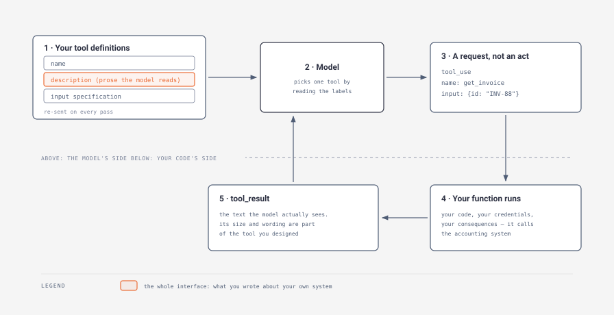
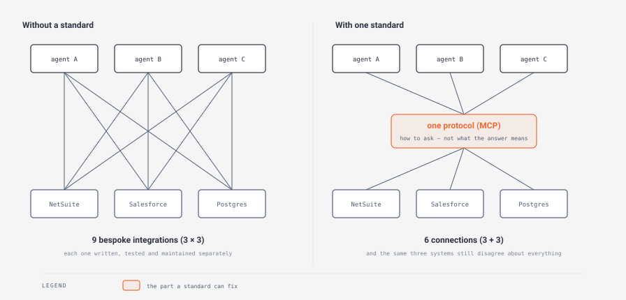

# Day 2 — Tool use

> **The interview question this day answers:**
> "The customer's data lives in NetSuite and Salesforce. Walk me through how your agent actually touches it — and how you decide what tools to give it."

## 1. Why this day exists

Yesterday you learned that the model asks and your code acts. Today you learn what the asking looks like, and that the *asking* is the part you design.

Right now you'd say "we give the agent tools" and "we connect it over MCP", and both sentences would evaporate under one follow-up. *What does the model actually receive that tells it a tool exists?* *Who writes that?* *Is MCP a library you install, or a format on a wire?* *The customer's finance system has a dozen fields that are some variant of "status" — which of your tools knows which one means paid?*

Those questions are the job. A **connector** — a piece of software that lets one system read or write another — is what an integration project mostly consists of, and Varick Agents' own posting for this role described the work as "mapping how data flows across NetSuite, Salesforce, and the tangle of systems".

⚠️ **Unverified:** that fragment reaches us through `FDE_Report`, which quotes the posting rather than reproducing it, and the posting is no longer on [Varick's live board](https://jobs.ashbyhq.com/varick-agents) (checked July 2026; the nearest listing is now titled Forward Deployed AI Strategist). Use the substance, not the sentence.

If you can talk about tool design and connectors concretely, you are describing the thing they are hiring for. If you can only say "MCP", you are describing a logo.

By the end of today you can say what a tool definition contains, write a good one and say why it's good, read either of the two major dialects, explain what MCP standardises and — the part most candidates miss — what it leaves entirely unsolved.

## 2. Explain it like I'm five

Picture a stores window at the back of a machine shop.

On one side of the hatch is the crib: hundreds of drawers, the gauges, the tooling, the raw stock, the paperwork. On the other side is a fitter who has never been inside. He cannot see the drawers. He cannot open one. He can only write on a slip — the name of a drawer and how many he wants — and push the slip through the hatch. Someone behind the window fetches it and pushes back whatever came out.

Every drawer has a label. The label is a piece of card you wrote. It is the entire basis on which the fitter chooses.

Now imagine you labelled two drawers "fasteners" and "hardware". He will pick wrong about half the time, and when he does, it is not because he is careless. It is because you wrote two labels that mean the same thing. Label one drawer "M8 stainless cap screws, 20–60 mm" and the other "imperial fixings, legacy machines only" and the wrong picks stop, without anyone getting better at their job.

The labels also carry your shop's assumptions badly. You know "stock" means the bar stock in bay three, never the finished goods in the racks outside, because everyone here has known that for eleven years. The fitter has been on site four minutes. Anything the shop knows and the card doesn't say, he does not know.

That is the whole idea. The model on the other side of the hatch is not choosing between capabilities. It is choosing between descriptions you wrote. Its accuracy is bounded by the quality of your labelling before it is bounded by anything about the model.

Where the picture leaks, and it matters: a real stores clerk will lean out and say "did you mean the metric ones?" He has judgement about *your* shop and he can interrupt. The thing on the other side of your hatch cannot interrupt to check, and it will not tell you it was unsure. It will pick the closest-sounding label with complete confidence and pass the slip. There is no hesitation in the signal — which is why the label has to be right before the run, not fixed after it.

The plain version: a tool is a named operation you expose to the model, described in prose, and that prose plus the name is the only thing the model ever learns about your customer's systems.

## 3. The concept, properly

### Tier 1 — The shape of it

A tool call is text. That is the whole trick, and it takes a minute to believe.

Three definitions first, because nothing below reads without them.

**JSON** is a plain-text way of writing structured data — labelled values, in braces, that both a person and a program can read. `{"invoice_id": "INV-88", "amount": 4200}` is JSON. It is the format nearly every system on the internet uses to exchange records, and it is the format a tool call arrives in.

**A schema** is a written statement of what shape some data must take: which fields exist, which are required, what type each one is. The industry standard for writing one is called **JSON Schema**. Today it appears in exactly one place — describing the *inputs your tool accepts*. Constraining the model's own *answers* into a fixed shape is a different problem with different machinery, and Week 2 owns it; do not conflate the two.

**A system prompt** is the standing block of instructions at the top of every request — the role, the rules, the available tools — as distinct from the user's message. Yesterday's five-station loop assembled it fresh on every pass.

A tool definition, in any dialect, has three parts:

1. **A name.** Machine-readable, short, no spaces: `get_invoice`, `netsuite_invoice_search`.
2. **A description.** Prose, written by you, read by the model. This is the label on the drawer.
3. **An input specification.** A schema naming each argument, its type, and whether it's required.

Nothing else. There is no code in it, no address, no credentials. Anthropic's own documentation states the consequence plainly: "Claude determines when to call a tool based on the user's request and the tool's description" ([tool use overview](https://platform.claude.com/docs/en/agents-and-tools/tool-use/overview), checked July 2026). Not on your code. On your description.



*Notice the dashed line. Above it is the model's side of the hatch; below it is your code's side, and only your code's side touches the customer's systems (box 4). Box 5 is below the line too, and it is still only text — that's the point: what the system returned and what the model gets to read are two different things, and you chose the second one. Notice also that the highlighted `description` in box 1 is re-sent on every pass, which is why its length is a running cost and not a one-off.*

One round trip: you send the definitions with the conversation so far; the model returns a request naming one tool and its arguments; your code runs the matching function under your credentials; you send the result back attached to that specific request; the model reads it and either answers or asks again.

Two things follow that people miss on first pass.

**The result is part of the tool.** A tool that returns nine hundred lines of a database dump and a tool that returns four labelled fields are different tools, even against the same system. The model's next move is determined by what you chose to hand it. Anthropic's tool-design essay puts the point sharply: "What agents omit in their feedback and responses can often be more important than what they include" ([Writing effective tools for agents](https://www.anthropic.com/engineering/writing-tools-for-agents), 11 September 2025).

**Your tool list is a permission list.** The tools you define are the exact set of things the agent can cause to happen — a boundary enforced by the absence of code. With no `delete_invoice` function, no wording in any prompt makes the agent delete an invoice. What to *do* with that boundary is tomorrow's subject; today, notice you drew it when you chose which tools to write.

### Tier 2 — How it actually works

Here is a complete tool definition, in Anthropic's dialect. It is four fields deep and there is nothing hidden.

```json
{
  "name": "get_weather",
  "description": "Get the current weather for a given location.",
  "input_schema": {
    "type": "object",
    "properties": {
      "location": {"type": "string",
                   "description": "City and state, e.g. San Francisco, CA"}
    },
    "required": ["location"]
  }
}
```

Line by line, in English:

- **`name`** — what the model writes on the slip when it wants this one.
- **`description`** — the label. One sentence here; in production it is often a paragraph.
- **`input_schema`** — `"type": "object"` means "the arguments come as a set of labelled values". `properties` lists them. Each gets its own `description`, which the model also reads — a parameter description is a label too.
- **`required`** — omit a field from this list and the model may leave it out.

That example is from Anthropic's [tool use overview](https://platform.claude.com/docs/en/agents-and-tools/tool-use/overview) (checked July 2026). When the model wants it, you get back a `tool_use` block with an `id`, the `name`, and an `input` object, and the response carries `stop_reason: "tool_use"` — the loop's signal to go round again rather than finish. You reply with a `tool_result` block carrying the matching `tool_use_id` and your `content`.

#### The two dialects

Every provider invented its own field names for the same three ideas. This is the least intellectually interesting part of the subject and the most likely to be asked, because knowing it proves you have opened the documentation.

| The same idea | Anthropic Messages API | OpenAI Responses API | MCP |
|---|---|---|---|
| the tool's name | `name` | `name` | `name` |
| the prose the model reads | `description` | `description` | `description` |
| the input specification | `input_schema` | `parameters` | `inputSchema` |
| the model asks | `tool_use` block: `id`, `name`, `input` | `function_call` item: `call_id`, `name`, `arguments` | `tools/call`: `name`, `arguments` |
| you answer | `tool_result`: `tool_use_id`, `content` | `function_call_output`: `call_id`, `output` | a result containing a `content` array |
| force schema conformance | `strict: true` | `strict: true` | left to the server |

*Anthropic fields from the [tool use overview](https://platform.claude.com/docs/en/agents-and-tools/tool-use/overview); OpenAI fields from the [function calling guide](https://developers.openai.com/api/docs/guides/function-calling); MCP fields from the [architecture overview](https://modelcontextprotocol.io/docs/learn/architecture). All checked July 2026.*

Three observations worth carrying into a room.

**One real difference hides in that table.** Anthropic hands you `input` as structured data. OpenAI hands you `arguments` as a *string* of JSON text that your code must decode before use — and a string can arrive that isn't valid JSON. That is one extra failure point in the OpenAI dialect, and the reason `strict: true` exists on both sides: setting it, per OpenAI's guide, "will ensure function calls reliably adhere to the function schema, instead of being best effort."

**The rest is spelling.** `input_schema`, `parameters`, `inputSchema` — the same JSON Schema under three names, the third run together with a capital letter because a different working group wrote it. Porting a tool between dialects is therefore mechanical, so a customer's lock-in worry should be aimed at everything *except* the tool definitions.

**"Function calling" and "tool use" are the same thing.** OpenAI's term; Anthropic's term. Someone will use both in one sentence and mean nothing by the switch.

#### Naming and describing, which is the actual engineering

Anthropic's essay on this opens by saying "Agents are only as effective as the tools we give them" and later frames what a tool is: "Tools are a new kind of software which reflects a contract between deterministic systems and non-deterministic agents." That second sentence is the one to hold. Ordinary software has a contract with other software, and both sides read it exactly. A tool has a contract with something that reads it *approximately* — which is why the prose matters and why "it's documented" is not a defence.

Four concrete moves from that essay, all cheap:

**Namespace the names.** "Namespacing (grouping related tools under common prefixes) can help delineate boundaries between lots of tools." A **namespace** here is a shared prefix carving a name into a family — `asana_search` and `jira_search` when you group by service, `asana_projects_search` and `asana_users_search` when you group by resource. Both are in the essay, and so is a detail worth quoting: "We have found selecting between prefix- and suffix-based namespacing to have non-trivial effects on our tool-use evaluations." Word order in a name changes measured behaviour. Note what the essay does *not* say: it reports that the choice mattered, not which one won, so if you cite this, cite it as evidence that naming is empirical rather than as a rule to follow.

**Write for a new hire.** "When writing tool descriptions and specs, think of how you would describe your tool to a new hire on your team." The essay's own list of what to make explicit — specialised query formats, definitions of niche terminology, relationships between underlying resources — is exactly the list of things a customer's staff will never think to tell you, because to them it isn't information. It's Tuesday. The essay's promise for doing this: "Even small refinements to tool descriptions can yield dramatic improvements."

**Name parameters unambiguously.** "Input parameters should be unambiguously named: instead of a parameter named `user`, try a parameter named `user_id`." One character of ambiguity is enough. Given `user`, the model has to guess between a name, an email and an internal identifier. And it will guess: Anthropic's documentation notes that when a required parameter isn't determined by the request, Claude Sonnet "might also infer a reasonable value," while Claude Opus is "much more likely to recognize that a parameter is missing and ask for it." A guessed identifier is a lookup against the wrong record, which is not an error anyone sees.

**Build fewer, larger tools than the API suggests.** "More tools don't always lead to better outcomes." The essay's examples are the clearest thing in it. Rather than `list_users`, `list_events` and `create_event` for the agent to stitch together, expose one `schedule_event` that finds availability and books it. Rather than `read_logs`, expose `search_logs`, returning only the relevant lines with their context. Rather than `get_customer_by_id`, `list_transactions` and `list_notes`, expose one `get_customer_context`.

One caveat, because these two ideas pull against each other: consolidating widens what a single call can do, and Tier 1 said your tool list is your permission boundary. Consolidate reads freely — a wider read is still a read — and keep each write in its own narrowly-scoped tool, so `schedule_event` is a deliberate exception you can point at rather than the pattern.

A product manager should recognise consolidation instantly, because it is process design wearing different clothes. The vendor's API is organised around the vendor's data model. Your tools should be organised around the customer's *decisions*. Every hop between them is a pass of the loop, and yesterday's arithmetic says passes are quadratic in cost.

#### Knob one: how many tools

You will be asked for a number. Here is how to arrive at one rather than recite one.

**Two reference points.** OpenAI's guide says to "Aim for fewer than 20 functions available at the start of a turn at any one time, though this is just a soft suggestion." A **turn** is one user request through to the model's final answer, which on yesterday's loop can be many passes — so that number bounds the *list you present*, not the number of calls the agent makes. Anthropic's essay recommends starting from a few thoughtful tools aimed at specific high-impact workflows — ones that match your evaluation tasks — and scaling up from there. Neither is a method.

**The method.** Map the process the way you'd map it for a person: list the decision points a human hits doing this job today. One tool per decision, not one per API endpoint (an **endpoint** being one addressable operation the vendor's API publishes). If a decision needs three reads to make, that's one tool doing three reads, not three tools. Then look for pairs of tools whose descriptions could plausibly both answer the same request, and merge or rename until no pair could. Then measure: run your test cases and count, per tool, how often the model reached for it when a different one was correct. Confusable pairs show up as a lopsided error count, and the fix is almost always the name or the description rather than the count.

**What the number trades.** Too few and each tool is a blunt instrument: the agent chains more calls, spends more passes, and every extra pass re-sends everything before it. Too many and two costs land at once — selection errors rise, because "too many tools or overlapping tools can also distract agents from pursuing efficient strategies," and every definition is input tokens on *every* pass, stacking on the tool-use overhead Day 1 measured. A set of well-named tools that don't overlap beats both a longer list that does and a shorter list that forces the agent to reassemble the workflow by hand.

#### Knob two: how much a tool may return

The second number, and the one nobody asks about until a demo falls over.

**A reference point.** Anthropic caps it in their own product: "For Claude Code, we restrict tool responses to 25,000 tokens by default" — Claude Code being Anthropic's coding agent, a heavy tool user by design.

**The method.** Derive the ceiling from the run, not from taste. Take the context window you're working in, subtract the base prompt and the tool definitions, and divide what's left by the number of passes a normal run takes. That quotient is roughly what one result may consume before it starves the passes after it. Then make the tool respect it *intelligently* — paginate, filter, or select a range, with sensible defaults — rather than cutting the text off at a byte count. **Paginating** means returning the first page and letting the model ask for the next. And when you truncate, say so in the response and say how to narrow the request, because the model can only act on what it can read.

**Work it once, and watch what actually binds.** Claude Opus 5's window is 1M tokens; Claude Haiku 4.5's is 200,000 ([models overview](https://platform.claude.com/docs/en/about-claude/models/overview), checked July 2026). Take a 3,000-token base prompt with definitions, and a ten-pass run.

On the million-token model the window alone would permit roughly 100,000 tokens per result — four times Anthropic's 25,000 — so the window is not what binds there. Cost is. A 25,000-token result returned at pass five is re-sent on passes six to ten — five re-sends, so 5 × 25,000 = 125,000 input tokens, about 63 cents at Opus 5's $5 per million ([pricing](https://platform.claude.com/docs/en/about-claude/pricing), checked July 2026), from one tool call, against Day 1's ten-cent-per-task anchor.

On Haiku 4.5's 200,000-token window the same sum gives 19,700 — and mind the unit, because it is what the number is for. It came from dividing the window across ten passes, so it is an allowance *per pass*, and it is only the allowance per *result* on a pass that carries one. That is the shape here, so it is comparable: 19,700 is *below* 25,000. There the window binds first and Anthropic's default would be too generous. Same formula, opposite conclusion, decided by which model you're on: which is exactly why you derive the number rather than importing it. Attention binds before the window does in both cases, and that's Day 4's.

**A cheap trick worth knowing.** Give the tool a `response_format` argument the model can set to concise or detailed. In the essay's Slack example the concise form of a thread cost 72 tokens against 206 for the detailed one — about a third — and the agent gets to decide when it needs the rest. One wrinkle if you turn strict mode on: OpenAI's guide requires that under `strict` every object sets `additionalProperties` to `false` and *all* fields are marked required, so a genuinely optional argument like this one has to be modelled as required-with-a-permitted-empty-value rather than left out. That is what strict mode costs — a stricter, more verbose schema — and it is why you enable it on tools where a malformed argument is expensive and leave it off where the inputs are naturally loose.

**What the number trades.** Set it too low and the agent loops fetching page after page, burning passes to reassemble what one call could have given it. Set it too high and one fat result crowds out the rest of the run: the transcript fills, the later passes have less room, and cost rises on every subsequent pass because that result is re-sent each time. Both failures look like "the agent got confused."

### Tier 3 — What an interviewer digs into

#### MCP: what it is, precisely

**MCP is a protocol, not a library.** A **protocol** is an agreed format and sequence for two programs to talk — the rules of the conversation, independent of who wrote either side. The official definition: "MCP (Model Context Protocol) is an open-source standard for connecting AI applications to external systems" ([modelcontextprotocol.io](https://modelcontextprotocol.io/docs/getting-started/intro), checked July 2026). Anthropic released it on 25 November 2024 as "a new standard for connecting AI assistants to the systems where data lives" ([Introducing the Model Context Protocol](https://www.anthropic.com/news/model-context-protocol)).

**Attribute the USB-C line correctly.** Everyone quotes it and most people misplace it. The sentence is "Think of MCP like a USB-C port for AI applications. Just as USB-C provides a standardized way to connect electronic devices, MCP provides a standardized way to connect AI applications to external systems" — and it is on the protocol's own documentation site, not in Anthropic's launch post. The launch post makes the argument in a different sentence: "Every new data source requires its own custom implementation, making truly connected systems difficult to scale."



*Do the count yourself: three agents times three systems is nine bespoke integrations to write and maintain; route them through one protocol and it's three plus three, six. That gap widens fast — ten agents and ten systems is a hundred against twenty. Now notice what the right-hand panel does not change. The three boxes along the bottom are the same three systems, still disagreeing about what a customer record is. A standard collapses the count of connections. It does not collapse the count of disagreements.*

**The three roles.** MCP is client-server, with three named parts, verbatim from the architecture overview: an **MCP Host** is "The AI application that coordinates and manages one or multiple MCP clients"; an **MCP Client** is "A component that maintains a connection to an MCP server and obtains context from an MCP server for the MCP host to use"; an **MCP Server** is "A program that provides context to MCP clients." The host makes one client per server. Underneath, messages are JSON-RPC 2.0 — a long-established convention for "call this named method with these arguments over a connection".

**The three things a server can offer, and who drives each.** This is the distinction that separates people who have read about MCP from people who have used it:

| Primitive | The docs' definition | Who decides to use it |
|---|---|---|
| **Tools** | "Executable functions that AI applications can invoke to perform actions" | the model |
| **Resources** | "Data sources that provide contextual information to AI applications" | the application |
| **Prompts** | "Reusable templates that help structure interactions with language models" | the user |

Mahesh Murag of Anthropic's Applied AI team draws exactly that three-way split in the MCP workshop in §7 — resources as data exposed to the application and application-controlled *(from transcript at `11:23`)*, prompts as the ones a user invokes *(from transcript at `12:59`)*, tools as typically model-controlled *(from transcript at `14:58`)*. Why it matters commercially: only the first row is autonomy. A customer nervous about an agent acting on its own can often be served by resources and prompts — the model gets the context, a human still pulls the trigger — and knowing that gives you a third option in a room where everyone else is arguing between "full agent" and "no".

**Local or remote is a deployment decision.** MCP defines two transports: stdio, where the server runs on the same machine and talks through its input and output streams, and Streamable HTTP, where it runs elsewhere and is reached over the web. The docs note that "MCP recommends using OAuth to obtain authentication tokens" — **OAuth** being the scheme where a user grants an application limited access without handing over a password. For a regulated customer, "does the server run inside our network" is the security team's first question, and the transport choice is half your answer. Be precise about the other half, because this is where candidates overclaim: a local stdio server still reaches the vendor's cloud over the internet, so *where the process runs* and *where the data goes* are two separate questions. A local server keeps the orchestration and any cached data on their machines; it does not make the customer's Salesforce data stop leaving the building.

The identity question has a defensible default. A connector authenticates either as a service account — one shared identity with a fixed permission set — or per user, with each person's own OAuth grant. Default to per-user for anything a human triggers, because the agent then inherits exactly the access that person already has and the customer's existing permission model does the work; use a service account for scheduled, unattended runs, and scope it to the narrowest role that completes the task. The failure to avoid is a shared service account with broad rights standing in for forty employees, which quietly deletes every access control the customer spent years configuring. The specification is versioned by date and negotiated when a connection opens; the docs' worked example negotiates `2025-06-18`, and the current revision lives at [the spec](https://modelcontextprotocol.io/specification/latest).

**A real tension between two Anthropic documents, which you should not resolve.** MCP's value proposition is that any host can plug into any server, so plugging in more is easy. The tool-design essay says "More tools don't always lead to better outcomes" and warns that overlapping tools distract the agent. Both are true: connecting several servers can hand a model dozens of tools whose names nobody coordinated. The current answer is dynamic discovery rather than discipline — Anthropic ships a tool-search tool for working with "thousands of tools by discovering and loading them on demand" ([tool use overview](https://platform.claude.com/docs/en/agents-and-tools/tool-use/overview), checked July 2026), so the model gets a catalogue and fetches definitions when they're relevant. Cheap connection made tool sprawl the new problem, and search is the response. Don't pretend it's settled.

#### Gap fill — the connector reality: NetSuite, Salesforce, and the tangle

A customer's back office is not one system. Two acronyms first. An **ERP** is enterprise resource planning: the system of record for money, inventory and orders, NetSuite being a common one. A **CRM** is customer relationship management: the system of record for accounts, contacts and deals, Salesforce being the common one. A back office is an ERP, plus a CRM, plus a warehouse system, plus five spreadsheets that are load-bearing, plus one person who knows how they reconcile. `FDE_Report` reads Varick's posting as making the client-side half of the job shadowing workflows, interviewing department heads, and mapping data flows across NetSuite and Salesforce — see §1 for why that quotation is second-hand and how to use it.

**Pre-built servers exist, and it's worth reading the original list carefully.** The MCP launch shipped reference servers for Google Drive, Slack, GitHub, Git, Postgres and Puppeteer, and named Block, Apollo, Zed, Replit, Codeium and Sourcegraph as early adopters ([announcement](https://www.anthropic.com/news/model-context-protocol), 25 November 2024). Look at the shape of that list: it is developer tooling and productivity software. The reference implementations still live in one repository ([modelcontextprotocol/servers](https://github.com/modelcontextprotocol/servers)). By 2026 the enterprise vendors publish their own — Salesforce announced MCP support across its products in June 2025, and its hosted MCP servers reached general availability on 29 April 2026, "enabling AI agents to securely access your Salesforce data across every Enterprise Edition org and above" ([announcement](https://developer.salesforce.com/blogs/2025/06/introducing-mcp-support-across-salesforce), [GA post](https://developer.salesforce.com/blogs/2026/04/salesforce-hosted-mcp-servers-are-now-generally-available), both checked July 2026). Read the tail of that sentence: availability is gated on the customer's licence tier, which is the kind of detail that decides whether your design works at this customer. Coverage is uneven per vendor and moving quickly, so check the systems a customer actually runs rather than assuming presence or absence — guessing on this is how a candidate loses a room full of people who use the software daily.

**Here is the thing to actually understand.** A pre-built server gets you *connected* in an afternoon. It does not get you *correct*. The protocol's own documentation is explicit about the limit of its ambitions: "MCP focuses solely on the protocol for context exchange—it does not dictate how AI applications use LLMs or manage the provided context." Everything below is outside the protocol's scope and inside your project plan:

- **Semantics.** Which field means "approved"? The customer has `status`, `approval_status`, and a custom field named `stat_2` added in 2019 that the finance team actually filters on. No standard tells you this; a person does, if you ask the right one. And because both systems are configurable, every customer's instance is a different shape — so your tool descriptions are per-deployment artefacts, not product code.
- **Identity.** The same supplier is `ACME Corp` in the ERP and `Acme Corporation` in the CRM, with no shared key. Matching records across systems is often the largest single piece of work in the engagement, and it is not an AI problem.
- **Quotas and metering.** Enterprise systems limit API access in three different ways, and they need different answers: a cap on total calls per period (budget it), a rate limit on calls per second (space them out), and a concurrency limit on simultaneous open requests (queue them). Size it before you build: calls per run times runs per day against the cap. An agent that reads a record on every pass of a twenty-pass loop makes twenty times the calls a person does per task, so a quota that comfortably served a team of humans can be exhausted by one agent — and the failure arrives as a throttle in week three, not in the demo.
- **Permissions.** The connector runs as *someone*. Whether that identity can see the whole general ledger, and whether it can write, is a decision with an owner in the customer's organisation — and asking whose decision it is early marks you as someone who has done this.
- **Test data.** The safe copy of the system is usually a stale, sparsely populated copy. Things that work there fail on real data, because real data has the two-decade-old records in it.

The line to have ready: the protocol question is solved and boring, and the semantic question is the engagement. That is a more credible sentence than any amount of enthusiasm about MCP, and it happens to be what the customer's own staff believe.

## 4. What the resources say

### Anthropic — "Writing effective tools for agents — with agents"

**What it is:** Engineering essay, ~45 min, free. Published 11 September 2025, lead author Ken Aizawa with a long contributor list including Barry Zhang, who co-wrote the Day 1 essay. [Link](https://www.anthropic.com/engineering/writing-tools-for-agents)

**The one idea to take:** Tools should be built around workflows rather than around the API's endpoints, and building them is empirical rather than stylistic. The essay describes a loop: generate realistic evaluation tasks, run them, collect metrics, then use the agent itself to critique the tools. Their tasks are deliberately hard — "Strong evaluation tasks might require multiple tool calls—potentially dozens" — and they track more than accuracy: runtime per call and per task, number of tool calls, total token consumption, and tool errors, with held-out test sets so they weren't tuning to cases they'd already inspected. Tool quality is measured, not argued about.

**The line worth quoting in an interview:** "Tools are a new kind of software which reflects a contract between deterministic systems and non-deterministic agents."

**Skip if:** nothing — this is the highest-value item on today's list and the one your interviewer is most likely to have read. If you have forty-five minutes, spend them here. The implementation passages about writing servers will wash over you if you don't code; the naming, description and response-format sections will not, and they're the ones that show up in conversation.

### Anthropic — "Introducing the Model Context Protocol" + `modelcontextprotocol.io`

**What it is:** Announcement post (~10 min) plus the protocol's documentation site (~1 hr). Both free. Published 25 November 2024. [Announcement](https://www.anthropic.com/news/model-context-protocol) · [Docs](https://modelcontextprotocol.io/docs/getting-started/intro) · [Architecture overview](https://modelcontextprotocol.io/docs/learn/architecture)

**The one idea to take:** The three-way split between tools, resources and prompts, and who controls each. Read the architecture overview rather than the announcement if you only read one — the announcement is a press release with a good argument in it, while the architecture page contains the actual model. Skip the JSON-RPC message examples on that page; they are for people writing servers.

**The line worth quoting in an interview:** "MCP focuses solely on the protocol for context exchange—it does not dictate how AI applications use LLMs or manage the provided context." Quoting the *limit* of the standard is a stronger move than quoting its promise, because everyone else in the process will quote the promise.

**Skip if:** you were planning to cite the USB-C analogy as coming from the announcement. It doesn't; it's on the docs site. Small thing, but a specific misattribution in front of someone who has read both is worse than not mentioning it.

### Anthropic Academy — "Introduction to Model Context Protocol"

**What it is:** Free self-paced course, ~2 hr, on Anthropic's Skilljar-hosted learning platform. [Link](https://anthropic.skilljar.com/introduction-to-model-context-protocol)

**Say so plainly: this one is not for you.** It has you build an MCP server with the Python SDK — the code library a programmer installs to work with the protocol — and you chose a reading course. Without a Python environment, working through it means watching someone type.

**What to read instead, for the same two hours:** the architecture overview above, plus the workshop video in §7 at double speed. Between them you get the concepts, the vocabulary and a demonstration, which is what an interview tests. Building a server teaches you that library, and no interviewer will ask about the library. If you later decide to build the portfolio project, come back here first. (Account-gated platforms reorganise their catalogues; if the URL has moved, start from [Anthropic's learning hub](https://www.anthropic.com/learn).)

### OpenAI — function calling guide

**What it is:** Reference documentation, ~45 min, free. [Link](https://developers.openai.com/api/docs/guides/function-calling)

**The one idea to take:** The other dialect, so a mixed-provider conversation doesn't stall on vocabulary. It's also where the tool-count guidance is stated as a number: "Aim for fewer than 20 functions available at the start of a turn at any one time, though this is just a soft suggestion." Note the hedge in their own sentence, and repeat the hedge when you repeat the number.

**The line worth quoting in an interview:** on writing definitions — "Explicitly describe the purpose of the function and each parameter (and its format), and what the output represents." Read it next to Anthropic's new-hire framing. Two labs, independently, telling you the prose is the product.

**Skip if:** you're pressed. Read the definition fields, the strict-mode section and the best-practices list; skip the streaming and the code samples. Twenty minutes gets you everything that matters here, and the dialect table in Tier 2 already has the field names.

## 5. Suggested exercise (optional)

The exercise for today is to give one agent two tools — one that calls a real API you care about, and one that searches the web — and let the model decide which to reach for.

What doing it would teach you that reading cannot: you would watch the model choose wrong, then watch it choose right after you edited nothing but a sentence of English. That changes how you talk about tool design permanently, because you stop treating the description as documentation and start treating it as configuration. The second lesson is size. Point a tool at a real endpoint and the first response is far larger than you expected, and response budgets stop being an abstraction.

Roughly what it involves: two tool definitions, two small functions behind them, and yesterday's loop. An hour, if the API you pick has a key you already have.

**Optional — skip it if you're reading only.** What you'd lack is one story: "I renamed a parameter and the error rate dropped." If you don't build it, don't imply you did. Describe how you'd apply Anthropic's evaluation-driven approach, and if pushed, say plainly you haven't run it. Interviewers forgive that. They do not forgive a build that dissolves under two questions.

## 6. Where it breaks

Yesterday's failures were failures of the loop. Today's are failures of *labelling*, and they share a property that makes them dangerous: almost none of them throw an error. The agent does something reasonable-looking with the wrong drawer.

| Failure mode | What it looks like in production | The mitigation |
|---|---|---|
| **Two tools the model can't tell apart** | It reaches for `search_records` when `search_invoices` was right, on some runs and not others, with no pattern anyone can see. | Make the descriptions disjoint — each says what it is *and* what it is not for. Namespace by service or resource. If two tools genuinely serve one decision, merge them. |
| **The description assumes what only staff know** | The tool needs a query in the customer's internal format, or a term with a local meaning, and the description doesn't say. The model improvises. | The new-hire test: write it the way you'd brief someone on day one. Make implicit query formats, jargon and record relationships explicit. |
| **An ambiguous parameter name** | `user` gets an email address in one run and an internal ID in the next. The lookup returns the wrong record, or nothing, and nothing errors. | Name it `user_id`. Give each parameter its own description with an example value. Mark it required so it can't be quietly omitted. |
| **One tool returns too much** | The first call fills the transcript. Later passes get vaguer and cost climbs on every one, reading as the model "losing focus". | A response budget derived from window and pass count, then checked against cost. Paginate rather than cutting off mid-record, and say in the response how to narrow it. |
| **Too many tools** | Selection errors climb as the list grows, and every definition is billed as input on every pass. | Fewer, larger tools built around decisions. Measure per-tool wrong-selection counts and fix the names. Consider on-demand tool discovery once the catalogue is genuinely large. |
| **Tools that mirror the vendor's API** | A five-endpoint chain to answer one question that a person answers in one look. Five passes, five chances to go wrong, quadratic cost. | Consolidate into one tool per decision — the essay's `get_customer_context` over three separate reads. |
| **The tool call itself fails** | The connector's credentials expired overnight, the API quota ran out, or the record isn't there. | Day 1 covered *why* a failure has to come back as a plain observation rather than a crash. Today's addition is that the error text is a designed part of the tool, not a byproduct: write the failure messages when you write the description, and make each one name the thing to try instead — "no invoice with that ID; search by supplier and date" beats "404". Both dialects give you the room: the result you send back is text you control, so the failure message is yours to author. *Which* failures to retry is Day 10's; handling each class safely is Day 13's. |
| **A tool that can do more than the workflow needs** | A write-capable connector on a read-only task. Nothing goes wrong for months, and then something does, at full permission. | Scope each tool to the narrowest operation its decision requires, and let the customer's system owner see that scope. Tomorrow builds the enforcement layer; today's point is that the tool list sets the ceiling. |

Two patterns across that table.

**The visible failures are the cheap ones.** A malformed argument throws and you find it in an afternoon. A confidently-selected wrong tool returns a valid record for the wrong supplier, and a human catches it three weeks later, or never. Every mitigation above that is a name or a description is aimed at the second kind.

**Your tool descriptions are customer-specific, and that has a project consequence.** The loop, the model and the framework are the same at every deployment. The prose describing this customer's fields is not, and it goes stale when they reconfigure their systems. Saying "the tool descriptions are per-customer artefacts, and I'd expect to revisit them after any change to their ERP configuration" describes a maintenance reality the customer has already lived through with every other integration they own.

## 7. Watch this

One video today, not two. The workshop below covers what the two-hour hands-on course covers, in a form you can absorb by watching, and no second video on tool *design* earns your time next to Anthropic's essay.

### 1. Mahesh Murag (Anthropic) — "Building Agents with Model Context Protocol"
**AI Engineer channel · AI Engineer Summit workshop · 1 hr 44 min · [Watch](https://www.youtube.com/watch?v=kQmXtrmQ5Zg)**

Why this one: an engineer on Anthropic's Applied AI team — the closest job at a frontier lab to the one you're interviewing for — walking through MCP from "what is it" to "where is it going", about three months after launch. It is long, and you do not need all of it. Watch the first chapter and the last.

**Worth watching:** this video has **published chapter markers**:

- `0:00` — What is MCP? (chapter marker)
- `9:39` — Building with MCP (chapter marker)
- `26:25` — MCP & Agents (chapter marker)
- `1:13:15` — What's next for MCP? (chapter marker)

The first chapter is the ten minutes that matter: the problem statement and the three primitives. The three-way control split sits just inside the second chapter — resources as application-controlled *(from transcript at `11:23`)*, prompts as user-invoked *(from transcript at `12:59`)*, tools as model-controlled *(from transcript at `14:58`)*. Those three timestamps come from the video's auto-generated captions, committed to `.agents/transcripts/kQmXtrmQ5Zg.en.auto.vtt`; the captions are machine-transcribed and garble several words in this passage, so the wording above is a summary rather than a quotation.

Two caveats. It was recorded at the AI Engineer Summit in New York in February 2025 — the same event as Day 1's talk — and published on 1 March 2025, so the roadmap chapter is history. Watch it to see which parts landed, which calibrates how fast this area moves. And a workshop demonstrates rather than argues; the case for *not* connecting everything is in the tool-design essay, not here.

## 8. Say this in an interview

### "Our data's in NetSuite and Salesforce. How would you connect an agent to it?"

**Weak:** "I'd use MCP — there are pre-built servers for most enterprise systems now, so we'd connect those and give the agent access to your data."

**Strong:** "The connection is the easy half, and I'd spend our time on the other half. Mechanically: check whether each system has a maintained MCP server — Salesforce publishes hosted ones — and if not, a small connector doing the handful of reads we need. Days, not months. The work is semantic. Which field means approved, in your instance, with your customisations. How a supplier in NetSuite is matched to the same supplier in Salesforce with no shared key. Which identity the connector runs as, and whether it can write. What your API quota is, because an agent that reads on every pass consumes it faster than a person does. I'd shadow whoever does this job today, because those answers are in their head and not in either system's documentation."

**Why the strong one lands:** it moves the conversation from the protocol to the deployment, where their pain and their budget both are, and concedes that the exciting part is trivial.

### "What makes a good tool? How many would you give an agent?"

**Weak:** "You want clear names and good descriptions, and you don't want too many — around twenty is the usual guidance."

**Strong:** "A good tool matches a decision the business makes, not an endpoint the vendor publishes. Anthropic's example is that instead of exposing list-users, list-events and create-event, you expose one schedule-event that finds the slot and books it — fewer hops, fewer chances to go wrong, and less context burned on intermediate results. On the number: OpenAI's docs say aim for under twenty per turn and call it a soft suggestion, but I'd derive it. Count the decision points in the process, one tool each, then check no two descriptions could plausibly answer the same request. Then measure — per tool, how often did the model pick it when something else was right? Confusable pairs show up as lopsided error counts, and the fix is nearly always the name or the description, not the count. And the descriptions are per-customer artefacts, because they encode that customer's field names."

**Why the strong one lands:** it gives a method and then a measurement, which is what a solution-design round scores. Quoting the twenty *and* its hedge shows you read the source rather than a summary of it.

### "Isn't MCP just a wrapper around an API? Why does it need to be a standard?"

**Weak:** "It's more than that — it's a whole ecosystem for connecting AI to data, and it's become the industry standard for agent integrations."

**Strong:** "For one system and one agent, yes, effectively. The standard earns its keep on the count. Three agents against three systems is nine bespoke integrations; through one protocol it's six connections, and at ten by ten it's a hundred against twenty. It also standardises discovery, so a host can ask a server what it offers rather than being compiled against it. What it deliberately doesn't do is tell you what the data means — their own documentation says MCP focuses solely on the protocol for context exchange and doesn't dictate how applications use the context. So it removes the plumbing cost and leaves the whole semantic problem, which in my experience is where the schedule actually goes. And it created a new problem worth naming: connecting several servers can hand a model dozens of tools nobody coordinated, which is why on-demand tool discovery is showing up now."

**Why the strong one lands:** it agrees with the deflationary framing, defends the standard on arithmetic rather than enthusiasm, then volunteers the limitation. The weak answer defends the technology; the strong one describes it.

## 9. Vocabulary

| Term | Plain definition | Why an FDE cares |
|---|---|---|
| **Tool call** | One request from the model naming a tool and its arguments — text, not an action. | The unit of everything an agent does to the outside world. Reading one is how you debug a run. |
| **Tool definition** | The three-part package you send the model: a name, a prose description, and a specification of the inputs. | It is the entire interface between the model and the customer's systems. |
| **Tool description** | The prose in a tool definition that the model reads when deciding whether to use it. | The highest-leverage sentence in the system, and the one nobody reviews. |
| **JSON** | A plain-text way of writing labelled, structured data, readable by people and programs. | Every tool call and result is JSON; when you read a trace, this is what you're reading. |
| **Schema / JSON Schema** | A written statement of what shape data must take — which fields, which types, which required. Today it describes a tool's *inputs* only. | It's what stops a tool being called with a date where a customer ID belongs. |
| **System prompt** | The standing instructions at the top of every request, as distinct from the user's message. | Where tool guidance lives, and re-sent (and re-billed) on every pass. |
| **`tool_use` / `function_call`** | The block in the model's reply naming one tool and its arguments — Anthropic's term and OpenAI's for the same thing. "Function calling" and "tool use" are likewise one mechanism, two words. | Recognising both means a mixed-provider conversation doesn't stall on vocabulary. |
| **`tool_result` / `function_call_output`** | The block you send back carrying what the tool returned, tied to the request it answers. | Its size and wording are design decisions, not facts about the system. |
| **`strict` mode** | A setting that makes the model's arguments conform to your input schema rather than approximately match it. Under OpenAI's version, every field must be required and no extra fields are allowed. | Removes a class of malformed-argument failure; the price is that optional arguments have to be modelled as required-with-an-empty-value. |
| **Turn** | One user request through to the model's final answer — which may be many passes of the loop. | Tool-count guidance is stated per turn, so confusing it with a pass makes you quote the number wrongly. |
| **Namespacing** | Grouping related tools under a shared name prefix, by service (`jira_search`) or by resource (`asana_users_search`). | The cheapest fix for a model picking between confusable tools. |
| **Endpoint** | One addressable operation a vendor's API publishes. | Your tools should map to the customer's decisions, not one-to-one onto these. |
| **Tool consolidation** | Replacing several thin tools with one that completes a decision, e.g. one `get_customer_context` instead of three reads. | Fewer passes, less context burned, fewer chances to go wrong. |
| **Response budget** | The ceiling you set on how much one tool may return. | Prevents one fat result crowding out the rest of the run; derive it, don't guess it. |
| **Protocol** | An agreed format and sequence for two programs to talk, independent of who wrote either side. | MCP is one of these — which is why "we use MCP" says nothing about your architecture. |
| **MCP (Model Context Protocol)** | An open standard, released 25 November 2024, for connecting AI applications to external systems. | The default answer to "how do we plug in", and the thing to be precise about rather than enthusiastic about. |
| **MCP host / client / server** | The AI application; the per-server connection it opens; the program exposing the data or actions. | Lets you answer "where does this run and who authenticates" without hand-waving. |
| **MCP primitives** | The three things a server can expose: tools (model-controlled), resources (application-controlled), prompts (user-invoked). | Resources and prompts let you offer a customer usefulness without autonomy. |
| **Transport (stdio / Streamable HTTP)** | How the messages travel: a local program's input and output streams, or over the web. | Half the answer to "does this run inside our network" — where the process runs is not where the data goes. |
| **OAuth** | A scheme for granting an application limited access to a system without handing over a password. | How a connector authenticates, and where "which identity does the agent act as" gets decided. |
| **Connector** | Software that lets one system read or write another. | The bulk of an integration project, and the subject of the job description you're answering. |
| **ERP / CRM** | The system of record for money, inventory and orders / for accounts, contacts and deals. | The two systems a back-office agent almost always has to touch. |

## 10. Test yourself

<details>
<summary><b>Q1.</b> Where does the USB-C analogy for MCP actually come from, and why is getting that right worth anything?</summary>

It's on the protocol's own documentation site, not in Anthropic's launch post: "Think of MCP like a USB-C port for AI applications." The launch post argues the same point differently — "Every new data source requires its own custom implementation, making truly connected systems difficult to scale." Worth a minute because that analogy is the most-repeated line about MCP, and a confident misattribution in front of someone who has read both sources quietly discounts everything else you cite.

</details>

<details>
<summary><b>Q2.</b> A customer's system exposes twelve API endpoints for the process you're automating. How many tools do you build, and how do you decide?</summary>

Not twelve. Count the decision points a person hits doing the job today and build one tool per decision, even if a decision needs three reads underneath. Anthropic's example is exposing one `schedule_event` rather than `list_users`, `list_events` and `create_event`. Then check that no two descriptions could plausibly answer the same request, and once you have test runs, count per tool how often the model picked it when another was right — confusable pairs show a lopsided error count, and the fix is usually the name, not the number.

</details>

<details>
<summary><b>Q3.</b> Why is a tool that returns everything a worse tool than one that returns a filtered subset — even though it gives the model more information?</summary>

Because the result lands in the transcript and is re-sent on every later pass, so one fat response raises the cost of the whole rest of the run and crowds out what follows. A 25,000-token result returned at pass five of a ten-pass run is re-sent on passes six to ten — five re-sends, so 5 × 25,000 = 125,000 input tokens, about 63 cents at Opus 5's $5 per million ([pricing](https://platform.claude.com/docs/en/about-claude/pricing)). Anthropic's essay: "What agents omit in their feedback and responses can often be more important than what they include."

</details>

<details>
<summary><b>Q4.</b> Name the three things an MCP server can expose, and say who decides to use each. Why does the distinction matter in a customer conversation?</summary>

Tools, which are "Executable functions that AI applications can invoke to perform actions" and are model-controlled; resources, "Data sources that provide contextual information to AI applications", which are application-controlled; and prompts, "Reusable templates that help structure interactions with language models", which the user invokes. It matters because only the first is autonomy. A customer who won't let a model act on its own can still be served by resources and prompts — the model gets the context, a human still decides — which gives you a third option between "full agent" and "no".

</details>

<details>
<summary><b>Q5.</b> The one real difference between the Anthropic and OpenAI dialects isn't the field names. What is it, and why does it matter?</summary>

Anthropic returns the arguments as structured data in an `input` object; OpenAI returns `arguments` as a string of JSON text your code has to decode, and that string can arrive invalid. That's one extra failure point on the OpenAI side. Everything else in the table — `input_schema` versus `parameters` versus `inputSchema` — is spelling, which is why porting a tool between providers is mechanical and a customer's lock-in worry should be aimed elsewhere.

</details>

<details>
<summary><b>Q6.</b> A pre-built MCP server exists for the customer's CRM. Your project manager concludes the integration is a two-day job. What do you tell them?</summary>

That the connection is a two-day job and the integration isn't. The server gets you to the data; it says nothing about which customised field means "approved", how a supplier in the CRM matches the same supplier in the ERP with no shared key, which identity the connector runs as and whether it can write, or which of the three kinds of API limit will bite first. Those answers live with the person doing the job today — which is why this role is described as shadowing workflows and interviewing department heads rather than as writing connectors.

</details>

<details>
<summary><b>Q7.</b> You rename a tool's parameter from `user` to `user_id` and the wrong-record rate drops. Explain to a non-technical executive why that worked.</summary>

Because the model was guessing what `user` meant — a name, an email, an internal number — and it guesses silently rather than asking. Anthropic's own documentation notes that Claude Sonnet "might also infer a reasonable value" for a parameter the request didn't determine. `user_id` removes the guess. The general point for the executive: a large share of what looks like model error is under-specified instructions, and the fix is usually a sentence of English rather than a better model.

</details>

<details>
<summary><b>Q8.</b> An interviewer pushes: "You keep saying description quality matters. Isn't that just prompt engineering folklore?" What's your answer?</summary>

That it's measured, not folklore, and the measurement is the interesting part. Anthropic's essay reports that choosing between prefix- and suffix-based namespacing had "non-trivial effects on our tool-use evaluations" — word order in a name moved their numbers. Their process is evaluation-driven: realistic tasks that may need dozens of tool calls, held-out test sets, and metrics beyond accuracy including tool-call counts, token consumption and tool errors. So the claim isn't "descriptions feel important", it's "we ran the evaluations and the descriptions moved them."

</details>

<details>
<summary><b>Q9.</b> MCP makes it easy to plug in many servers at once, and Anthropic's tool-design essay says "More tools don't always lead to better outcomes." How do you hold both?</summary>

As a live tension rather than a contradiction, because both come from evidence. Connecting several servers can hand a model dozens of tools whose names nobody coordinated, and overlapping tools distract the agent from efficient strategies. The current answer isn't restraint alone — Anthropic ships a tool-search tool for working with "thousands of tools by discovering and loading them on demand", so the model gets a catalogue and fetches definitions when they're relevant. Cheap connection created tool sprawl, and search is the response. Saying it that way is more credible than picking a side.

</details>

---

**Next up (Week 1):** Day 3 puts bounds on what the agent is allowed to do with the tools you just designed — prompt injection, input validation, output filtering, and the interlocks that stop a confident wrong action from reaching a real system.
