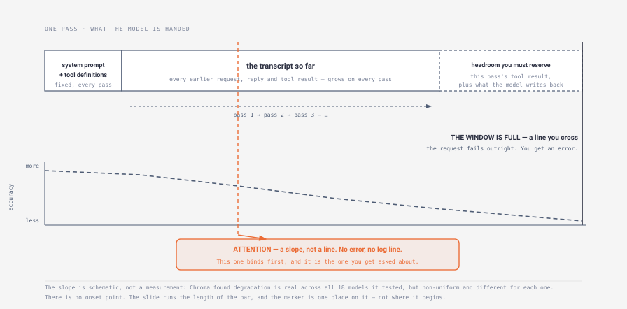
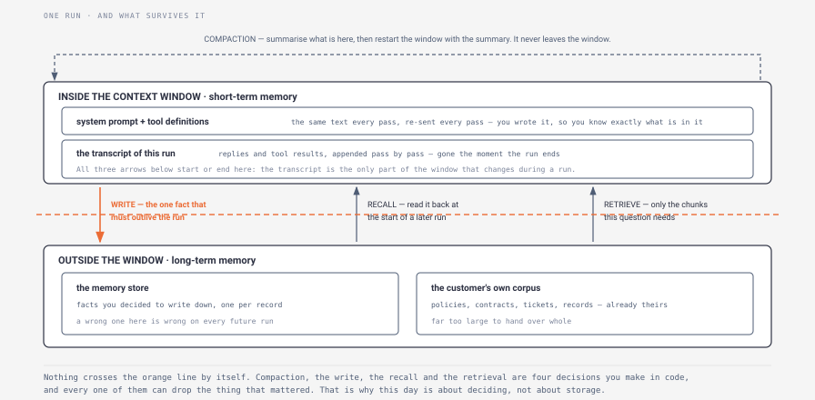

# Day 4 — Context and memory

> **The interview question this day answers:**
> "Our agent gets less accurate as the conversation gets longer, and the customer wants us to paste their whole 400-page policy manual into every request so it stops missing things. Why is that going to make it worse, and what would you do instead?"

## 1. Why this day exists

Day 2 ended by telling you that attention binds before the window does, and left the argument for today. Day 3 gave you controls that sit *around* the loop. Today is about what is *inside* it.

Right now you'd answer the question above with "the context window fills up, so we'd move to a model with a bigger one." Then it comes apart. *The customer's manual is 400 pages, well inside a million-token window — so why would a bigger window not fix it?* *Does accuracy fall off a cliff at the limit, or before it?* *You said you'd add retrieval. What if the answer to the question is spread across the whole manual rather than one clause?* *When the run ends, what does the agent still know tomorrow, and what did you have to write down for it?*

That last question is the one people fumble worst, because it sounds like a storage question and is not. It is a question about which single piece of state is worth the risk of being wrong forever.

By the end of today you can name the two independent ceilings on a prompt and say which one binds first, explain in mechanical terms why a longer input degrades accuracy, give a derived number for when to compact a conversation, and take a defensible position on retrieval over a customer's data — including when *not* to use it.

Two things today deliberately leaves alone. What all this costs in dollars is Day 19. Recording what happened so you can reconstruct it is Day 5, tomorrow.

## 2. Explain it like I'm five

Picture the bench you work at. Before you start a job, you lay out what you need: the drawing, the work order, the tools for this operation. The bench is a fixed size. Lay out too much and two things happen, in that order.

The second thing is the obvious one: you run out of bench. There is physically nowhere to put the next thing down. That is a hard stop, it is loud, and you notice it immediately.

The first thing is the one that costs you. Long before the bench is full, a crowded bench starts making you slower and less accurate. You reach for the 13 mm and come back with the 1/2 inch, because they were lying next to each other and they look the same. The two revisions of the drawing are both out, and you work from the wrong one for twenty minutes. Nothing has failed. No alarm went off. You are just quietly less reliable than you were an hour ago, and you do not know it.

That is the whole of today's first half. The model has a fixed bench. It has a hard limit you can hit, and a soft slide in accuracy that starts long before the limit and announces nothing.

Now the second half, and here the bench analogy stops working — worth saying out loud, because the gap is the point. A real bench keeps what you put on it. Walk away for lunch, come back, everything is where you left it. The model's bench is cleared completely between every single operation and laid out again from scratch. Nothing carries over on its own. The only reason the model appears to remember what happened three steps ago is that your code puts the record of those three steps back on the bench, every single time.

So "does the agent remember?" is never a question about the model. It is a question about what your code chose to lay back out. And when the job is finished and the bench is cleared for the last time, everything that was on it is gone — unless somebody wrote it into a logbook that lives in a drawer, on purpose, one line at a time.

**In plain English:** the model holds a fixed-size amount of text for one call and nothing at all between calls. Accuracy degrades as you fill that space, well before you run out of it. Anything that has to survive past the end of a run has to be written down somewhere else, by you, deliberately.

## 3. The concept, properly

### Tier 1 — The shape of it

The **context window** is the fixed amount of text the model can consider in one pass ([Day 1](../day-01-agent-loop/) defined it; it is in the [glossary](../GLOSSARY.md)). Day 1 called it one of two independent ceilings on a run, alongside the max-step cap. That was true and incomplete. There are two ceilings inside the window itself.

*What to notice: the failure you'll be asked about in an interview is the one in the middle of the bar, not the one at its right edge. The right edge throws an error you can see in a log. The middle throws nothing at all.*

**Ceiling one is the window.** The assembled prompt exceeds what the model accepts and the request fails. You get an error. This is the ceiling everyone knows about, and it is the less interesting one, because it is loud.

**Ceiling two is attention.** Anthropic's framing: models have an **attention budget** they draw on when parsing large volumes of context, and "Every new token introduced depletes this budget by some amount" ([Effective context engineering for AI agents](https://www.anthropic.com/engineering/effective-context-engineering-for-ai-agents), 29 September 2025). Fill more of the window and the model's ability to use any given part of it declines. The essay names the phenomenon **context rot**: "as the number of tokens in the context window increases, the model's ability to accurately recall information from that context decreases." Crucially, it adds: "While some models exhibit more gentle degradation than others, this characteristic emerges across all models."

So the sentence to hold onto is that **the second ceiling binds first, and it is silent.** A run that overflows the window fails visibly. A run that degrades because you handed the model 400 pages returns a confident, fluent, wrong answer, and nothing anywhere says so.

The memory half follows directly from the diagram's other property. The window is assembled fresh on every pass and discarded. Day 1's **transcript** — the running record of the goal, what the model said each pass, and what each action returned — exists only because your code re-sends it. That makes the transcript **short-term memory**: it lives inside the window, it is the reason the agent seems to remember this conversation, and it ends when the run ends. **Long-term memory** is anything you deliberately wrote somewhere else so that a *future* run can read it.

Everything in the rest of this day is one of four decisions: what to put in the window, what to summarise away, what to write down outside it, and what to fetch back in.

### Tier 2 — How it actually works

**Why a longer input degrades accuracy.** Two mechanisms, both in Anthropic's essay, and both mechanical enough to state plainly.

The first is scaling. Models are built on the **transformer** architecture, in which every token can relate to every other token in the input — **attention** being the mechanism by which the model weighs how much each token should influence its reading of every other one. Anthropic: "This results in n² pairwise relationships for n tokens. As its context length increases, a model's ability to capture these pairwise relationships gets stretched thin, creating a natural tension between context size and attention focus." Ten times the input is a hundred times the relationships to be held apart, with no more capacity to do it.

The second is training exposure. "Models develop their attention patterns from training data distributions where shorter sequences are typically more common than longer ones. This means models have less experience with, and fewer specialized parameters for, context-wide dependencies." The long window is a capability that was extended onto the model, not one it was mostly trained in.

The essay's own summary of the effect is the line to carry into an interview, because it corrects the way most people describe it: "These factors create a performance gradient rather than a hard cliff: models remain highly capable at longer contexts but may show reduced precision for information retrieval and long-range reasoning compared to their performance on shorter contexts."

**What the measurement actually looks like.** Chroma's [Context Rot](https://www.trychroma.com/research/context-rot) report (Hong, Troynikov and Huber, 14 July 2025) is the study to know, and its method matters more than any single chart. The problem with most long-context tests is that longer inputs are also harder problems, so a drop could be either. Chroma's fix was to hold the task constant and vary only the length: "our experiments hold task complexity constant while varying only the input length—allowing us to directly measure the effect of input length alone." Across 18 models, including GPT-4.1, Claude 4, Gemini 2.5 and Qwen3, its opening summary states that models "do not use their context uniformly; instead, their performance grows increasingly unreliable as input length grows", and its conclusion states: "we demonstrate that LLMs do not maintain consistent performance across input lengths."

The single result to quote is the conversational one, because it is the shape of a real deployment. Using a benchmark called LongMemEval, Chroma took 306 questions about a chat history and asked each one twice: once against the full history, which averages about 113,000 tokens, and once against a **focused** version containing only the parts needed to answer, averaging about 300 tokens. Same question, same model, same correct answer. Every model family did better on the 300-token version ([Context Rot](https://www.trychroma.com/research/context-rot)). The 112,700 extra tokens were not neutral padding. They were a second, harder task bolted onto the first — Chroma's framing is that the full-history version forces the model to "find relevant parts of the conversation history (retrieval), then synthesize them", where the focused version asks only for the second.

Three further findings are worth carrying:

- **Irrelevant is not the same as confusing.** Chroma distinguishes **distractors** — content that is topically related to the question but does not answer it — from merely irrelevant content, and reports that "Even a single distractor reduces performance relative to the baseline (needle only), and adding four distractors compounds this degradation further." In production your distractors are not synthetic. They are the three near-identical revisions of the customer's policy that all live in the same folder.
- **Model families fail differently.** "Claude models consistently exhibit the lowest hallucination rates. Specifically, Claude Sonnet 4 and Opus 4 are particularly conservative and tend to abstain when uncertain, explicitly stating that no answer can be found. In contrast, GPT models show the highest rates of hallucination, often generating confident but incorrect responses when distractors are present." Two different problems for a deployment: one model wastes a human's time, the other spends the customer's credibility.
- **Structure hurts, which nobody expects.** Chroma tested each haystack in its original order and with its sentences randomly shuffled, and found the opposite of the intuitive result: "Across all 18 models and needle-haystack configurations, we observe a consistent pattern that models perform better on shuffled haystacks than on logically structured ones." Chroma does not claim to know why, and says so — it does "not explain the mechanisms behind this performance degradation." Do not offer a mechanism either. The value of this one is that it proves how little the field knows, which is the honest thing to say about it.

**The four levers you actually have.** Anthropic names three techniques for work whose token count exceeds the window, plus a fourth strategy for getting data in. Recognise them by what they do to the window:

| Lever | What it does | Anthropic's own example |
|---|---|---|
| **Compaction** | Summarise the conversation and restart the window with the summary | Claude Code compacts, then continues with "this compressed context plus the five most recently accessed files" |
| **Structured note-taking** | The agent writes notes outside the window and pulls them back later | An agent maintaining a `NOTES.md`; Claude playing Pokémon holding tallies "for the last 1,234 steps" across a context reset |
| **Sub-agents** | A separate agent explores with its own clean window and returns only a summary | A sub-agent may use "tens of thousands of tokens or more" and return "often 1,000-2,000 tokens" |
| **Just-in-time retrieval** | Keep pointers, not payloads, and fetch on demand | Claude Code holds file paths and uses `glob` and `grep` — two ways of searching a filesystem, by name and by content — "without ever loading the full data objects into context" |

Sub-agents are Day 20's argument and I will not make it here. The first two and the last are today's.

**Setting the compaction trigger — the number you will be asked for.** "We'd compact when we get close to the limit" is not an answer. Here is a method.

Compaction has to happen while there is still room for the pass that triggers it to finish. So the trigger is the window minus the largest thing a single pass can still add. Two things get added on a pass: whatever the tools return, and whatever the model writes back.

Work it on Claude Haiku 4.5's 200,000-token window ([models overview](https://platform.claude.com/docs/en/about-claude/models/overview), checked July 2026). Day 2 derived a **response budget** of 19,700 tokens per tool result for exactly that window and a ten-pass run. Set the output cap on the request at 4,000 tokens — that is a parameter you choose, and it should come from the task: an agent whose replies are a short reasoning trace plus a tool call rarely needs more, while an agent that writes a final report needs far more and moves this arithmetic. Then:

**200,000 − 19,700 − 4,000 = 176,300 tokens, or 88% of the window.**

Now change one assumption. A single model reply may carry several `tool_use` blocks, so one pass can return three tool results rather than one:

**200,000 − (3 × 19,700) − 4,000 = 136,900 tokens, or 68% of the window.**

Same formula, twenty points apart, decided by something nobody thinks to ask: whether the model can call tools in parallel. And say what the number trades in each direction. Trigger at 88% and you compact less often, so you lose less detail and pay for less summarising — but one three-tool pass overflows the window and the run dies partway through with work already done in the customer's systems. Trigger at 68% and you are safe from that, at the cost of compacting more often, and every compaction risks what Anthropic warns about directly: "overly aggressive compaction can result in the loss of subtle but critical context whose importance only becomes apparent later."

Then the second half, which is what makes it a method rather than a sum. Once the system has run for real, replace the theoretical worst case with the observed one: take the 95th-percentile tokens-added-per-pass across your recorded runs — the size that 95 passes in every 100 stay below. If that is 22,000 rather than 59,100, the trigger moves to 174,000 — 87% — and you have bought the detail back. You also now know what fraction of passes exceed your assumption, which is the number you give the customer rather than a reassurance. Getting that distribution at all requires recording every pass, which is tomorrow.

**Short-term versus long-term, in the terms the tools use.** LangGraph draws the line as sharply as anyone and is worth knowing because interviewers use its vocabulary. Short-term memory is "thread-scoped": a **thread** is one conversation, and the state of that thread is saved by a **checkpointer** so the conversation can be resumed. Long-term memory lives in a **store**, is saved under a **namespace** — a label such as the customer's ID, grouping records the way a folder groups files — rather than under a thread, and "can be recalled at any time and in any thread" ([LangChain memory overview](https://docs.langchain.com/oss/python/concepts/memory)). Its own reason for the split is blunt: "A full history may not fit inside an LLM's context window, resulting in an irrecoverable error. Even if your LLM supports the full context length, most LLMs still perform poorly over long contexts."

The mechanics of resuming from a checkpoint belong to Week 2 and I will leave them there. What matters today is the shape: one container is scoped to a conversation and dies with it, the other is scoped to a customer and outlives everything.

### Tier 3 — What an interviewer digs into

*What to notice: compaction stays inside the window; the other three cross the line. Every crossing is code you wrote, which means every one of them is a place you can drop the thing that mattered.*

**The gap fill: retrieval over the customer's data, and when not to use it.**

Almost every real deployment involves the customer's own documents, and the standard answer is **RAG** — retrieval-augmented generation. Anthropic's own description: "RAG is a method that retrieves relevant information from a knowledge base and appends it to the user's prompt" ([Introducing Contextual Retrieval](https://www.anthropic.com/engineering/contextual-retrieval), 19 September 2024). The machinery, in three steps from that post: break the documents into **chunks** of "usually no more than a few hundred tokens"; use a model to turn each chunk into an **embedding**, a list of numbers standing for its meaning, such that two chunks about the same thing sit close together; store those in a **vector database** "that allows for searching by semantic similarity." At query time you embed the question, take the closest handful of chunks — the **top-k** — and append them to the prompt.

Now the decision, and it is the one worth being able to argue both ways.

**The case for skipping retrieval entirely** comes from Anthropic in the same post: "If your knowledge base is smaller than 200,000 tokens (about 500 pages of material), you can just include the entire knowledge base in the prompt that you give the model, with no need for RAG or similar methods." Note the date on that sentence — September 2024 — and note that the customer's 400-page manual sits comfortably inside it. On that advice, the customer in the interview question is right.

**The case against it** is Chroma's, ten months later: a 113,000-token prompt lost to a 300-token prompt on the same 306 questions. If the manual is 400 pages and each question touches two clauses, then handing over all 400 pages means 398 pages of distractors, and Chroma's distractor result says a single one already costs you.

And Anthropic's own position moved between the two posts. The September 2025 essay says context "must be treated as a finite resource with diminishing marginal returns", and argues for holding "lightweight identifiers (file paths, stored queries, web links, etc.)" and loading data at runtime instead of "pre-processing all relevant data up front" — with the honest caveat that "runtime exploration is slower than retrieving pre-computed data." Same lab, one year apart, and the default has flipped from *put it all in* toward *fetch what you need*. Do not paper over that. Two sourced positions from the same organisation, dated, is a better thing to say in a room than a confident synthesis.

**The question that dissolves the argument** is not "how big is the corpus" but *what fraction of it is relevant to one question*. A 150,000-token corpus where every question needs most of it should go in whole. A 150,000-token corpus where every question needs 400 tokens of it should not, no matter how comfortably it fits. Anthropic's own hybrid — "retrieving some data up front for speed, and pursuing further autonomous exploration at its discretion" — is what most real systems end up as.

**Four cases where retrieval is the wrong tool**, which is the half of this that candidates never have ready:

1. **The question is about the whole document.** *Summarise this contract.* *Is anything missing from this filing?* Chunks cannot answer a question about absence — [Chroma](https://www.trychroma.com/research/context-rot) cites a benchmark built precisely on that, AbsenceBench, "which tests models for recognizing the absence of a given snippet of text." Retrieval returns what is there. It has no way to hand you what is not.
2. **The data changes faster than you can re-index.** Anthropic's argument for `glob` and `grep` over an index is that it "effectively bypass[es] the issues of stale indexing" ([essay](https://www.anthropic.com/engineering/effective-context-engineering-for-ai-agents)). If the customer's records change hourly, an index is a second system that can be wrong, and the freshest possible read is the tool call you already built on [Day 2](../day-02-tool-use/).
3. **The lookup is exact.** Semantic similarity is the wrong instrument for *find ticket INC-4471*. Anthropic's own illustration is a support query for "Error code TS-999", where "An embedding model might find content about error codes in general, but could miss the exact 'TS-999' match" ([Contextual Retrieval](https://www.anthropic.com/engineering/contextual-retrieval)) — which is why their recipe pairs embeddings with BM25, a keyword-matching ranking function that looks for the literal string. In a deployment the better answer is often neither: it is a query against the system of record, which returns the row rather than a chunk that mentions it.
4. **Chunking has already destroyed the answer.** Anthropic's example is exact and worth memorising because it is so mundane. A chunk reads "The company's revenue grew by 3% over the previous quarter." Retrieved on its own it is useless: no company, no quarter. Their fix, Contextual Retrieval, prepends a generated sentence of context to each chunk before embedding it — "This chunk is from an SEC filing on ACME corp's performance in Q2 2023; the previous quarter's revenue was $314 million." — and they report it "can reduce the number of failed retrievals by 49% and, when combined with reranking, by 67%" ([Contextual Retrieval](https://www.anthropic.com/engineering/contextual-retrieval)), **reranking** being a second pass that reorders the retrieved candidates by relevance before any of them reach the prompt.

**Setting k.** Same discipline as the compaction trigger. The floor comes from the task: if a correct policy answer typically cites two clauses and a clause is one chunk, k cannot be below 2. Then raise it, because retrieval misses — with a labelled set of real questions you can measure how often the needed chunk fell outside the top k, and that measurement is the only honest basis for the number. The ceiling comes from the other direction: every extra chunk you pull in is a distractor candidate, and Chroma showed one distractor is enough to cost you. So k is bounded below by recall and above by rot, and the labelled set that tells you where to sit between them is Week 3's work. Saying "I'd need twenty labelled questions before I'd defend a k" is a stronger answer than any number.

**Two more things an interviewer will probe.**

**"Models ignore the middle of the context, right?"** Be careful here, because this is repeated everywhere and Chroma's own data does not support it for their task: "Testing across 11 needle positions, we find no notable variation in performance for this specific NIAH task." The finding they *did* get is that degradation tracks input length, ambiguity and distractors — not position. Asserting the position effect as settled fact is a cheap way to be caught, and declining to assert it is a cheap way to look like you read the paper.

**Who is telling you this, and what do they sell?** Chroma sells a vector database, so a report showing that long context is unreliable supports its product. Anthropic sells a model with a very large window, and published an essay arguing you should put less into it. Neither of those makes either wrong — the Chroma method is public and replicable, with its [full codebase](https://github.com/chroma-core/context-rot) released — but noticing the incentive in both directions is exactly the habit that separates someone who read the sources from someone who read a summary of them.

## 4. What the resources say

### Anthropic — "Effective context engineering for AI agents"
**What it is:** Essay, ~45 min, free. [Link](https://www.anthropic.com/engineering/effective-context-engineering-for-ai-agents) · published 29 September 2025.

**The one idea to take:** context is a budget with diminishing returns, not a container you fill. The essay's four practical techniques — compaction, structured note-taking, sub-agents, just-in-time retrieval — are the vocabulary an interviewer will use.

**The line worth quoting in an interview:** "find the smallest set of high-signal tokens that maximize the likelihood of your desired outcome"

**Skip if:** nothing. This is the highest-value 45 minutes on the list. If you only have ten, read the sections "Why context engineering is important to building capable agents" and "Compaction". Its companion post [Introducing Contextual Retrieval](https://www.anthropic.com/engineering/contextual-retrieval) is where the retrieval mechanics in Tier 3 come from, and is worth a further twenty minutes.

### Chroma — "Context Rot: How Increasing Input Tokens Impacts LLM Performance"
**What it is:** Technical report, ~1 hr, free. [Link](https://www.trychroma.com/research/context-rot) · Kelly Hong, Anton Troynikov, Jeff Huber, 14 July 2025.

**The one idea to take:** the experimental design, not the charts. Holding task difficulty constant and varying only input length is what makes the result mean anything, and describing that design is how you demonstrate you read it rather than a thread about it.

**The line worth quoting in an interview:** "we demonstrate that LLMs do not maintain consistent performance across input lengths"

**Skip if:** you are short on time — in which case read the opening summary, the LongMemEval section, and the Conclusion, and skip the four needle-in-a-haystack experiments. Do not skip the Limitations section, which is unusually honest: it states plainly that the report does not explain *why* degradation happens, and that real applications should expect the effect to be worse than measured, not better. One practical note: the report's original address, `research.trychroma.com/context-rot`, now redirects to the link above.

### Letta / MemGPT — the paper, and the product it became
**What it is:** Paper plus product docs, ~1.5 hr, free. [MemGPT paper](https://arxiv.org/abs/2310.08560) (Packer, Wooders, Lin, Fang, Patil, Stoica, Gonzalez, 12 October 2023) · [Letta docs](https://docs.letta.com/).

**The one idea to take:** the operating-system metaphor. The paper proposes "virtual context management, a technique drawing inspiration from hierarchical memory systems in traditional operating systems that provide the appearance of large memory resources through data movement between fast and slow memory." Read that as: a small fast tier the model always sees, a large slow tier it must ask for, and code that decides what moves between them. That is the shape of every agent memory system you will meet, whatever it is called.

**The line worth quoting in an interview:** "a system that intelligently manages different memory tiers in order to effectively provide extended context within the LLM's limited context window"

**Skip if:** you were planning to learn the paper's terminology in order to use it. **Read the abstract and the introduction, then go to the docs instead** — because the product has moved on from the paper's vocabulary, and reciting 2023 terms is a tell. Letta today describes its long-term memory as **MemFS**, "the git-backed filesystem where a Letta agent stores long-term memory", holding plain Markdown files the agent can edit and version ([MemFS docs](https://docs.letta.com/concepts/memfs/index.md)). The design detail worth stealing is the tiering, which is explicit: files under `system/` "are loaded into the agent's system prompt on every turn", while files outside it "remain discoverable through the memory tree, but their full contents are loaded only when relevant. This keeps the active context lean while preserving deeper reference material." That is today's whole lesson expressed as a directory layout.

### LangGraph — memory: checkpointers and stores
**What it is:** Docs, ~45 min, free. [Link](https://docs.langchain.com/oss/python/concepts/memory) · checked July 2026.

**The one idea to take:** the short-term/long-term split as an engineering distinction with two different containers. Short-term is thread-scoped state persisted by a checkpointer; long-term is namespaced records in a store, readable from any thread.

**The line worth quoting in an interview:** "Even if your LLM supports the full context length, most LLMs still perform poorly over long contexts."

**Skip if:** you are not going to write LangGraph code — but read the "Long-term memory" section anyway, because it supplies the taxonomy an interviewer may reach for: **semantic** memory (facts about the user), **episodic** memory (past actions and examples) and **procedural** memory (the rules the agent follows). It also names a genuine design fork you can use: memories written "in the hot path" during the run are available immediately but add latency and force the agent to multitask, while memories written "in the background" cost nothing in the moment but may leave the next run reading stale state. Note that the URL in `FDE_Report` has moved; the address above is where it resolves now.

## 5. Suggested exercise (optional)

**The exercise:** keep all state in the context window by default, then add external memory for exactly one piece of state — the single thing that must outlive the run.

**What doing it would teach you that reading cannot:** how hard it is to find a second piece of state that qualifies. The instinct is that an agent needs memory, broadly, and that more of it is better. Actually trying to name what must survive the run ending usually produces a list of one, and it is almost never a preference or a summary. It is an identifier: the ticket number you already created, the payment you already submitted, the email you already sent. Everything else can be re-derived from the customer's systems next time, and re-deriving it is safer than trusting a copy you made.

The second thing it teaches is that the write is the dangerous part. Reading a stale note gives you a wrong answer once. Writing a wrong note gives you a wrong answer on every run from now on, and there is nothing in the loop that will ever notice.

**What it involves:** roughly, run the same agent twice against the same task, deliberately give it nothing between runs, and see what breaks. Then add one durable record and see what stops breaking. The interesting output is not the code — it is the list of things you *thought* needed to persist and then found you could look up instead.

**Optional — skip it if you're reading only.** You can get most of the benefit by doing the naming exercise on paper for a workflow you know: write down every piece of state the agent holds, then cross out everything that could be looked up again from the source system. Whatever survives is your answer, and being able to say "in this workflow exactly one thing needed to persist, and here's why" is the interview-grade version.

## 6. Where it breaks

The FDE job is the failure list. Here is this day's, and note how many of these produce no error at all.

| Failure mode | What it looks like in production | The mitigation |
|---|---|---|
| **Silent degradation before the limit** | Accuracy drifts down across a long conversation. No error, no log line, no alert. A user says "it used to be better in the mornings" and they are describing shorter conversations. | Cap the conversation. Compact at a derived trigger. Measure quality against input length rather than assuming it is flat — this is the single most valuable thing on the list. |
| **Window overflow mid-run** | The run dies at pass eight of ten with an error about input length, after eight passes of work already landed in the customer's systems. | Reserve headroom for the worst single pass, as derived in Tier 2. The recovery half — resuming without redoing the eight — is Week 2's. |
| **One tool returns a payload that eats the run** | A single document fetch returns 40,000 tokens and every later pass is vaguer, reading as the model "losing focus". | A response budget, from [Day 2](../day-02-tool-use/). Paginate rather than truncating mid-record. |
| **Compaction drops the load-bearing detail** | The summary keeps the plan and loses the customer's one exception, which mattered only at the last step. Nothing in the transcript records that it was ever there. | Tune the compaction prompt on real traces — Anthropic advises maximising recall first, then trimming for precision. Keep raw traces outside the window so the loss is recoverable. |
| **The memory store is unreachable** | The read to the long-term store times out. The agent proceeds as though the customer has no history, and behaves like a stranger on their fourth call — or worse, writes a duplicate record on the way past. | Decide fail-closed or fail-open before it happens ([Day 3](../day-03-guardrails/)). For a memory read the usual right answer is fail-open-but-say-so: continue without the memory and mark the run as having run blind, rather than silently pretending the store was empty. |
| **A wrong fact gets written to long-term memory** | The agent records "this customer approves invoices over £10,000 without review" from one misread thread. It is now wrong on every future run, and no future run has any reason to question it. | Restrict what may be written, not just what may be read. Prefer identifiers and customer-confirmed facts over inferences. Give every record a source and a date so a human can audit it. Note the crossover: content the agent fetched can carry instructions, so this is [Day 3](../day-03-guardrails/)'s indirect injection with a permanent blast radius. |
| **Distractors from the customer's own filing** | Three revisions of the same policy sit in the same folder. Retrieval returns two of them and the model answers from the superseded one, fluently. | Deduplicate and date the corpus before you index it. This is usually a data-hygiene conversation with the customer, not a model problem — and having it early is the job. |
| **The answer was in chunk k+1** | Retrieval returns its top k, the needed clause was ranked k+1, and the model answers confidently from what it was given. Indistinguishable from the model being wrong. | Log what was retrieved on every run, so a wrong answer can be traced to a retrieval miss rather than blamed on the model. Then set k against measured misses. |

Read that list again for what it does *not* contain. Only two rows raise something a monitor could catch: the window overflowing, and the store being unreachable. The other six announce nothing at all — the silent slide, the fat tool result, the compaction that dropped the exception, the wrong fact written down, the customer's own near-duplicates, and the clause ranked one place too low. Nobody gets paged for any of them. That is the argument for tomorrow.

## 7. Watch this

Two videos, and deliberately different in kind: eight minutes on the finding, then a working team on what they do about it.

### 1. Chroma — "Context Rot: How Increasing Input Tokens Impacts LLM Performance"
**Chroma · 7 min 56 s · [Watch](https://www.youtube.com/watch?v=TUjQuC4ugak)**

Why this one: the authors' own eight-minute summary of the report you are meant to read for an hour. Watch it first, then decide which sections of the report to read properly.

**Worth watching:** this video has **published chapter markers**:

- `1:44` — Models struggle with long context (chapter marker)
- `3:09` — Ambiguity compounds challenges (chapter marker)
- `4:28` — Models struggle with distractions (chapter marker)
- `5:30` — Models are not reliable computing systems (chapter marker)
- `6:24` — Context Engineering (chapter marker)

The fourth chapter is the one that changes how you talk to customers. The claim is not that the model is bad at hard problems; it is that a task as trivial as copying a list of repeated words back becomes unreliable as the list gets longer. A customer who believes "it's software, so it either works or it doesn't" needs that example, not an explanation of attention.

### 2. LangChain — "Context Engineering for AI Agents with LangChain and Manus"
**LangChain · 1 hr 0 min · [Watch](https://www.youtube.com/watch?v=6_BcCthVvb8)**

Why this one: Manus is a shipped agent product, and this is its team describing the context decisions they actually made, in the same vocabulary as Anthropic's essay. It is long — use the chapters and treat it as four short talks. Published 14 October 2025.

**Worth watching:** **published chapter markers**:

- `15:00` — Context reduction in Manus (chapter marker)
- `19:20` — Context isolation in Manus (chapter marker)
- `22:17` — Context offloading in Manus (chapter marker)
- `29:00` — Avoid context over-engineering (chapter marker)
- `31:55` — Q&A: Indexing (vectorstore) vs just using files (chapter marker)

Those five chapters run to about seventeen minutes in total. The last one is the Tier 3 argument being had by people who ship, and the one before it is the counterweight this whole day needs: it is possible to over-engineer context management and end up with a system whose behaviour nobody can predict, which is a worse failure than a prompt that was slightly too long.

## 8. Say this in an interview

### "Our agent's accuracy drops as the conversation gets longer. What's happening and what would you do?"

**Weak:** "You're filling up the context window. I'd move to a model with a bigger one, or trim the history."

**Strong:** "There are two separate ceilings and I'd want to know which one you're hitting, because they need different fixes. If you're seeing errors about input length, that's the window and it's a plumbing problem. If accuracy is sliding with no errors at all, that's attention, and a bigger window won't help — Chroma tested 18 models and found performance 'grows increasingly unreliable as input length grows', across all of them. Their sharpest result is the one that matches your symptom: same 306 questions, once against 113,000 tokens of full chat history and once against a 300-token focused version, and every model family did better on the short one. So the first thing I'd do is measure quality against conversation length to confirm which ceiling it is, then reduce what's in the window rather than enlarge the window."

**Why the strong one lands:** it refuses to accept the customer's diagnosis, distinguishes two failure modes that look the same from the outside, and proposes a measurement before a fix.

### "Should we use RAG over the customer's documents, or put them in the context window whole?"

**Weak:** "RAG. That's the standard approach for a company's own data, and it scales."

**Strong:** "It depends on what fraction of the corpus one question needs, not on how big the corpus is. Anthropic's own guidance in 2024 was that under about 200,000 tokens — roughly 500 pages — you can put the whole knowledge base in the prompt with no retrieval at all. But their 2025 essay argues the other way, for holding pointers and fetching at runtime, and Chroma's data says the irrelevant 398 pages actively hurt you. So the question I'd ask the customer is: for a typical question, how much of this document is relevant? If the answer is 'most of it', put it in. If it's 'two clauses', retrieve. And there are cases where retrieval is the wrong tool no matter the size — anything asking what's *missing* from a document can't be answered from chunks, and an exact lookup like a ticket number should be a query against their system of record, not a similarity search."

**Why the strong one lands:** it reframes the question from a size threshold to a relevance ratio, cites two dated positions rather than one confident rule, and names where the default approach fails outright.

### "What would you put in long-term memory?"

**Weak:** "Anything useful about the user — their preferences, past conversations, a summary of what we've done. The more it remembers, the better it gets."

**Strong:** "My default is nothing, and I'd make each item argue for itself against one test: does it have to survive the run ending, and can it not be looked up again from your systems? Almost everything fails that test — preferences and summaries can be re-derived, and re-deriving them is safer than trusting a copy. What usually passes is an identifier: the ticket we already opened, the payment we already submitted. And I'd weight the write far more heavily than the read, because a wrong fact in long-term memory is wrong on every future run and nothing in the loop will ever question it. So writes get restricted to things the customer confirmed, with a source and a date attached so a human can audit them."

**Why the strong one lands:** it makes the conservative choice the default and gives a test rather than a policy, and it treats a memory write as a change with permanent blast radius — which is how a security team thinks about it too.

You should recognise the four levers when a customer describes one, and be able to say which one their situation calls for. If they say "it forgets what we discussed earlier in the call", that is compaction or a longer thread. If they say "it forgets between calls", that is a store. Those are different systems, and hearing which one they mean is most of the diagnosis.

## 9. Vocabulary

| Term | Plain definition | Why an FDE cares |
|---|---|---|
| **Attention** | The mechanism by which a model weighs how much each token in the input should influence its reading of every other token. | It is the thing that gets stretched thin, so it is the mechanism behind every claim on this page. |
| **Transformer** | The architecture underneath every model you will meet, in which every token can attend to every other token in the input. | It is *why* long context degrades — the relationships to be held apart grow as the square of the input. |
| **Attention budget** | Anthropic's term for the finite capacity a model draws on to parse its context; every token added depletes it. | Turns "the prompt is too long" into a resource argument a customer can follow. |
| **Context rot** | The measured decline in a model's ability to use information as the input gets longer, with no error raised. | The failure mode you will be asked about, and the one that never appears in a log. |
| **Performance gradient** | Anthropic's framing that long-context degradation is a slope, not a cliff at the window limit. | Stops you promising the system is fine up to the limit and broken after it. |
| **Needle in a haystack (NIAH)** | A test that hides one known sentence in a long document and asks the model to find it. | The benchmark whose near-perfect scores created the belief that long context is solved. Know what it does *not* measure. |
| **Distractor** | Content that is topically related to the question but does not answer it, as distinct from merely irrelevant content. | In a customer's data these are free and everywhere: old revisions, near-duplicates, superseded policies. |
| **Compaction** | Summarising a conversation that is nearing the window limit and restarting the window with the summary. | The first lever you reach for, and the trigger point is a number you must be able to derive. |
| **Structured note-taking (agentic memory)** | The agent writing notes to storage outside the window and pulling them back in later. | The cheapest form of long-term memory, and the one whose failure mode is a wrong note that never gets questioned. |
| **Short-term memory** | Everything inside the context window for this run — in practice, the transcript. Rebuilt every pass, gone when the run ends. | Where state belongs by default. Most "we need memory" conversations are solved here. |
| **Long-term memory** | Anything deliberately written outside the window so a future run can read it. | Every item in it is a permanent liability as well as an asset. The default should be empty. |
| **Thread** | One conversation, as a unit of scope — the way an email client groups a chain. | The boundary that decides whether state dies with the conversation or outlives it. |
| **Checkpointer** | The component that saves a thread's state so the conversation can be resumed. LangGraph's name for it. | Names the short-term half precisely. The durability mechanics are Week 2's. |
| **Store** | A container for long-term memory, keyed by a namespace rather than a thread, readable from any conversation. | The other half of the split, and the thing a customer's security team will ask where it lives. |
| **RAG (retrieval-augmented generation)** | Fetching relevant pieces of a document collection at query time and appending them to the prompt. | The default answer for customer data, and knowing when it is the wrong answer is the differentiator. |
| **Chunk** | One small slice of a document, usually a few hundred tokens, stored and retrieved as a unit. | Chunk boundaries decide what can be found. A badly chunked corpus cannot be fixed by a better model. |
| **Embedding** | A list of numbers representing a piece of text's meaning, arranged so similar texts sit close together. | How "find me relevant text" becomes a computation. It matches meaning, which is why it misses exact strings. |
| **Vector database** | A store for embeddings that can return the closest matches to a query. | Where the customer's indexed data physically sits — a second copy of their documents, with its own access-control conversation. |
| **Top-k** | The number of chunks retrieval returns for one query. | A knob with recall below it and context rot above it. Derive it, then measure it. |
| **Reranking** | A second pass that reorders retrieved candidates by relevance before any of them reach the prompt. | Buys retrieval accuracy without lengthening the prompt. The price is an extra step and its latency, not a bigger context. |
| **Just-in-time retrieval** | Holding lightweight pointers — paths, queries, links — and loading the data only when needed. | Anthropic's current preferred pattern, and the answer to "our data changes hourly, how do you keep the index fresh?" |

## 10. Test yourself

<b>Q1.</b> Name the two ceilings on a prompt and say which one binds first.

The window and attention. The window is the fixed amount of text the model accepts: exceed it and the request fails with an error. Attention is the model's finite capacity to use what is in the window, and it degrades continuously as the input grows. Attention binds first, and it binds silently — no error, no log line. That asymmetry is why the second one is the interview question.

<b>Q2.</b> Why does a longer input degrade accuracy? Give the mechanism, not the analogy.

Two mechanisms, both from Anthropic's essay. First, models are built on the transformer architecture where every token can attend to every other, so n tokens produce "n² pairwise relationships" and the model's ability to hold them apart "gets stretched thin". Second, models were trained mostly on shorter sequences, so they have "less experience with, and fewer specialized parameters for, context-wide dependencies." The essay's own summary: "a performance gradient rather than a hard cliff."

<b>Q3.</b> What made Chroma's Context Rot study worth citing, when everyone already believed long context was imperfect?

The experimental design. Most long-context tests make the task harder as the input grows, so a drop could be either cause. Chroma held task complexity constant and varied only input length, across 18 models including GPT-4.1, Claude 4, Gemini 2.5 and Qwen3, and released the codebase. That is what lets you say input length alone caused the degradation, rather than the problems getting harder.

<b>Q4.</b> What is the difference between short-term and long-term memory, in one sentence each, and where does the transcript sit?

Short-term memory is everything inside the context window for this run, rebuilt on every pass and gone when the run ends. Long-term memory is anything you deliberately wrote outside the window so a later run can read it. The transcript is short-term: it exists only because your code re-sends it each pass, and it dies with the run.

<b>Q5.</b> A customer wants their 400-page policy manual pasted into every request so the agent stops missing things. What do you ask, and what do you tell them?

Ask what fraction of the manual a typical question actually needs. If the answer is "most of it", their instinct is defensible — Anthropic's 2024 guidance was that under about 200,000 tokens, roughly 500 pages, you can include the whole knowledge base with no retrieval. If it's "two clauses", tell them the other 398 pages are distractors, and Chroma's data shows a single distractor already reduces accuracy. Then propose measuring it rather than arguing: run a set of their real questions both ways.

<b>Q6.</b> Your agent compacts the conversation when it gets long. What number do you have to defend, and how do you arrive at it?

The trigger point. Derive it as the window minus the largest thing one pass can still add: the biggest tool result your response budget permits, plus the output cap you set. On Haiku 4.5's 200,000-token window with Day 2's 19,700-token response budget and a 4,000-token output cap, that's 176,300 — 88% of the window. If one reply can carry three tool calls, it becomes 200,000 − 59,100 − 4,000 = 136,900, or 68%. Then replace the worst case with the 95th percentile from real traces.

<b>Q7.</b> Name two situations where retrieval over the customer's documents is the wrong tool regardless of how big the corpus is.

First, questions about the whole document or about absence — *summarise this contract*, *is anything missing from this filing* — because retrieval returns what is there and has no way to hand you what is not. Second, exact lookups: finding ticket INC-4471 should be a query against the system of record, not a similarity search over chunks. A third is data that changes faster than you can re-index, where a fresh tool call beats a stale index.

<b>Q8.</b> A customer says "just remember everything the user tells you, it'll get smarter." What's wrong with that, and what do you propose?

Reads and writes have very different risk. A stale read gives a wrong answer once; a wrong write gives a wrong answer on every future run, and nothing in the loop will question it — imagine "this customer approves invoices over £10,000 without review" recorded from one misread thread. Propose that long-term memory starts empty and each item passes one test: it must have to survive the run ending, and it must not be re-derivable from their systems. Attach a source and a date to everything written, so a human can audit it.

<b>Q9.</b> An interviewer says: "models ignore the middle of the context — that's well established." How do you respond?

Carefully, and without asserting it. Chroma tested 11 needle positions and reported "no notable variation in performance for this specific NIAH task" — so on the study most people are half-remembering, position was not the factor. What their data does support is degradation with input length, with lower question-to-answer similarity, and with distractors. Saying "I've seen that claim but the study I'd cite found position effects didn't show up in their setup" is stronger than agreeing, and it's true.

<b>Q10.</b> An interviewer pushes back: "Chroma sells a vector database. Aren't they just marketing?" What do you say?

Grant the incentive, then point at the method. The report's codebase is public and the design is replicable, and its Limitations section states plainly that it does not explain why degradation happens — which is not how marketing is written. Then note the incentive runs the other way too: Anthropic sells a model with a very large window and published an essay arguing you should put less into it. Both have an angle; the method is what you evaluate.

---

**Next up (Week 1):** Day 5 makes all of this visible. Most of §6's failures raise nothing anywhere, which means the only way you ever learn they happened is if the run recorded what it did — tracing, spans, and reconstructing a run step by step.
