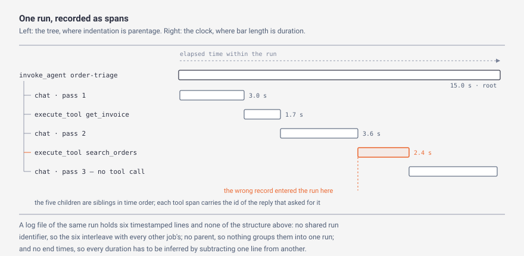
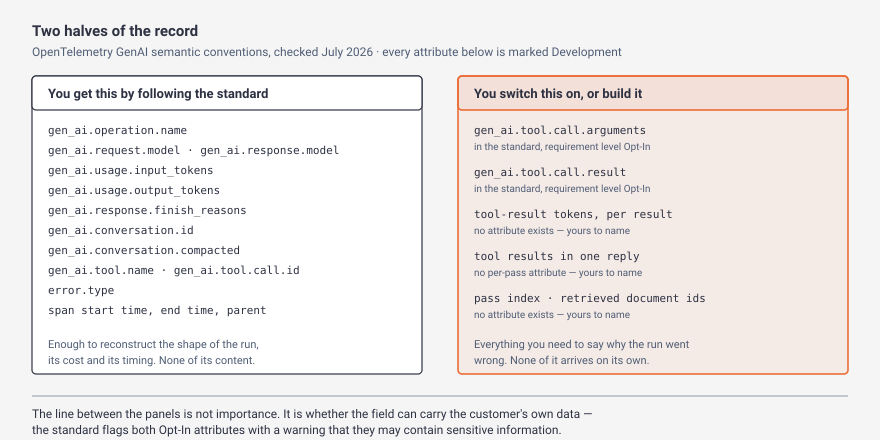

# Day 5 — The audit trail

> **The interview question this day answers:**
> "A customer emails you on Friday: the agent gave their team the wrong answer on a job it ran on Tuesday. Nothing alerted, nothing errored, and nobody can reproduce it. Walk me through how you find out what happened."

## 1. Why this day exists

Yesterday ended on a list of nine ways an agent goes wrong, and Day 4's own count was that only two of them raise anything a monitor could catch. Among the silent ones: the slide in accuracy, the fat tool result, the summary that dropped the one exception, the wrong fact written to memory, the customer's own near-duplicate documents, the clause ranked one place too low. None of those raise an error, and nobody gets paged for any of them.

Right now your answer to Friday's email is "I'd look at the logs." Then it comes apart in three questions. *Which log lines belong to that one job, out of the forty thousand the service wrote on Tuesday?* *Your log says the agent called `search_orders` — what did `search_orders` give back?* *Can you re-run it?*

The third one is where most people discover the problem is not a tooling gap. [Day 1](../day-01-agent-loop/) established that the same prompt does not reliably produce the same output, even with **temperature** set to zero — so you cannot re-run Tuesday's job and watch it fail the same way again. In ordinary software, reproducing the bug *is* the debugging technique. Here it is unavailable in that form. Be precise about what survives: if you captured what went in, you can send it again and see how often the failure recurs, which is a measurement rather than a reproduction. If you did not, there is nothing. Either way the record made at the time is not a nice-to-have on top of debugging — it is the only evidence there will ever be.

By the end of today you can say precisely what a trace is and how it differs from a log, name the vendor-neutral standard and what it does and does not give you, defend how much of a run you keep and for how long with a derived number in each case, and describe what a complete trace still cannot tell you.

Two things today leaves alone. Sorting failures into named categories you can count comes later in the course — this day is about the record, not the taxonomy. Scoring runs against known-correct answers is Week 3.

## 2. Explain it like I'm five

A machine on the shop floor made a bad part on Tuesday. You have two kinds of record, and the difference between them is the whole of today.

The first is the shift log. Somebody wrote down that the machine ran from 06:00, that there were no alarms, and that it stopped at 14:00. It is true, it is cheap, and it tells you nothing. The machine ran. You already knew the machine ran, because you are holding the bad part it made.

The second is a data logger wired into the machine, with a channel on every station: spindle load at the drilling station, coolant temperature, clamp pressure at the fixture sampled every tenth of a second, which pallet went in and which came out. All of it stamped against the same clock, so you can lay the channels on top of each other and see that the clamp pressure sagged eleven seconds into the cycle and the spindle load spiked right after it. Now you have where, when, in what order, and what the machine was reacting to.

Everybody who has instrumented a test bench knows the next problem too: the channels you did not wire up. If nobody put a sensor on the coolant line, no amount of staring at the data tells you the coolant was low. The record is not the truth about the run. The record is exactly the set of things somebody decided in advance to measure, and everything else is gone.

And here is where this machine is unlike the one you know. A conventional machine is repeatable: run the same program on the same stock and you get the same part, so if you are unsure what happened you set it up again and watch. Feed this one the identical job tomorrow and it may do something slightly different, for reasons nobody can point at. So "set it up again and watch" is not available, and the recording you made the first time is what you have.

**In plain English:** a log tells you that something happened. A trace tells you what happened, in what order, nested inside what, with what going in and what coming out at every step. For a system you cannot re-run, the trace is not a debugging aid. It is the only account of the run that will ever exist, and it contains exactly what you decided to record.

## 3. The concept, properly

### Tier 1 — The shape of it

Start with the three words that get used interchangeably and should not be.

**A log line** is one independent statement that something happened, written at a moment in time. `14:02:11 called search_orders`. It stands alone. It knows nothing about the line above it.

**A metric** is a number aggregated across many events. *Average response time this hour: 3.4 seconds.* *Error rate: 0.8%.* A metric is how you notice a problem across a population. It can never explain one case, because by construction it has thrown the individual cases away.

**A trace** is the record of one request as it moved through your system, kept as a tree. The units of that tree are **spans**. A span is one piece of work with a start time, an end time, a parent, and a set of labelled fields called **attributes**. Because every span knows its parent, the tree preserves *what caused what* — which is the property a pile of log lines does not have.

Langfuse, whose documentation is the first resource for today, draws the distinction as cleanly as anyone: "Observability is the broader capability of understanding the internal state of your system from its outputs. It encompasses tracing, metrics, and logging. Tracing is a specific observability technique that records the flow of a request through your system, preserving causal relationships between operations" ([Langfuse observability overview](https://langfuse.com/docs/observability/overview), checked July 2026). *Preserving causal relationships* is the phrase to keep. That is what you are buying.

Here is one run of an agent, recorded that way.

*What to notice: the two halves say different things. The tree on the left says these six spans are one run; the clock on the right says how long each took and in what order. A flat log file gives you neither, and no amount of work afterwards puts them back.*

Line the tree up against vocabulary you already have. [Day 1](../day-01-agent-loop/)'s **pass** — one trip round the loop, where the model reads the **transcript**, decides, and either acts or stops — is one `chat` span in that diagram, together with the tool spans that follow it. So a five-pass run has one outer span, five model spans, and one tool span for every **tool call** the model made. The **max-step cap** from Day 1 is a limit on how many model spans one run may contain, and now you can see it in the record rather than infer it.

Two properties of the tree matter more than they look.

**Every span in one run shares one identifier — the trace ID** — and each span also carries its own ID and its parent's, which is what makes the tree a tree. The trace ID is what answers the first of Friday's three questions: out of forty thousand log lines, Tuesday's job is one query. Two consequences. If a tool of yours runs as a separate service, its spans join this trace only if the trace ID travels with the request; otherwise it produces a second, orphaned trace, which is the commonest way a real agent trace comes out incomplete. And the trace ID is reachable from Friday's email only if the customer's own keys — their invoice number, their ticket — are on the root span.

**A span has an end, not just a beginning.** A log line is written at an instant. A span is opened and closed, so its duration is a fact in the record rather than a subtraction you perform between two lines that might not be adjacent.

### Tier 2 — How it actually works

**The standard, and where it actually lives.** Rather than instrument against one vendor's software library, you instrument against a published schema of span names and attribute names, so the same recording can be read by any tool that follows it. That schema is the **OpenTelemetry GenAI semantic conventions**.

Two facts about it are worth getting right. First, as of July 2026 these conventions no longer live in OpenTelemetry's main `semantic-conventions` repository. That page now reads only "Moved: Generative AI semantic conventions" and points at a separate one, `semantic-conventions-genai` ([the moved page](https://github.com/open-telemetry/semantic-conventions/blob/main/docs/gen-ai/README.md) · [the live repository](https://github.com/open-telemetry/semantic-conventions-genai)). Second, its own front page gives its status as "**Status**: [Development]" ([GenAI conventions index](https://github.com/open-telemetry/semantic-conventions-genai/blob/main/docs/gen-ai/README.md), checked July 2026). Every generative-AI attribute in the registry carries that label and not one is marked *Stable*, which in OpenTelemetry's vocabulary means the names may still change.

What the conventions define is a small set of operations, each becoming one span. `gen_ai.operation.name` takes one of a fixed list of values, and the ones an agent produces are `chat` (one call to the model), `execute_tool` (one tool running), `invoke_agent`, `invoke_workflow`, `plan`, `retrieval`, and a family of memory operations that is [Day 4](../day-04-context-and-memory/)'s **store** appearing in the schema. Span names are formulaic — "**Span name** SHOULD be `execute_tool {gen_ai.tool.name}`" for a tool ([GenAI spans](https://github.com/open-telemetry/semantic-conventions-genai/blob/main/docs/gen-ai/gen-ai-spans.md), checked July 2026) — which is the diagram above, spelled as a rule.

**Now the part that decides whether the record is any use.** Attributes in these conventions carry a *requirement level*, and there are four: `Required`, `Conditionally Required` (required whenever the value is available), `Recommended`, and `Opt-In`. `Opt-In` is the one to know, because it means an instrumentation is not expected to record the attribute at all unless you deliberately turn it on. Four attributes carry that level, and between them they are the entire content of the run:

- `gen_ai.tool.call.arguments` — "Parameters passed to the tool call."
- `gen_ai.tool.call.result` — "The result returned by the tool call (if any and if execution was successful)."
- `gen_ai.input.messages` — "The chat history provided to the model as an input."
- `gen_ai.output.messages` — the messages the model returned.

All four carry the same warning in the specification: "This attribute may contain sensitive information" ([GenAI spans](https://github.com/open-telemetry/semantic-conventions-genai/blob/main/docs/gen-ai/gen-ai-spans.md), checked July 2026).

Read that back against Friday's second question — *what did `search_orders` give back?* A trace that follows the standard and changes no defaults records that `search_orders` ran, for 2.4 seconds, without error, straight after the pass-2 model call and tied to the reply that asked for it by `gen_ai.tool.call.id`. It does not record what came back.

*What to notice: the left panel is enough to reconstruct the shape, cost and timing of a run and none of its content. The dividing line is not how useful a field is — it is who has to act. Four fields on the right exist and are switched off for data-protection reasons. The rest are not in the standard at all.*

**What the standard does hand you for free, and what it does not.** Token accounting is a good test case, because [Day 4](../day-04-context-and-memory/) left you a method that depends on it. The conventions define exactly five token-usage attributes: `gen_ai.usage.input_tokens` ("The number of tokens used in the GenAI input (prompt)"), `gen_ai.usage.output_tokens` ("The number of tokens used in the GenAI response (completion)"), and three sub-totals that are carved out of those two — `gen_ai.usage.cache_read.input_tokens`, `gen_ai.usage.cache_creation.input_tokens` and `gen_ai.usage.reasoning.output_tokens`, each of which the spec says "SHOULD be included in" its parent total ([attribute registry](https://github.com/open-telemetry/semantic-conventions-genai/blob/main/docs/registry/attributes/gen-ai.md), checked July 2026).

So: input total and output total, per model call, and nothing that breaks out how many of those input tokens arrived as **tool results**. There is no such attribute. If you want it you name it yourself.

**The record you actually need, worked through on Day 4's own method.** Day 4 gave you a way to set a **compaction** trigger: the window, minus the largest tool result your **response budget** permits, minus the **output cap** you set. On Claude Haiku 4.5's 200,000-token window with Day 2's 19,700-token budget and a 4,000-token cap, that was 176,300 tokens, or 88% of the window. Then it said to replace the theoretical worst case with the observed one — the 95th-percentile tool-result tokens per pass across your recorded runs.

That refinement is not executable against the trace the previous paragraph describes, and it is worth walking why, because the failure is not "it's missing a field". It is that the reader follows the method exactly and gets a wrong number while believing he did it right.

The trap sits in the most natural thing to measure. `gen_ai.usage.input_tokens` is the assembled prompt for one pass, which is the previous prompt plus everything the last pass added — so the obvious way to get *tokens added per pass* is to subtract one pass's figure from the next. That difference contains the model's own reply as well as the tool results, because the reply is appended to the **transcript** and re-sent. Day 4's sum already subtracts the output cap on its own line, so feeding it that difference subtracts the same allowance twice. What the method needs is the tool results on their own, and the standard has no attribute for them.

Then the divisor. Day 4 established that Day 2's 19,700 came from dividing the window across ten passes, which makes it an allowance per *pass* — so if one reply asks for three tools, those three results share it rather than each receiving it. (Day 2's own page words it as "per result"; Day 4 corrected that, and Day 4's is the version to carry.) A trace holding one token figure per pass cannot tell a pass with one fat result from a pass with three lean ones, so it cannot tell you whether the budget held.

Five fields fix it, and they are not bookkeeping:

1. **Tool-result tokens, per tool result.** Not summed for the pass. The per-result figures add up to the per-pass one, so recording them individually gives you both numbers; recording only the sum loses the spread across a reply for good.
2. **How many tool results the reply carried.** One number, per pass. It is what decides whether the budget was shared or exceeded.
3. **The output tokens, separately.** Already standard, as `gen_ai.usage.output_tokens`. Its job here is to check the cap you chose against what the model actually wrote, and it is how you find out you chose wrong.
4. **A run identifier and the index of the pass within it.** The run identifier is the trace ID, which plain OpenTelemetry gives you — *not* `gen_ai.conversation.id`, which identifies a whole conversation and therefore spans many runs. The pass index is neither, and you add it, because Day 4 converts a per-pass risk to a per-run one and the exponent is *the observed pass count of that run*: over ten passes, a 5% chance per pass is roughly 40% per run. A percentile computed over passes you cannot group by run gives you the 5% figure Day 4 explicitly warns against quoting.
5. **A compaction marker, with the prompt size either side of it.** Half of this is standard: `gen_ai.conversation.compacted` is a plain true-or-false flag, which the spec says instrumentations "SHOULD set it to `true` only when they can reliably determine that context compaction was applied" ([attribute registry](https://github.com/open-telemetry/semantic-conventions-genai/blob/main/docs/registry/attributes/gen-ai.md)). The flag alone tells you it happened. Without the prompt size before and after, your percentile is computed over a mixture of pre- and post-compaction passes, and the trigger is invisible in its own data.

Of those five, one is standard outright, one is standard as a flag and custom as a measurement, one is standard for the run and custom for the pass, one has only a per-run metric where you need a per-pass field, and one has no attribute at all. Two things the record also needs and does get free: the model, as `gen_ai.request.model`, because every threshold in Day 4's method is a fraction of a particular model's window and the sum flips between a 200,000-token model and a million-token one; and `gen_ai.response.finish_reasons`, which reports why the *model* stopped writing that pass. Read the values carefully: the field passes through whatever the provider returned, so they are the vendor's vocabulary rather than the standard's. `stop` and `length` are the registry's examples and OpenAI's words; Anthropic's are `end_turn`, `max_tokens`, `stop_sequence` and `tool_use` ([handling stop reasons](https://platform.claude.com/docs/en/api/handling-stop-reasons), checked July 2026).

Be careful with that last one, because it is the field people assume covers more than it does. `length` means the model hit the **output cap** you set. A run that died because the assembled prompt exceeded the window did not stop for a reason the model can report at all — the request failed, so it lands as `error.type` on that span. And a run that stopped because your **max-step cap** fired stopped for a reason the model never saw: its final pass ended by asking for another tool, so the field reads `tool_use` and reports a pass that was mid-work. The field answers why the model stopped writing a pass. It never answers why the run ended, and no attribute does. [Day 1](../day-01-agent-loop/) taught that treating "ran out of steps" as success is a common silent failure, and the standard will not save you from it: *finished*, *hit the step cap* and *overflowed the window* have to be one field of your own on the root span, with three distinct values.

### Tier 3 — What an interviewer digs into

**The trace is a second copy of the customer's data, and that is why the useful fields are off by default.**

This is where the day stops being a tooling topic. Switch on `gen_ai.tool.call.result` and every record your agent read is now sitting in a tracing system: the invoice lines, the patient identifiers, the salary field that happened to be in the row. The specification's warning is not boilerplate — it is the reason the level is `Opt-In`.

Everything [Day 3](../day-03-guardrails/) established about where data lives applies to the trace store with no discount. If the recorded prompts and tool results contain **PHI**, the tracing vendor is handling protected health information on the customer's behalf, so it needs the same written assurances and the same which-network question your model provider does. "It's only telemetry" is how that gets skipped. A self-hostable tool is often the only version a security review will pass, which is most of why the open-source options on today's list matter.

There is a version of this that is worse and easier to miss. Day 3's **exfiltration** row was already the case where no tool ran and the data left anyway; the trace is a further channel of exactly that kind, and one nobody thinks to look at, because it is the tool you installed in order to be careful. The sharpest version: if a **guardrail** stripped a customer identifier before the model saw it, but your instrumentation captured the input *before* the guardrail ran, then the trace holds the thing the guardrail existed to remove. Redact where the span is created, not in the viewer — hiding a value in the viewer means it was still transmitted and stored.

**One object, three names.** This looks like trivia and is the difference between following a customer's engineer and stalling on vocabulary. These tools record the same shape and disagree about what to call it:

| The thing | OpenTelemetry | Langfuse | LangSmith | Braintrust |
|---|---|---|---|---|
| One unit of work | span | **observation** | **run** | span, with a type |
| One request, end to end | the root span and its children | **trace** | **trace** | **trace** |
| A multi-turn conversation | `gen_ai.conversation.id` | **session** | **thread** | — |

The collision that will actually catch you is LangSmith's, because it reuses a word you already have for something else: "A run is a span representing a single unit of work within your LLM application", and "A trace is a collection of runs for a single operation" ([LangSmith observability concepts](https://docs.langchain.com/langsmith/observability-concepts), checked July 2026). Their *run* is your *span*, not your *run*. Langfuse's observations are "the individual steps of your application: LLM calls, tool calls, retrieval steps, and so on" ([Langfuse concepts](https://langfuse.com/docs/observability/data-model)), Braintrust types each span `llm`, `tool`, `function` or `score` ([Braintrust instrumentation](https://www.braintrust.dev/docs/instrument)), and Phoenix and Weave both just say *span*. One further agreement worth noting: LangSmith's *thread* is "a sequence of traces representing a single conversation", the same boundary Day 4's LangGraph **thread** draws, so that word survives the crossing intact.

**How much of a run do you keep? The number you will be asked for.** "We trace everything" stops being an answer once the customer sees the bill, and "we sample 10%" was never one, because 10% of what.

Split the record in two. The **skeleton** — spans, timings, token counts, operation and tool names, identifiers, error types — is small and contains no customer content. The **payloads** — prompts, tool arguments, tool results, model replies — are almost all of the bytes and all of the risk. Keeping 100% of the skeleton is close to free and you should say so plainly. The rate you have to defend is the payload rate.

Derive its floor from the rarest failure you need to be able to diagnose. You need more than one captured example, because one example is an anecdote and a pattern needs several. So: if the customer runs *R* runs a week, the failure class you care about occurs on a fraction *f* of them, and you want *k* examples in a week, then the payload sampling rate needs to satisfy `p ≥ k ÷ (R × f)`.

Work it. Four thousand runs a week; a failure class showing up on 0.5% of runs, so twenty runs a week; *k* of five. `5 ÷ 20 = 0.25`, so keep payloads on **25%** of runs. Two honesties about that sum. *k* is the one input here that is a judgment rather than a measurement — it is the number of cases you would need before you would believe a pattern rather than a coincidence, so own it as a choice and say which way you would move it. And the result is an *expected* count, not a guarantee: at 25% you will get five or more in a given week roughly half the time, so if you need to be confident of five, ask for ten.

Now change one input, and note that it belongs to this day rather than being borrowed from another. Suppose the failure class you most need to explain is rarer — 0.05% of runs, so two a week. The same sum gives `5 ÷ 2 = 2.5`. The floor is 250%, which is not a rate. **The arithmetic has told you sampling cannot deliver this at all**: even at 100% capture, two failures a week take two and a half weeks to reach five. That is the more valuable result, and the one people miss, because they pick a percentage first and never check whether it can reach the thing they are trying to see.

Say what the number trades. Sample low and you pay less and hold a smaller duplicate of the customer's data, and the incident you are asked about on Friday may have no payload attached. Sample high and every incident is explicable, and you hold something close to a complete second copy of their records, with its own access control and its own line in their security review.

Then replace the assumption, which is what makes this a method rather than a sum. *f* is a guess until you have traces; once you have them, compute it per failure class from the traces and re-derive *p*. Admit the bootstrap out loud: you cannot sample intelligently before you have sampled naively, so run the first weeks at full capture on a deliberately small volume.

**And the better answer, which is a different shape of question.** Everything above assumes you decide before the run whether to keep it — *head-based* sampling. You do not have to. Buffer the trace, and decide once the run has finished: keep 100% of runs that errored, that hit the step cap, that a **tripwire** stopped, or that a human corrected, and sample *p* of the ordinary ones. That is *tail-based* sampling, and for this problem it is the better default, because the rare failure is no longer the thing you threw away. Name its two costs rather than calling it strictly better. The whole trace has to be held until the run ends, so a process that dies mid-run loses a record head-based sampling would already have sent, and the buffer has a time limit that agent runs can outlast. And once every errored run is kept unconditionally, *f* has to be re-derived over the failures that raise **no** signal to select on — which, from Day 4's list, is most of them. The rate protects the silent failures. The rule protects the loud ones.

**The second number: how long you keep it.** A separate knob, and one a customer asks about directly.

The floor comes from the customer's own process, not from a default. Ask how a wrong output gets noticed, and take the worst case rather than the average, because the floor has to cover it. If the agent posts invoices and the customer reconciles monthly, a wrong invoice posted just after one reconciliation goes unnoticed for up to 31 days. Then ask the second question people skip — how long from their staff noticing to it reaching you — and use their answer rather than inventing one. If they say a fortnight, the floor is 45 days.

The ceiling comes from the other direction: whatever obligations attach to the data in the payloads. Regulated content you hold for a year is regulated content you hold for a year, and it needs a reason. So a 14-day default is not a slightly conservative choice against a 45-day floor — it guarantees that the traces of exactly the failures worth investigating expire before the question is asked — and "keep everything forever" is not available either.

When the two conflict, this is the interview-grade version of the answer: **retain the two halves for different periods.** Payloads for the 45 days you derived. Skeleton for as long as the longest comparison you need to make across it, which is usually a model upgrade cycle or the customer's own annual review — call it a year, and say which of those two set it. Be honest that separability is something you build rather than a setting you flip: in every tool on today's list retention is configured per project, and the payload is an attribute *on* the span, so splitting the clocks means either a scheduled job that strips those attributes at 45 days or keeping payloads in your own store keyed by trace ID. Worth knowing before you promise it in a meeting.

**What a complete trace still cannot tell you.** Three limits, and being the person who names them unprompted is worth more than any of the machinery above.

A trace records what happened. It does not record whether what happened was right. Every failure in Day 4's list that has no error attached is still, in a perfect trace, a set of successful spans: **context rot** shows up as good spans with a wrong final answer, and retrieval that ranked the needed **chunk** at *k*+1 shows up as a retrieval span that returned *k* documents successfully. The trace tells you which documents it got. Whether the right one was missing is a judgment, and judgment needs known-correct answers to compare against, which is Week 3's work. Tracing is the input to that work and not a substitute for it.

Second, the **reasoning trace** in the record is a witness statement, not an explanation — text the model generated about its own reasoning, which may be a fair account and is not the mechanism. Check it against the **ground truth** in the tool spans, meaning what the environment actually returned.

Third, the fields you did not record — §2's unwired coolant sensor. The version that will actually cost you is retrieval. A span saying only that retrieval returned five **chunks** of text cannot tell you which of three near-identical revisions of a policy the answer came from, because the revisions are mostly the same words. What that span needs is the document identifier and revision, the chunk identifier, and each chunk's rank and relevance score — four fields, none of them in the conventions, and all of them cheap at the moment the span is created and unrecoverable an hour later.

## 4. What the resources say

### Langfuse — observability documentation
**What it is:** Docs, ~1.5 hr, free to self-host with paid managed tiers. [Overview](https://langfuse.com/docs/observability/overview) · [Concepts](https://langfuse.com/docs/observability/data-model) · checked July 2026.

**The one idea to take:** the three-level data model, because it is the one most tools converge on. **Observations** are the individual steps, **traces** group the observations for one request, and **sessions** optionally group traces for one conversation. Also worth knowing: Langfuse "is built on OpenTelemetry", which is why the previous section's vocabulary carries over rather than being replaced.

**The line worth quoting in an interview:** "Because AI is inherently non-deterministic, debugging your application without any observability tool is more like guesswork."

**Skip if:** you are not going to instrument anything — but read the FAQ at the bottom of the overview page anyway, whose first entry ("What is the difference between observability and tracing?") separates the three words more cleanly than anything else on today's list, and the Background Processing section of the concepts page, which is the source of a failure mode in §6. One correction to the reading list: this is described as MIT-licensed, and that is nearly right rather than right. The repository's licence file says content under the `ee/` directories "is licensed under the license defined in" a separate file, and that everything outside those directories is available under MIT ([LICENSE](https://github.com/langfuse/langfuse/blob/main/LICENSE), checked July 2026). Self-hosting the core is genuinely permissive; some enterprise features are not, and being the person who checked which is which is the difference between a promise you can keep and one you cannot.

### OpenTelemetry — GenAI semantic conventions
**What it is:** Specification, ~45 min, free. [Repository](https://github.com/open-telemetry/semantic-conventions-genai) · [attribute registry](https://github.com/open-telemetry/semantic-conventions-genai/blob/main/docs/registry/attributes/gen-ai.md) · [spans](https://github.com/open-telemetry/semantic-conventions-genai/blob/main/docs/gen-ai/gen-ai-spans.md) · checked July 2026.

**The one idea to take:** instrument against the schema rather than a vendor's library, and then know exactly where the schema stops. It marks the contents of every tool call `Opt-In`, and it has no attribute for tool-result tokens at all.

**The line worth quoting in an interview:** "This attribute may contain sensitive information" — the specification's own warning on the four `Opt-In` attributes, which is why turning them on is a conversation with the customer rather than a configuration change.

**Skip if:** never, but read the files rather than any rendered version, because their tables give each attribute's requirement level and stability side by side. `docs/registry/attributes/gen-ai.md` for the fields, `docs/gen-ai/gen-ai-spans.md` for the model, tool and retrieval spans, and `docs/gen-ai/gen-ai-agent-spans.md` for `invoke_agent`, `invoke_workflow` and `plan` — the outer span in this day's first diagram is in that third file, not the second. And verify attribute names against the current files rather than against anything written about them, including this page.

### Arize Phoenix — OTEL-native tracing, on OpenInference
**What it is:** Tool plus docs, ~1 hr, free and self-hostable. [Docs](https://arize.com/docs/phoenix) · [OpenInference](https://github.com/Arize-ai/openinference) · checked July 2026.

**The one idea to take:** that a tool can be a plain OpenTelemetry consumer. Phoenix "is built on top of OpenTelemetry and is powered by OpenInference instrumentation", **OpenInference** being Arize's set of instrumentation libraries and span conventions for AI applications, published under the permissive Apache-2.0 licence. Phoenix "accepts traces over OpenTelemetry (OTLP)", the wire protocol OpenTelemetry data travels on, which means the same instrumentation in your code can send to Phoenix without being written for Phoenix.

**The line worth quoting in an interview:** "Tracing lets you see what happened during a single run of your AI application, step by step."

**Skip if:** you are comparing tools on features — the tracing model is the transferable part. **But do not skip the licence, and here the reading list needs correcting rather than nuancing.** Phoenix is described as open-source. Its licence is the **Elastic License 2.0**, which permits use, copying and modification but states "You may not provide the software to third parties as a hosted or managed service, where the service provides users with access to any substantial set of the features or functionality of the software" ([LICENSE](https://github.com/Arize-ai/phoenix/blob/main/LICENSE), checked July 2026; the `arize-phoenix` package on [PyPI](https://pypi.org/project/arize-phoenix/) declares `Elastic-2.0`). That is source-available, not open source in the sense a customer's legal team means it — academic for a customer self-hosting it internally, and the whole conversation for anyone who would resell it inside their own product. OpenInference, the instrumentation half, is separately Apache-2.0, so you can instrument to that standard whatever you decide about the viewer.

### Braintrust, LangSmith and W&B Weave — the managed alternatives
**What it is:** Three commercial products, ~1 hr to read across all three, free tiers then paid. [Braintrust](https://www.braintrust.dev/docs/instrument) · [LangSmith](https://docs.langchain.com/langsmith/observability) · [W&B Weave](https://docs.wandb.ai/weave) · checked July 2026.

**The one idea to take:** all three couple tracing to evaluation in the same product, which is the actual argument for a managed tool — the traces become the material for Week 3's work without an export step. Read them for the vocabulary rather than for a purchase decision. Weave is the clearest about the underlying model, describing what it captures as "sessions, LLM calls, and tool calls as OpenTelemetry spans".

**The line worth quoting in an interview:** "A trace represents one end-to-end execution — a single request or interaction in logs, or a single test case run in experiments" (Braintrust). The cleanest definition on today's list, and its second half is the bridge to evals.

**Skip if:** you are reading all three end to end — read one properly and skim the others for their vocabulary. One caveat on the reading list, which calls LangSmith the deepest option for LangChain and LangGraph. The coupling is real: same team, one documentation site. The ranking is not something to assert. ⚠️ **Unverified:** I found no vendor-neutral comparison establishing depth-of-support rankings between these three, and a vendor's own documentation cannot settle it.

## 5. Suggested exercise (optional)

**The exercise:** record every prompt, model reply, tool call, tool result, error and timestamp for one run. Then close the code, open only the record, and write down in plain English what the agent did and why — from the record alone.

**What doing it would teach you that reading cannot:** which fields you left out. That list sounds complete and is not, and you find out at the exact moment you try to answer a question with it. The usual first discovery is that you recorded the tool's name and not its arguments, so you know the agent looked up *an* invoice and not *which* invoice. The second is that you cannot tell a run that finished from a run that hit the cap, because success and exhaustion left the same trace.

**Optional — skip it if you're reading only.** Most of the value is available on paper. Take the diagram in Tier 1 and, for a workflow you know, write out the spans one run would produce and the fields on each. Then have someone ask three questions about that run: *which record did it use, in what order, and why did it stop?* Any question the fields cannot answer is the exercise working.

## 6. Where it breaks

The FDE job is the failure list. Here is this day's.

| Failure mode | What it looks like in production | The mitigation |
|---|---|---|
| **The process exits before the trace is sent** | Traces are complete for the web service and truncated for the batch job. Both use the same instrumentation. The batch job finishes and exits while the last spans are still queued. | Tracing sends in the background so it does not slow the run down, which means a short-lived process must be made to wait: Langfuse's docs state that "short-lived applications must explicitly call `flush()` before exiting" ([concepts](https://langfuse.com/docs/observability/data-model)). Verify it on the job that exits, not the service that stays up. |
| **The tracing backend is down or throttling** | The external system this day depends on, failing. Either the run slows to the speed of the tracing service, or the traces for the busiest hour of the week are the ones that are missing. | Decide fail-open or fail-closed deliberately ([Day 3](../day-03-guardrails/)). For a plain trace export, fail open — losing the record is better than failing the customer's work — but count the drops and alert on them, because a silent exporter looks exactly like a quiet week. |
| **The run is recorded and its content is not** | The trace shows `execute_tool search_orders`, 2.4 s, no error. The customer asks which order it found. Nothing in the record says. | The contents of a tool call are `Opt-In` in the conventions and off in most default configurations. Turn them on deliberately, with the data conversation that comes with them, rather than discovering the gap during an incident. |
| **Payloads truncated at the interesting part** | Every tool result in the trace ends mid-record at the same length, and the field you need is always just past the cut. | Truncate by structure rather than by character count — keep whole records and drop later ones, the same choice [Day 2](../day-02-tool-use/) made for the **response budget** — and record the original size next to the truncated value so the record admits what it dropped. |
| **Sampling discarded the only example** | A failure occurs twice a month and the payload rate is 10%, so the expected number of diagnosable examples per month is 0.2. Every incident review ends in "we don't have that one". | Derive the rate from the rarest failure you must explain, as in Tier 3, and prefer tail-based sampling so anything that errored, hit the cap or was corrected by a human is kept unconditionally. |
| **Retention expired before anyone looked** | The customer reports a bad output from six weeks ago. Retention is 30 days. The record existed and no longer does, which is worse than never having had it, because you told them you had it. | Set retention from the customer's own detection lag, and split it: skeleton long, payloads short. |
| **The trace is perfect and does not say why** | Every span succeeded. The answer was wrong. This is [Day 4](../day-04-context-and-memory/)'s **context rot**, or the needed chunk ranked *k*+1, and both look like a clean run. | Accept that this row is not fixable by more instrumentation. It needs known-correct answers to compare the run against, which is Week 3. What tracing contributes is the ability to tell this row apart from all the rows above it, which is most of the diagnosis. |

Notice which way the list leans. In most of these rows the run worked and the *record* failed — the unflushed process, the downed backend, the content never captured, the truncation, the sampled-away payload, the expired retention. The instrumentation is a system with its own failure modes, and treating it as a switch you flip is how you end up with an incident review that has nothing to review.

## 7. Watch this

Two videos, both short, and deliberately one of each kind: the standard, then a tool.

### 1. Whitney Lee and Austin Parker — "Making GenAI Observable with OpenTelemetry"
**wiggitywhitney · 15 min 56 s · [Watch](https://www.youtube.com/watch?v=RNaa_48LWBY)**

Why this one: Austin Parker is Director of Open Source at Honeycomb, per the video's own description, and this is the clearest short statement of *why* generative-AI systems need a different record from ordinary software. The description's opening is the argument of this whole day in two sentences: "GenAI applications don't fail the same way traditional software does. A 200 response means the model answered—it says nothing about whether that answer was useful." (`200` is the code a web request returns when it succeeded, so "we're returning 200s" is the monitoring equivalent of the shift log in §2.) Published 15 January 2026, which makes it the most current thing on today's list.

**Worth watching:** this video has **published chapter markers**:

- `0:00` — Intro: The GenAI Observability Problem (chapter marker)
- `0:54` — What is OpenTelemetry (OTel)? (chapter marker)
- `5:55` — How OTel Helps with GenAI-Powered Features (chapter marker)
- `11:15` — The Challenge of "Architectural Blindness" (chapter marker)

The middle chapters on training models and coding workflows are not this day's subject; the four above are. One caveat, and it is why Tier 2 told you to check the files rather than the commentary: no video keeps up with a specification still marked *Development*. Take the argument from here and the attribute names from the source.

### 2. Langfuse — "10 min Walkthrough of Langfuse – Open Source LLM Observability, Evaluation, and Prompt Management"
**Langfuse · 10 min 9 s · [Watch](https://www.youtube.com/watch?v=2E8iTvGo9Hs)**

Why this one: ten minutes of somebody clicking through real traces, which does something no amount of prose can. Reading that spans nest to reflect the execution flow is not the same as watching a run open up into a tree and a tool result appear in a pane.

**Worth watching:** **published chapter markers**:

- `0:49` — Tracing (chapter marker)
- `2:33` — Evaluation (chapter marker)
- `7:00` — Datasets and Experiments (chapter marker)

Watch the Tracing chapter, about a minute and three quarters, which is the only part that belongs to today; Evaluation and Datasets are Week 3's. Two caveats: published 17 December 2024, against a product whose documentation now announces a version 4, so treat the interface as illustrative; and made by the vendor, so it is a demonstration rather than an evaluation.

## 8. Say this in an interview

### "The agent gave a customer the wrong answer three days ago. How do you find out why?"

**Weak:** "I'd check the logs and see what the agent did, then try to reproduce it locally."

**Strong:** "Reproducing it isn't available to me — the same prompt doesn't reliably give the same output, so the record I made at the time is the only evidence there'll ever be. I'd pull the trace for that run by its trace ID and read it as a tree: the outer span for the run, one model span per pass, and a tool span straight after the pass that asked for it, carrying that request's ID. What I'm looking for first is which pass introduced the wrong information, and that's usually a tool result rather than the model. Then the three questions I'd expect to fail on: whether the tool *results* were captured, since they're `Opt-In` in the OpenTelemetry conventions and so often off; whether that run's payloads survived sampling; and whether they're still inside retention three days later. If any is no, I'd say so plainly and then fix it, because it'll happen again next week."

**Why the strong one lands:** it starts from the constraint that makes this problem different from ordinary debugging, uses the structure of the record rather than treating it as a text file, and names the three ways it will be unable to answer instead of promising it can.

### "We're already OpenTelemetry-compliant. Isn't that enough?"

**Strong opener:** "It gets you most of the way and I'd want to check one thing." Then name it: "the GenAI conventions give you the skeleton — operation names, the model, input and output token totals, the run identifier, finish reasons, timings, errors. The two attributes that carry what a tool actually returned are marked `Opt-In`, because the spec's own warning is that they 'may contain sensitive information'. So a fully compliant trace can tell you a tool ran and not what it gave back. And there's no attribute for tool-result tokens broken out from the input total, so if you want to size a tool result against a budget you're adding a custom field. I'd also check the status: every GenAI attribute is still marked *Development*, so I'd pin the version of the conventions our dashboards depend on — a renamed attribute doesn't throw an error, it silently empties a chart, and the first you'd know is an incident where the field you needed had been blank for a month."

**The weak version of this answer is agreeing.** "Great, then we're covered" is what most candidates say, and it gets discovered as untrue during an incident, by which point you asserted it.

**Why the strong one lands:** it treats a standard as something with edges rather than a badge, and every claim in it is checkable in one file — which is what makes it credible rather than clever.

### "How much of this do you keep, and for how long?"

**Weak:** "We'd keep everything for 30 days, that's the standard retention."

**Strong:** "Two separate numbers, and they split the same way. The skeleton — spans, timings, token counts, names, identifiers — is small and holds none of your data, so I'd keep all of it, for as long as the longest comparison I need to make across it, which is usually a model upgrade cycle. The payloads are almost all the bytes and all the risk, so those get a rate and a shorter clock. For the rate, I'd ask what the rarest failure is you need me to be able to explain, and work back from how many examples of it I'd need before I believed a pattern — on your volumes that lands around a quarter of runs. For the clock, I'd ask how you find out an output was wrong: if you reconcile monthly, a bad invoice can sit for 31 days before anyone sees it, plus however long it takes to reach me, so a 14-day retention guarantees the interesting traces expire before you ask me about them. And I'd sample on the way out rather than on the way in, so anything that errored or hit a cap is kept regardless of the rate."

**Why the strong one lands:** it turns two vague defaults into two derived numbers, both derived from the customer's own process rather than from a vendor's default, and the split lets it be generous and careful at the same time instead of choosing.

You should recognise these three conversations when a customer opens one. If they say "we have monitoring, we'd know", they have metrics and no trace. If they say "we log everything", ask what a single run looks like when they read it back. If they say "we have full traces", ask whether the tool results are in them.

## 9. Vocabulary

| Term | Plain definition | Why an FDE cares |
|---|---|---|
| **Observability** | The general ability to work out what is happening inside a system from what it emits. Covers tracing, metrics and logging together. | The word a customer will use for all three. Your job is to find out which of the three they actually have. |
| **Log line** | One independent statement that something happened, written at a moment in time, with no link to the line before it. | Cheap, and structurally unable to tell you which pass caused which tool call. |
| **Structured log** | A log line written as labelled fields rather than a sentence, so it can be searched and filtered by field. | The minimum bar. It makes lines queryable without making them related to each other. |
| **Metric** | A number aggregated across many events, such as an average duration or an error rate. | Tells you a population is unhealthy and can never explain one case, because the cases were discarded to make it. |
| **Trace** | The record of one request through the system, kept as a tree of spans that preserves what caused what. | It is the deliverable of this day, and the only account of a run you cannot re-run. |
| **Span** | One piece of work inside a trace, with a start time, an end time, a parent, and labelled fields. | The unit you read, filter and cost a run in. |
| **Root span** | The outermost span of a trace, covering the whole request. | Where a run's total duration, its outcome and its identifier live. |
| **Span attribute** | One labelled field on a span, such as the model name or the token count. | The whole record is attributes. Which ones exist was decided before the run, and cannot be added afterwards. |
| **Trace ID** | The identifier stamped on every span of one run so they can be retrieved together. | It is what makes "show me Tuesday's job" a query instead of an archaeology project. |
| **Instrumentation** | The code that emits spans as your application runs. **Auto-instrumentation** does it for known libraries with no changes to your code. | Decides what is in the record. Auto-instrumentation covers the model calls; your own tools and logic are usually yours to add. |
| **Semantic convention** | An agreed naming scheme for spans and attributes, so different tools can read the same recording. | The difference between a portable record and one that only your current vendor understands. |
| **OpenTelemetry** | The vendor-neutral standard and toolkit for emitting traces, metrics and logs, governed by the Cloud Native Computing Foundation rather than by one company. | Instrumenting against it rather than one vendor's library is how you avoid re-instrumenting when the customer changes tools. |
| **OTLP** | The wire protocol OpenTelemetry data travels on, which most tracing tools accept. | It is why one instrumentation can send the same traces to two destinations at once. |
| **OpenInference** | Arize's set of AI instrumentation libraries and span conventions, layered on OpenTelemetry and licensed Apache-2.0. | A second convention you will meet in the wild, and the reason Phoenix reads traces it did not produce. |
| **Requirement level** | How strongly a convention asks for an attribute. OpenTelemetry has four: `Required`, `Conditionally Required`, `Recommended` and `Opt-In`. | `Opt-In` is why a fully compliant trace can be missing the field you need most. |
| **Development (stability)** | OpenTelemetry's label for a convention whose names may still change. | Every GenAI attribute currently carries it, so "we're compliant" has a version attached whether you say so or not. |
| **Observation** | Langfuse's name for one step of a run. Its equivalent of a span. | One of four words for the same object; recognising them keeps a customer conversation moving. |
| **Run (LangSmith)** | LangSmith's name for one span. Runs nest inside a trace. | The same collision in the other direction: their *run* is your *span*, not your *run*. |
| **Session** | A group of traces belonging to one conversation, across several requests. | The level at which a customer describes a complaint — "the whole chat went wrong" — rather than one request. |
| **Head-based / tail-based sampling** | Deciding whether to keep a trace before the run starts, versus deciding after it finishes. | Tail-based keeps every failure by construction. Head-based can throw away the only example of the thing you were asked about. |
| **Retention period** | How long recorded traces are kept before deletion. | Set from the customer's own detection lag, not a default, or the interesting traces expire before the question arrives. |
| **Skeleton / payload** | The two halves of a trace: the skeleton is spans, timings, token counts, names and identifiers; the payload is the prompts, tool arguments, tool results and model replies. | Almost all the bytes and all the risk sit in the payload, so the two halves get different sampling rates and different retention. |
| **Exporter** | The component that ships finished spans from your process to the tracing backend, normally in batches in the background. | It is why tracing does not slow the run down, and why a process that exits can lose the end of its own record. |
| **Flush** | Forcing the exporter to send queued spans immediately rather than on its own schedule. | The one line of code that stands between a batch job and a truncated record of it. |
| **Redaction at instrumentation** | Removing sensitive values as the span is created, rather than hiding them in the viewer. | Hiding in the viewer means the data was still transmitted and stored. Only the first one is an answer to a security review. |

## 10. Test yourself

<b>Q1.</b> What does a trace give you that a pile of log lines cannot, and why does it matter for an agent specifically?

Structure and causality. A trace is a tree of spans, each with a parent, a start and an end, so it records the order of the run and how long each step took — Langfuse's phrase is that tracing "records the flow of a request through your system, preserving causal relationships between operations." It matters more for an agent than for ordinary software because you cannot re-run the job and watch it fail again: the same prompt does not reliably give the same output, so the record made at the time is the evidence.

<b>Q2.</b> Your trace follows the OpenTelemetry GenAI conventions with default settings. Name something important it will not contain.

What the tools returned. `gen_ai.tool.call.arguments` and `gen_ai.tool.call.result` both carry the requirement level `Opt-In`, because the specification warns that each "may contain sensitive information" — so a compliant trace records that `search_orders` ran, under that name, with a duration and an error status, and not what came back. Also missing: any breakdown of tool-result tokens. The conventions define `gen_ai.usage.input_tokens` and `gen_ai.usage.output_tokens` and nothing that separates tool results out of the input total.

<b>Q3.</b> Why are the most useful attributes the ones that are off by default? Give the reason, not the complaint.

Because they are the ones that carry the customer's data. The moment you record tool arguments and results, your tracing system holds a copy of every record the agent read, and the specification flags both attributes with a warning about sensitive information. The default is safe rather than useful on purpose. Turning them on is a decision about where regulated data may live — the same conversation Day 3 required about the model provider, applied to the trace store, which is why a self-hostable tool is often the only version a security review passes.

<b>Q4.</b> Derive a payload sampling rate. State the inputs, and then say what would make sampling the wrong answer entirely.

Rate ≥ examples wanted ÷ (runs per week × failure rate), and the result is an expected count rather than a guarantee. Four thousand runs a week, a failure class on 0.5% of them (twenty a week), five examples wanted to see a pattern rather than a coincidence: `5 ÷ 20 = 0.25`, so keep payloads on 25% of runs. Now make the failure rarer — 0.05%, so two a week — and the same sum gives 250%, which is not a rate. That result is the useful one: it says sampling cannot deliver this failure class at all, because even at 100% capture two failures a week take two and a half weeks to reach five.

<b>Q5.</b> A customer wants 14-day trace retention to control cost. What do you say?

Ask how a wrong output gets noticed, and take their worst case. If they reconcile invoices monthly, one posted just after a reconciliation goes unnoticed for up to 31 days; ask how long from noticing to reaching you and add their answer, not yours. So 14 days guarantees that the traces of exactly the failures worth investigating are gone before the question is asked. Then offer the split instead of arguing: the skeleton holds none of their data, so keep it as long as the longest comparison you need across it; the payloads get the shorter clock, from the detection lag. Say that splitting the clocks is something you build, not a setting.

<b>Q6.</b> Day 4 told you to set a compaction trigger from the 95th-percentile tool-result tokens per pass. What must the trace record for that to be possible?

Tool-result tokens broken out **per result** rather than summed per pass, and the number of results the reply carried. Two reasons. Day 2's 19,700 is an allowance per pass, so three results in one reply share it — and only per-result figures let you see both the individual sizes and the total. And the tempting shortcut, subtracting one pass's `input_tokens` from the next, includes the model's own reply in the difference, which double-counts the output cap Day 4's sum already subtracted. You also need the trace ID and a pass index, because the per-pass risk has to be raised to that run's observed pass count before you quote it — roughly 40% across ten passes, not the 5% per pass.

<b>Q7.</b> Your trace is complete, every span succeeded, and the answer was wrong. What now?

Accept that this is not an instrumentation problem, and say so. A trace records what happened, not whether it was right — Day 4's context rot shows up as a set of successful spans, and retrieval that ranked the needed chunk one place too low shows up as a retrieval span that returned its documents successfully. Deciding the answer was wrong needs known-correct cases to compare against, which is Week 3's work. What the trace contributes is the ability to tell this case apart from a tool that failed, a payload that was truncated, or a run that hit the step cap.

<b>Q8.</b> An interviewer says: "the reasoning trace in your span shows the agent explaining why it chose that record. So you know why it went wrong." How do you respond?

Carefully, because that is a witness statement and not a mechanism. The reasoning trace is text the model generated, sitting in the record next to the evidence; it is the model's account of its reasoning and may or may not correspond to what actually drove the output. The check is to read it against the ground truth in the tool spans — what the environment actually returned. Day 1's distinction applies directly: the difference between a feedback loop and a machine narrating a plausible story is whether you compared the narration to the result.

---

**Next up (Week 1):** everything so far has been one piece of an agent at a time. Day 6 points all of it at a single genuinely manual back-office process — picking the workflow, mapping it step by step, and deciding where a human has to approve before the agent may act.
