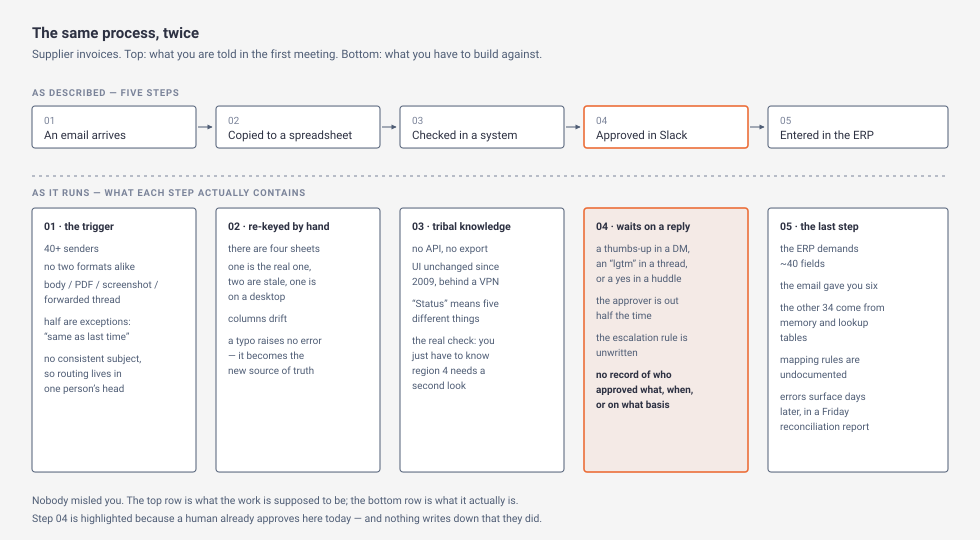
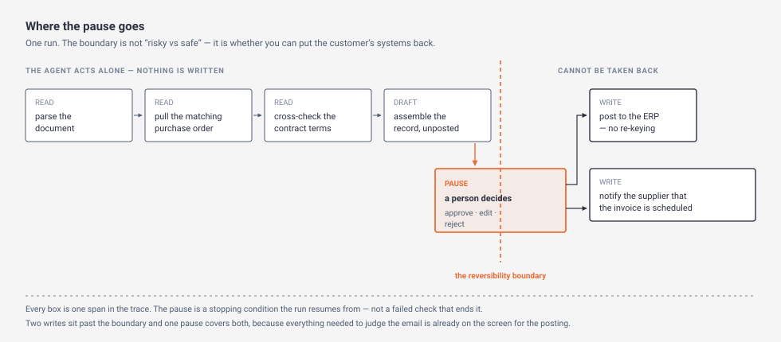

# Day 6 — A real workflow

> **The interview question this day answers:**
> "Our finance team spends about ten days a month keying supplier invoices. Walk me through what you would build — and tell me exactly where a person has to approve, and why there."

## 1. Why this day exists

Five days in, you can describe five components and you have never pointed them at a job. That is the gap this day closes, and it is the one the solution-design round is built to find.

Asked the question above today, you would answer with the parts list. An agent reads the invoice, looks up the purchase order, checks the contract, posts the record. Four verbs, and each hides rules that are written down nowhere. Then the follow-up arrives — *which of those steps would you let it do without asking anybody?* — and you would say "we'd keep a human in the loop", which is a phrase, not a design. The question after that is *how many approvals per run, and can the customer staff that?*, and there the conversation ends.

By the end of today you can pick a process on stated grounds rather than on which department complained loudest; map it at a resolution that survives the second case; put the approval where the run stops being undoable and defend the *number* of approvals with arithmetic from the customer's own volumes; and say what "last mile" means and why anybody pays for it.

Two things today leaves alone deliberately. How to *ask* the questions that get you the map is the final week's work, and the highest-signal round in the interview loop. So is the money: hours saved, cost per case, the one-page business case. Today is the process and the pause.

## 2. Explain it like I'm five

You have been asked to automate a manual assembly cell. There is a routing sheet on the wall. It lists five operations: load, drill, deburr, inspect, pack.

You could design a fixture from that sheet. It would not work, and you would find out in week six. So instead you stand next to the operator for a full shift, with a notebook.

By lunchtime the sheet has stopped being true. She files a burr off the second face that the sheet does not mention, because the castings changed last spring and nobody reissued the sheet. She rejects roughly one casting in twelve by feel; ask her the rule and she says "you can just tell". "Inspect" is two operations, because the bore gauge drifts after about forty parts. And every third or fourth part is a special: a rush order that skips the deburr, a rework that comes back already drilled, a batch quarantined for the wrong heat number.

Nobody lied to you. The sheet is what the work is supposed to be. What you watched is what the work is, and the difference is not detail — a third of the parts are specials, so the difference is most of the job.

Now the second half. You are not going to automate the whole cell in one go, and there is one operation you are frightened of, because past it the part is scrap if you got it wrong. So you do what a quality plan has always done: you put a **hold point** in front of it. The part cannot advance to the next operation until an inspector has signed. Not a light that comes on. Not a report somebody reads on Friday. A stop.

That costs you something real. The cell now runs at the speed of the inspector, so if she is at lunch the line waits; and if you put a hold point in front of every operation she will start signing without looking, which is worse than no hold point at all, because now somebody else's name is on the part.

This is where the shop-floor picture stops matching. A steel part genuinely cannot move past a hold point; a fixture and gravity enforce it. Software has no such property. A step in a program will happen unless something in your code stops it happening, so the hold point is not a feature of the material. It is a thing you build, and if you forget to build it there is nothing there.

**In plain English:** the process you get described to you is a summary, the process that actually runs is the summary plus every exception, and the exceptions are where the work is. Before you let software take a step you cannot take back, you make it stop and wait for a person — and the number of times per job you make it stop is a number you have to be able to defend, because a person who has to approve everything approves nothing.

## 3. The concept, properly

### Tier 1 — The shape of it

**A process map is a drawing of how work actually moves.** Every company has one at low resolution, usually in a slide or an onboarding document: five or six boxes with arrows. That drawing is not wrong. It is just not the thing you can build against, and the whole of this day turns on the gap between the two resolutions.

Varick Agents' own material states the problem in one line: "The documented process is rarely the real process" ([Varick FDE microsite](https://learn.varickagents.com/fde-in-30-days), checked July 2026). Here is one process at both resolutions.



*What to notice: the top row is five boxes and you could recite it after a ten-minute call. The bottom row is the same five steps, and none of it is available from a call, because none of it is written down anywhere. Step 04 is highlighted for a reason that comes back later — a human already approves at that step today, and nothing records that they did.*

**What a granular map records that a summary does not.** Three things per step, and they are the three you will be asked for.

1. **Where the input really comes from, and in how many shapes.** "It arrives from 40+ senders and no two are formatted alike" ([Varick](https://learn.varickagents.com/fde-in-30-days)) — body, attached PDF, screenshot of a PDF — and roughly half the messages carry an **exception**, a case the written procedure does not cover, resolved by somebody's judgment at the time.

2. **The rule that decides what happens next, and where that rule lives.** A rule can live in only three places: a system, a document, or a person's head. The third has a name — **tribal knowledge** — and it is why this work cannot be done from a written brief. The microsite's example is a region that always needs a second look, and it is blunt about the consequence: "The knowledge isn’t in the system — it’s in the operator."

3. **What happens when the step cannot be completed.** Not the error message — the *behaviour*. Who finds out, how long that takes, and what they do. Here, for the last step, nothing surfaces at the time: errors "show up days later in a reconciliation report someone reads on Fridays."

**Now line the map up against the five days behind you.** This is the point of the exercise, because a mapped step is not an abstraction — each kind of step becomes a specific thing you have already met.

- A step that reads a system becomes a **tool** ([Day 2](../day-02-tool-use/)), and the map tells you which systems: the **ERP**, the **CRM**, the internal application with no API.
- A rule that lives in a document becomes either a deterministic check in your code or a line in the **prompt**. A rule that lives in a person's head becomes one of three things: a rule you extract and write down, an instruction to the model, or a step that stays with the person. Deciding *which*, for a given rule, is the final week's subject; today you only have to notice that every rule forces the choice.
- A step past which you cannot undo the consequence becomes an approval pause, sitting behind [Day 3](../day-03-guardrails/)'s action gate.
- Every step, without exception, becomes a **span** in the **trace** ([Day 5](../day-05-audit-trail/)) — which is what turns "the agent did the invoice" into a record somebody can audit.
- And the whole thing is bounded by [Day 1](../day-01-agent-loop/)'s **max-step cap** and Day 3's **action budget**, which is why those two numbers stop being abstract the moment a real process is attached to them.

**The last mile, and the French waiter.** The phrase you will hear in every FDE interview has a specific origin, and knowing it is worth more than using it.

First Round Review traces the role to an observation by Palantir's co-founder and CEO Alex Karp about why French restaurants are so good: "The waiters are an extension of the kitchen staff." They know the kitchen as well as the cooks do, so they can build something for the diner in front of them rather than reading out a menu ([First Round Review, "So You Want to Hire a Forward Deployed Engineer"](https://review.firstround.com/so-you-want-to-hire-a-forward-deployed-engineer/), checked July 2026). That is the **French-waiter model**: the person facing the customer is not relaying requests inward, they are building outward, because they understand the machinery.

The **last mile** in `GLOSSARY.md` is the gap between a general capability and one customer's mess. Today gives it a concrete meaning. The general capability is a model that can read an invoice; everybody buys the same one. The last mile is *this region always needs a second look* — a rule in one operator's head, true for your customer and nobody else, without which the system is wrong on a slice of cases and cannot say which slice. That is why the role is a person and not a document.

### Tier 2 — How it actually works

**Choosing the process.** You will usually be handed a shortlist rather than a blank sheet, and the value you add is ruling things out. Four filters, in the order that saves the most time.

| Filter | Why it comes first | What it trades |
|---|---|---|
| **Volume and repetition** | Varick's guidance is to "Prioritize lengthy, high-volume workflows where the improvement is large enough to matter" ([Varick](https://learn.varickagents.com/fde-in-30-days)). Not only for the bigger saving: at two hundred a week you have seen a thousand cases in five weeks, and at four a quarter you have seen sixteen in a year. | The highest-volume processes have the most integrations and the most stakeholders, so they start slowest. |
| **Are the inputs reachable** | Where most candidates skip a month of work. If a step is a system reachable only from inside the company's own network, with no API and no export button, your first four weeks are not agent work. Day 2 established the integration is the bulk of the project. | Sometimes the highest-value process is the least reachable. Saying so in week one is worth more than finding out in week five. |
| **Is the outcome checkable** | Can somebody today look at one completed case and say, without ambiguity, right or wrong? For invoices, yes — check the posted record against the invoice and the purchase order. For "draft a response to this dispute", much less so. A process nobody can grade is one you can never prove is working. | The checkable processes are often the less interesting ones. Building the graded set of cases is Week 3's subject; noticing at selection time whether one is *possible* is yours. |
| **Are the irreversible steps few and late** | Mark every step you cannot take back. Clustered at the end — read, read, decide, write — and the process is straightforward to deploy carefully. An unrecoverable step at position two means everything after it inherits the risk. | Nothing, which is why it is a filter rather than a judgment. |

Notice what is absent. None of these four is the business case. Sizing the value in hours and money, and defending that number to a finance team, is the final week's work. Run these filters first, because a process failing the second or third has no business case worth building.

**Mapping it granularly.** The bottom row of the diagram is the worked example, step by step. Four things in it change how you design, beyond the detail itself.

The cost of getting it is a schedule item, not background reading: "Before a line of code gets written, someone has to sit next to the person who reads these all day and learn the 30 unwritten rules for what actually counts." The **system of record** at step 2 cannot be trusted as an input, because "It’s re-keyed by hand, so a typo doesn’t throw an error — it just becomes the new source of truth". It is something you reconcile rather than read. And at step 3 the person who understands the edge cases is retiring in eight months, which is a project constraint rather than a colour detail.

Step 4 inverts the usual framing of this whole day. The process *already has* a human approval in it: a thumbs-up in a direct message, or an "lgtm" (looks good to me) in a thread. And "There’s no record of who approved what, when, or on what basis — until an auditor asks, and then it’s a very bad week." You are not adding a control to a process that had none. You are replacing an unrecorded approval with a recorded one, which is a far easier thing to sell.

**When is the map deep enough?** There is a test, and it is not "when it feels thorough". **The map is deep enough when every step names the rule that decides what happens next, and every rule has a location.** Work through your own map and write *system*, *document* or *person* against each rule. Any rule you cannot locate is a rule you have not found yet, not a rule that does not exist. And every rule located in a person is a decision you now owe: extract it, hand it to the model, or leave it with the human.

**The approval pause, properly.** Anthropic's architecture whitepaper names it in the place that matters. Describing the loop, it says the agent keeps going "until the task is completed or it hits a stopping condition" — and the example it gives of such a condition is "pause here for human review" ([Anthropic, *Building Effective AI Agents: Architecture Patterns and Implementation Frameworks*](https://resources.anthropic.com/hubfs/Building%20Effective%20AI%20Agents-%20Architecture%20Patterns%20and%20Implementation%20Frameworks.pdf), checked July 2026).

That placement is the whole point. Day 1 taught two exits — the model declaring it is done, and the cap firing — and its vocabulary named a third, an *external interrupt*, without teaching it. The approval pause is that third exit, and it is the only one that is *planned*. Which gives you the distinction an interviewer will test:

| | A **tripwire** (Day 3) | An **approval pause** (today) |
|---|---|---|
| What triggers it | A check failed | The design says so, every time |
| State of the run | Halted, and possibly healthy | Fine, and waiting |
| What the person receives | A blocked request to clear | A decision on a drafted action |
| What happens next | The run does not resume on its own | The run continues from where it stopped |

Conflating these is the commonest way this answer goes wrong. Asked where the human is, a candidate describes a tripwire — which is what happens when things go badly — and never names a control that operates when things go *well*.

Two shapes of pause, and the shop floor already gave you both names. A **hold point** stops the work: nothing proceeds until somebody decides. A **witness point** notifies somebody and the work proceeds anyway. Both are legitimate, they are not interchangeable, and "we have human oversight" is the sentence that hides which one you built. A notification email, a dashboard or a daily digest is a witness point whether or not anybody intended it, and the usual way you find out is during an incident.

**What the frameworks actually give you.** LangChain's current documentation is worth reading not for the code but because it enumerates the design choices. It calls the **human-approval pause** a piece of *middleware* — a component you slot into the loop without rewriting it: "The Human-in-the-Loop (HITL) middleware lets you add human oversight to agent tool calls." When the model proposes an action that needs review, "the middleware can pause execution and wait for a decision" ([LangChain human-in-the-loop docs](https://docs.langchain.com/oss/python/langchain/human-in-the-loop), checked July 2026). Three things in there change how you answer the question.

First, the decision is not yes-or-no. The documented options are four: approve the action as proposed, **edit** the arguments before it runs, reject it and send the reason back to the agent, or answer directly on the tool's behalf. *Edit* is the one worth naming out loud, because it is what the human in step 4 of the invoice process is doing today — not signing off, but fixing the cost centre and *then* signing off. An approval flow offering only approve and reject will be worked around within a week.

Second, the pause is configured per action rather than per run, and a condition can be attached so that only *some* calls of the same action stop — which is the mechanism behind the most important number in the next section.

Third, and this one has a consequence for the whole week: a pause requires state that survives it. LangChain's docs make it a hard requirement — "You must configure a checkpointer to persist the graph state across interrupts." Day 4 established that a run's state lives in the **context window** by default and dies when the run ends. A pause that waits for an accounts-payable clerk to come back from lunch, or from Friday, is a run that has to exist for hours or days without a process staying alive to hold it.

**So the approval pause is the first thing in this course that makes durable state mandatory rather than a choice.** Day 4 named the **checkpointer** and described it thinly; the mechanics of saving state mid-run and picking it back up are Week 2's, and this is a large part of why Week 2 exists. Two smaller dependencies point the same way, and are worth naming rather than assuming: recognising an invoice you have already seen, and pulling forty fields out of a screenshot reliably. Both are Week 2's, and neither is the ordinary code a design like this usually calls them.

### Tier 3 — What an interviewer digs into

**How many approval pauses may one run have? This is the number you will be asked for, and "one" is a guess until you can derive it.**

It is also the number the customer cares about most, because it is the honest answer to *how much of this does my team still have to touch?*

**The floor comes from the map.** Count the points where the agent needs a decision it cannot get from an earlier decision. Two rules make that countable.

- Only steps past the reversibility boundary can require an *approval*. A read leaves the customer's systems as it found them; so does a draft that is assembled and not posted. One caveat, and it is Day 3's: a read is reversible and it is not free, because data that leaves needs no write — so reads are bounded by Day 3's budget even though they are not approved.
- Two irreversible steps can share one approval **only if everything the approver needs in order to judge the second is already on the screen for the first.** If a later consequence depends on information that exists only after the earlier one has happened, it needs its own pause, because the first approver could not have seen it.



*What to notice: the boundary is not drawn between safe steps and risky ones. It is drawn where undoing stops being possible. One write sits past it, so the floor for this run is one — and if a second write were added, the merge rule below decides whether it shares this pause or needs its own.*

For the invoice process the floor is therefore **1**. Recovering steps that *can* be recovered — undoing a write, replaying safely — is Week 2's subject, and it is worth knowing now that Week 2 can lower this floor, because a step you can reliably reverse does not need permission before the fact.

**The ceiling comes from the customer's staffing, and this is the half nobody prepares.** Every pause consumes a person's attention. So if the process runs *R* times per period, each approval takes *t* minutes of genuine review, and the customer will actually staff *M* minutes per period for approving, then *a*, the approvals one run may carry, is bounded by:

`a ≤ M ÷ (R × t)`

Be precise about *t*: it is **hands-on minutes**, the time the approver spends looking. It is not the elapsed time from the pause opening to the answer arriving, which includes lunch and meetings. That one sets cycle time rather than capacity, and putting it in this sum collapses it.

Work it. Say 120 invoices a day. One accounts-payable clerk is giving this two hours a day, so *M* is 120 minutes. Reading a drafted record against the invoice and the purchase order well enough to catch a wrong cost centre takes about ninety seconds, so *t* is 1.5. Then `a ≤ 120 ÷ (120 × 1.5) = 120 ÷ 180 = 0.67`.

*t* is the one input that is your judgment rather than the customer's measurement, so own it as a choice and say which way you would move it. Note what it is measured against: keying one invoice by hand takes about two minutes, so ninety seconds of review is *less* work per invoice, not more. Make that comparison before the customer does.

**Which is not an approval count.** You cannot pause 0.67 times, and there is no way to round it: 1 exceeds the ceiling and 0 is below the floor. The arithmetic has told you something the number itself cannot. **At this volume an approval on every run is not staffable, and the gap is too wide to close by trying harder.** Be exact about how much room there is rather than waving at it: the ceiling reaches 1 only if *t* falls to a minute, and whether sixty seconds is still *genuine* review of three documents is the question — not the arithmetic. That is a finding, it arrives before you have built anything, and that is the only time it is cheap.

Change one input and watch it become an ordinary knob again. Suppose the pilot is scoped to one supplier group — 20 invoices a day instead of 120. Same clerk, same ninety seconds: `a ≤ 120 ÷ (20 × 1.5) = 4`. Now there is room for four approvals per run against a floor of one, and the number you give the customer is one, with headroom. Same sum, same customer, and the difference is scope.

**When the two do not meet, there are four honest moves and one dishonest one.**

1. **Approve by exception.** A rule decides which runs a person sees, and the rest proceed without one. *R* in the sum becomes *selected* runs: if 15% of invoices are over a value threshold or involve an unfamiliar payee, 18 runs a day reach a person and `a ≤ 120 ÷ (18 × 1.5) = 4.4`, so the design fits. Re-derive *t* before believing that: you have selected the hard cases by construction, and at eight minutes each the same sum returns 0.83 and the design fails again. Say the cost out loud: for the other 85%, the *rule* is the control, not the person. Anthropic's whitepaper supplies the question to ask before accepting that — "if you need to explain exactly why the system made a specific decision to auditors, regulators, or executives, you want predictable, traceable behavior." A selection rule you wrote is traceable; human judgment on 15% of cases is not a substitute for it.
2. **Reduce *t* by designing the screen.** Ninety seconds is mostly the clerk assembling context. Put the invoice, the matched purchase order, the fields that differ from that supplier's last invoice, and the reason the agent chose them on one screen, and *t* falls. But *t* has a floor and it is not zero: below the time it takes to read the evidence you have bought a **rubber-stamp approval**, a signature with no inspection behind it. Day 3 gave you the tell for that and the constraint on what the screen may show; use them rather than re-deriving them.
3. **Batch.** One decision covering twenty runs changes *R* from runs to batches. The price is **cycle time**, the elapsed time from a case arriving to it being finished: a batch draining on Fridays is a second backlog with your name on it, not a pause.
4. **Narrow the scope until the floor drops.** The 20-a-day version above is this move: a **vertical slice** covering one supplier group end to end, approvals included, is deployable where the same design across all suppliers is not. Usually the right answer, and the one candidates are most reluctant to give, because it sounds like retreating.

The dishonest move is raising *M* — asking the customer to staff more approving. Sometimes that is legitimate. But if the pitch was that this gives the team time back, a design needing two more hours a day of somebody's attention is the pitch failing in front of you, and the interviewer is watching to see whether you notice.

**What the number trades in each direction.** More approvals per run: a smaller **blast radius** — less damage one run can do before anything stops it — and a throughput ceiling that now belongs to a person rather than to your system. Fewer: faster and cheaper, and every approval you remove converts a consequence from *reviewed before it happened* to *detected afterwards* — which lands the cost squarely on Day 5's **retention period** and on the customer's own detection lag. If they reconcile monthly, an unreviewed wrong posting can sit for weeks. The approval count and the retention period are answers to the same question from two ends, and quoting one without the other is how a design looks complete and is not.

**Then replace the guess, which is what makes this a method rather than a sum.** Both *t* and the exception rate in move 1 are estimates until the thing has run. Once it has:

- Measure *t* as the elapsed time between the pause opening and the decision arriving, not what anybody estimated. It will be higher than you assumed and its tail much higher, because approvals queue behind lunch, meetings and holidays.
- Measure the **override rate** — the share of pauses where the person edited or rejected what the agent proposed. It is the most informative number the pause produces, and it reads backwards: near zero across hundreds of runs means either the agent is right or nobody is reading, and the two are indistinguishable in the data.
- Distinguish them deliberately. Put a small number of deliberately wrong drafts in front of the approver and see whether they come back. That tests the *control*, not the agent — grading the agent is Week 3's work — and it is the only way to tell a working approval from a rubber stamp before an incident does it for you.

**One nesting, named so you do not derive it twice.** Day 3's action budget caps consequential writes per run; take its number from Day 3, whose worked answer sets it at eight. If the budget is eight and *a* is one, one approval stands in front of eight writes, so the screen has to show all eight — which raises *t*, which lowers the ceiling. What today adds is only that the two numbers are not independent: moving one moves the other, and this is also the case where the merge rule bites hardest.

**Where the value goes.** The pause is the likeliest place for the benefit to leak away: keying that took ten days a month now takes four seconds and waits six hours in a queue. The number that survives contact with a customer is cycle time, including the wait.

**And what a pause cannot fix.** An approval records that a person agreed. It does not record that they were right, and it does not transfer the failure to them — a wrong record posted with a signature on it is still a wrong record, and the signature makes the incident review harder rather than easier. This is also where Day 3's warning about *what* the screen may show stops being a security nicety and becomes the load-bearing part of your design: the approver is the last control, and a control that reads a summary written by the run it is checking is not one.

## 4. What the resources say

### Varick Agents — the FDE microsite and its example run
**What it is:** Marketing microsite for a paid programme, ~30 min, free. [learn.varickagents.com/fde-in-30-days](https://learn.varickagents.com/fde-in-30-days) · checked July 2026.

**The one idea to take:** the five-step invoice map, and specifically the material that is *behind a click*. The visible page gives each step a one-line annotation; clicking one opens the detail this whole day is built on, and it is the bottom row of the first diagram. Read the page without clicking the steps and you will have seen the least useful version of the best thing on it.

The second thing to take is the run log — one run of an invoice agent end to end, whose sixth line is the reason this day exists:

```
document received · invoice_0417.pdf
intake · fields parsed, no duplicates found
agent · pulling the matching PO from the ERP
agent · cross-checking contract terms
agent · drafting the record
paused — waiting for human approval
approved · by you, just now
posting to the ERP — no re-keying
record posted · evidence log complete
```

Nine lines — `PO` on line 3 is the purchase order. Five before the pause, none of which changes anything in the customer's systems. Then the pause, the decision, one write, and a closed record. Against Day 5 it is a trace with an approval in it; against Tier 3, the reversibility boundary falls between the drafting on line 5 and the posting on line 8.

**The line worth quoting in an interview:** "Turning a thumbs-up into an auditable control — who, what, when, on what evidence — is most of what risk and compliance teams actually care about." Attribute it as the vendor's framing, because it is, and then say what it buys: it moves the approval from a safety feature to an audit deliverable, which is the version a risk team will fund.

**Skip if:** you want a method — there is none. Two honesty items. The run log is an illustration, not a recording: a scripted animation with an Approve button that advances it. And the site sells a programme, so its claims about what an audit is worth are sales copy. What survives that discount is the specificity of the five-step detail, too particular to have been invented and matching what the podcast in §7 describes at length.

### First Round Review — "So You Want to Hire a Forward Deployed Engineer"
**What it is:** Essay, ~45 min, free. [review.firstround.com](https://review.firstround.com/so-you-want-to-hire-a-forward-deployed-engineer/) · checked July 2026.

**The one idea to take:** read it as a specification of what your interviewer believes the role is, because it is written *for the person hiring you*. Most of it is a founder's guide to whether to build an FDE team and how to interview for one, so it says unusually directly what will be assessed. The French-restaurant origin and the last-mile framing are in the opening, as is the sentence separating this role from a solutions consultant: "the FDE is still very much an engineer who writes and debugs production code."

The passage most relevant to today is Shilpa Balaji — a former Palantir FDE who went on to lead FDE recruiting there — on weeks at a customer's factory: "What you discover onsite is going to be so different from what was sold in the contract". That is Tier 1's resolution gap, from somebody who lived in it.

**The line worth quoting in an interview:** "The waiters are an extension of the kitchen staff." Attribute it as the essay does — an observation by Palantir's Alex Karp about French restaurants — then say what it means for the deployment in front of you: the person facing the customer has to understand the machinery well enough to build rather than to relay.

**Skip if:** you want the engineering. There is none. Two cautions. The essay reports that "Monthly job listings for the role shot up by 800% from January to September of 2025", and links the figure to the [Financial Times](https://www.ft.com/content/91002071-7874-4cb7-9245-08ca0571c408) rather than asserting it — so attribute it to the FT, not to the essay, and note that `FDE_Report` lists the same 800% among its marketing claims because the FT does not publish the method behind it. And it is not a sales pitch for the role: one of its own panellists calls the model "a pretty blunt instrument to try to use for your entire business".

### Anthropic — "Building Effective AI Agents: Architecture Patterns and Implementation Frameworks"
**What it is:** Whitepaper, 30 pages of dense two-column layout in five chapters, ~1 hr, free. [PDF](https://resources.anthropic.com/hubfs/Building%20Effective%20AI%20Agents-%20Architecture%20Patterns%20and%20Implementation%20Frameworks.pdf) · checked July 2026.

**The one idea to take:** the human-review pause is named as a **stopping condition** in the loop, not an interface feature bolted on afterwards. That placement is what makes the pause a design object you can reason about, and it is why Tier 2 could line it up against Day 1's two taught exits.

The second is the control question, the best-phrased thing in the document: "if you need to explain exactly why the system made a specific decision to auditors, regulators, or executives, you want predictable, traceable behavior." Use it as a filter on your own designs.

**The line worth quoting in an interview:** "pause here for human review", quoted as what it is — an example of a stopping condition. That framing gets you to the next question rather than a nod.

**Skip if:** you are looking for evidence, and be blunt about it, because the temptation to quote is strong. The first two chapters are customer outcomes with no methodology attached — one platform's agents "corresponding to 100x time-to-value improvement", resolution rates, productivity percentages. These are customers' own numbers, supplied to their vendor. Quoting one invites the follow-up you cannot answer: against what baseline, over what period, measured by whom. Take the framing, leave the numbers.

## 5. Suggested exercise (optional)

**The exercise:** pick one previously-manual back-office process — finance, HR, procurement, logistics or sales — get it in granular detail, run an agent on it, and tie the result to a portfolio repository.

**What doing it would teach you that reading cannot:** which of your mapped steps has no data source at all. On paper every step has an input. In practice you reach step 3, go looking for where the approval threshold is stored, and find that it is stored nowhere and the person who knows it is on leave. That discovery is unavailable from a document, and it is roughly half of what the job is.

**Optional — skip it if you're reading only.** Most of the value is available on paper, and the paper version is worth an hour. Take a process from your own working life; you have watched people do manual work for years, which is an advantage here rather than a gap. Write the five-box summary first, the one you would give in a meeting. Then, under each box, write what you know actually happens: the formats, the exceptions, the rule that decides what comes next and where that rule lives. Mark every rule you cannot locate — those are the gaps, and finding them is the exercise working. Then draw the reversibility boundary, count the decisions past it, and run the ceiling sum on the real volume you already know.

One thing you cannot get on paper and should not claim: that you ran it. If a portfolio build is not something you will do, present the map and the derivation as analysis rather than deployment, and name which parts you would expect to be wrong. That is stronger than a vague claim to have built something, because the first follow-up resolves it either way.

## 6. Where it breaks

The FDE job is the failure list. Here is this day's, and note how few of the rows are about the model.

| Failure mode | What it looks like in production | The mitigation |
|---|---|---|
| **You built against the summary** | The pilot handles the demo cases, then a large share of real cases lands in the exception queue. Nobody can say in advance which cases. | The resolution test from Tier 2: every step names the rule that decides what happens next, and every rule has a location. A rule you cannot locate has not been found. |
| **The rule was in a retiring head** | Nobody can tell you why one region gets a second look. The person who could has left, and the cases needing it are indistinguishable from the ones that do not. | Treat rule extraction as deliverable work with a deadline attached to a person's notice period, not as background research. Record each extracted rule with who gave it and when, because it will be disputed. |
| **The approval is a rubber stamp** | Override rate near zero over hundreds of runs. It looks like a working agent. The first genuine error is approved in nine hundred milliseconds. | Measure the override rate *and* the decision time, and test the control with deliberately wrong drafts. Cut *t* by improving the screen, never by shortening what the approver is asked to check. |
| **The approver is the bottleneck** | Median time to decision is six hours and the tail is four days. The agent's four seconds are irrelevant to the customer. | Quote end-to-end cycle time including the wait, from the first week. Batch or approve by exception deliberately rather than discovering the queue. |
| **The system you must write to rejects the write** | You hold a human approval for a record the ERP will not accept, because one field fails a validation nobody documented. The run ends, the approval is spent, and the invoice is in neither system. | The approval must be for a *staged* record you can resubmit, never for a write already attempted. On rejection the run has to reopen the pause with the rejection attached rather than ending. Making a run survive that is Week 2's subject, and this row is the reason it matters. |
| **The approval is not recorded** | An auditor asks who approved the payment, on what evidence, and at what time. You have a database field saying it was approved. | The approval is a span carrying the approver's identity, the timestamp, the decision, and the exact arguments they were shown — not the model's summary of them. Day 5 gave you the record; this row is what it must contain, and note that those arguments are payload, so the approval has to be exempt from Day 5's sampling rate rather than subject to it. |
| **You automated the step, not the process** | The agent does step 3 flawlessly. A person still re-keys steps 2 and 5 by hand, so the ten days a month are still ten days a month. | Scope by end-to-end path, not by the step that was easiest to automate. If the manual work either side survives, the saving is zero however well the automated step performs. |

One pattern runs through the table. In the queue, the rejected write, the unrecorded approval and the surviving manual work, the model does exactly what it was asked to do and the deployment fails anyway. That is the argument for this day, and for the role: the hard part of putting an agent on a real process is rarely the agent.

One row is deliberately absent because [Day 3](../day-03-guardrails/) owns it: run your own workflow against the lethal trifecta. This one already has two legs — forty untrusted senders, and private records — so any step you add that sends something outward completes it, out of parts that each looked reasonable.

## 7. Watch this

Two videos, at opposite ends: the whole role, then one mechanism.

### 1. Greg Isenberg and Vas (Varick Agents) — "FDE: The $1M/Year AI Job Explained"
**Greg Isenberg · 51 min 34 s · [Watch](https://www.youtube.com/watch?v=zXysLUTLjw4)**

Why this one: it is the source interview this course is derived from, so it is the closest you can get to hearing the plan's author explain his own reasoning. Published 20 July 2026, the most current item on any day's list, and the only place the five-step map is talked through rather than drawn.

**Worth watching:** this video has **published chapter markers**:

- `17:38` — How the Work Really Gets Done (chapter marker)
- `27:36` — Audit: Finding the Workflow Worth Rebuilding (chapter marker)
- `32:57` — Deployment: Build on Existing Systems (chapter marker)

The first is today's core and runs about three minutes. It walks the same five steps as the microsite and adds the argument the page does not make: had you asked the person what the first step is, they would have said an email arrives, and you would have built for a system that does not match reality. He also says he strongly recommends his own FDEs push for a human approval step in an agent implementation — a recommendation rather than a finding, and worth carrying as one.

**Before spending fifty minutes on it:** the title's figure is a claim, not audited data — `FDE_Report`'s caveats list the $1M among the marketing numbers, sourced to coaching sites and to the interviewee. Chapter `11:26`, "What FDEs Earn" (chapter marker), is the one to skip.

**One line worth having, because it is the thesis of the whole report and it is now checkable.** At `43:07` (from the transcript) he says: "There's only one way that something can go right, but there's a thousand different ways something can go wrong. So, if you're only building for the way it goes right, you're worth nothing. If you're solving for all the exceptions, that's where you are worth something as an agent." (From the transcript, committed to `.agents/transcripts/zXysLUTLjw4.en.auto.vtt`; the captions are auto-generated, so treat the wording as close rather than certified.) [Day 1](../day-01-agent-loop/) carried the first two sentences from `FDE_Report` and marked them unverified, because the report cites secondhand writeups rather than a transcript. They are verifiable, and the third sentence — the one about exceptions — is absent from the report's version and is the one that belongs to today. Note where he says it, though: he is walking through the second week of his own plan, about failure handling, not about process mapping. The sentiment generalises; the context is Week 2's.

### 2. LangChain — "LangGraph interrupt: Making it easier to build human-in-the-loop agents"
**LangChain · 7 min 49 s · [Watch](https://www.youtube.com/watch?v=6t7YJcEFUIY)**

Why this one: eight minutes of somebody showing a run stop, a person decide, and the run continue. Reading that a pause is a stopping condition is not the same as watching one open, and the thing to notice is how ordinary it looks — the run is not broken, it is parked.

**Worth watching:** no chapter markers — watch the whole thing (8 min).

Two caveats, and the second is the useful one. It is a vendor video announcing a vendor feature. And it is from 14 December 2024, so the interface has moved on: LangChain now documents human-in-the-loop as middleware attached to an agent and configured per tool action, with the four decision types Tier 2 listed ([current docs](https://docs.langchain.com/oss/python/langchain/human-in-the-loop), checked July 2026). Watch it for the shape of the interaction and read the docs for the shape of the configuration. That gap is nineteen months, and this is the layer of the stack that moves fastest.

## 8. Say this in an interview

### "Our finance team spends about ten days a month keying supplier invoices. What would you build?"

**Weak:** "I'd build an agent that reads the invoice, pulls the matching purchase order, checks it against the contract and posts it to the ERP. With a human in the loop for approval."

**Strong:** "I can give you the shape, but the first thing I'd do is sit with whoever does it, because the version I'd design from this conversation would miss the exceptions. The shape: intake and validation as ordinary code, the agent reads and drafts, one approval, then the write. What I'd be listening for is where the rules live — 'an email arrives' is usually dozens of senders with no two formats alike, and a large share of them exceptions somebody resolves from memory, so I'd want the list of unwritten rules for what counts and I'd expect it to take days to get. Then I'd draw the line where undoing stops being possible: reading the purchase order and drafting the record change nothing on your side, posting to the ERP does. That's where the approval goes. And there's already an approval in your process today — a thumbs-up in a direct message, with no record of who approved what. I'm not adding a control, I'm making an existing one auditable."

**Why the strong one lands:** it declines the question as asked and answers a better one. It names the shape of the mess before the customer does, puts the approval at a boundary it can define rather than a step it feels nervous about, and reframes the new control as a recorded version of one they already have — the version their risk team will approve.

### "Where does a human approve, and how many approvals per run?"

**Weak:** "We'd have a human in the loop on the risky steps. Probably one approval before it writes anything."

**Strong:** "Two numbers, and they have to meet. The floor comes from your process: count the points past the reversibility boundary needing a decision no earlier decision supplies — two writes share one approval if everything needed to judge the second is already on the first one's screen, so for invoices that's one. The ceiling comes from your staffing: approvals per run is at most the minutes you'll staff, divided by runs times minutes of real review each. At 120 invoices a day, two hours of a clerk's time, and ninety seconds to actually read a drafted record against the invoice and the purchase order, that's 120 over 180 — 0.67. Which isn't an approval count. It says an approval on every run isn't staffable at this volume, and no design change fixes it. So either we approve by exception, and I'd tell you plainly that for the runs a person doesn't see the rule is the control — or we scope the pilot to one supplier group, where at 20 a day the ceiling is four and one approval fits with room. What I wouldn't do is ask you to staff more approving, because getting time back is why you're talking to me."

**Why the strong one lands:** the number comes from the customer's own volumes, and then tells the candidate something he did not know at the start. Reading an impossible answer correctly is a stronger signal than producing a plausible one.

You should recognise these conversations when a customer opens one, and be able to say which shape their process already is. A process described in five steps with no exceptions is the summary, not the process. "We already have human oversight" has not yet said whether the work stops or merely gets reported. "It's fully documented" is a claim about a document, not about the work. Recognising all three is today's job; the questions that open them up are the final week's.

And if they offer to send a specification instead of a visit, the answer is not about rapport: it is that a specification cannot contain the rules nobody wrote down, so you would ship something correct on the cases it describes and silently wrong on the rest.

## 9. Vocabulary

| Term | Plain definition | Why an FDE cares |
|---|---|---|
| **Back-office process** | Internal administrative work that keeps a company running — invoices, purchase orders, onboarding, claims, expense reports — as distinct from anything a customer sees. | It is where the manual keying is, where the volume is, and where a first deployment is least likely to reach a customer if it goes wrong. |
| **Process map** | A drawing of how work actually moves through a company, step by step. It exists at many resolutions; the useful one names the rule behind every step. | The artefact your whole design is derived from. A map at the wrong resolution produces a system that works on the demo cases. |
| **Exception (in a process)** | A case the written procedure does not cover, resolved by somebody's judgment at the time. | Usually a large fraction of cases rather than a rare event, and that fraction is the difference between a demo and a deployment. |
| **Tribal knowledge** | A rule that governs the work and exists only in a person's head. | It cannot be read out of any system, so it sets the minimum time a deployment takes — and it leaves when the person does. |
| **System of record** | The one system whose copy of a fact is treated as authoritative. | It is what you write to, so it is where irreversibility lives. If it is a spreadsheet, a typo becomes the truth with no error raised. |
| **Irreversible step** | A step whose consequence you cannot undo: a payment made, an email sent, a filing submitted. | The only sound basis for deciding where a person must approve. "Risky" is a feeling; "cannot be undone" is a property you can check. |
| **Reversibility boundary** | The line in a run before which nothing has happened to the customer's systems, and after which something has. | Everything before it the agent may do alone. The approval belongs on the line, not near it. |
| **Human-approval pause** | A planned stop in a run where the agent presents what it intends to do and waits for a person, then continues from where it stopped. | The third stopping condition — the one that operates when things go *right* — and the control a customer's risk team understands fastest. |
| **Hold point / witness point** | A hold point stops the work until somebody decides. A witness point tells somebody, and the work proceeds. | Both are legitimate and they are not interchangeable, and "we have human oversight" is the sentence that hides which one you built. |
| **Approve / edit / reject** | The three decisions available on an action with a consequence: run it as drafted, change the arguments first, or refuse it and send the reason back to the agent. LangChain documents a fourth, answering on the tool's behalf, which is for asking the user a question rather than for denying an action. | Leaving *edit* out is how an approval flow gets worked around, because fixing one field and continuing is what the human does today. |
| **Approve by exception** | A rule selects which runs a person sees; the rest proceed without one. | The usual answer when per-run approval is not staffable — and it means the rule you wrote is the control on the majority of cases. Say so out loud. |
| **Rubber-stamp approval** | An approval given without the attention it was designed to buy. | Worse than no approval, because a signature transfers accountability without transferring scrutiny. |
| **Override rate** | The share of pauses where the person edited or rejected what the agent proposed. | The most informative number the pause produces, and it reads backwards: near zero means the agent is right *or* nobody is reading. |
| **Cycle time** | The elapsed time from a case arriving to it being finished, including every wait. | The number the customer actually experiences. Quoting the agent's runtime instead is how a project reports success and delivers none. |
| **Blast radius** | How much damage one run can do before anything stops it. | It is what a step cap, an action budget and an approval count each bound, in different units — and it is what a security review is really asking for. |
| **French-waiter model** | Palantir's founding analogy for the role: the waiter who knows the kitchen as well as the cooks, so they build for the diner rather than reading out the menu. | The origin of the FDE title and the cleanest one-sentence answer to what the role is for. Attribute it to Alex Karp, via First Round. |

## 10. Test yourself

<details>
<summary><b>Q1.</b> A customer says "we already have human oversight on this — the team gets a daily digest of everything the system did." What have they got?</summary>

A witness point, not a hold point. Somebody is told and the work proceeds anyway, so nothing in the process can be stopped by a person before it happens — which means it is a reporting feature and not a control. The distinction matters because "we have human oversight" is the sentence that hides which one was built, and a digest read the next morning cannot prevent an irreversible step taken yesterday. Ask what the person is able to *stop*, and whether the work waits for them.

</details>

<details>
<summary><b>Q2.</b> A step in your map says "check it in the internal system". What three things do you need to know before that step can become anything?</summary>

Where the input comes from and in how many shapes; the rule that decides what happens next and where that rule lives; and what happens when the step cannot be completed. Here that usually means: reachable only from inside the company's network, no API, no export; a field called "Status" meaning five different things depending on who set it; and a tribal check — one region always needs a second look, written down nowhere. A rule whose location you cannot name has not been found yet, which is not the same as not existing.

</details>

<details>
<summary><b>Q3.</b> Derive the number of approvals a run may carry. Then say what it means when the sum returns something impossible.</summary>

The floor is the count of points past the reversibility boundary needing a decision no earlier decision supplies; two writes share one approval only if everything needed to judge the second is already on the first one's screen. The ceiling is staffing: `a ≤ M ÷ (R × t)`, minutes staffed over runs times minutes of genuine review each. At 120 invoices a day, 120 staffed minutes and 90 seconds of review, `120 ÷ 180 = 0.67` against a floor of 1 — the two do not meet, and that is the finding: per-run approval is not staffable here and no tuning fixes it. The moves are approve by exception, cut *t* by designing the screen, batch, or narrow the scope; at 20 a day the same sum gives 4 and one approval fits with headroom.

</details>

<details>
<summary><b>Q4.</b> Your override rate has been under 1% for four hundred runs. Is that good?</summary>

Unknown, and that is the point: it means either the agent is right or nobody is reading, and those are indistinguishable in the data. Test the control rather than the agent — put a few deliberately wrong drafts in front of the approver and see whether they come back — and read the decision time alongside it, because approvals arriving in under a second are not reviews. An approval nobody reads is worse than none, since it transfers accountability without transferring scrutiny.

</details>

<details>
<summary><b>Q5.</b> An interviewer says: "you've put a human approval in, so the system is safe." What do you say?</summary>

That an approval records that a person agreed, not that they were right — a wrong record posted with a signature on it is still a wrong record. Three gaps: the approver can only judge what the screen shows, which is why it must carry the raw arguments and never the run's own summary of what it intends to do; a near-zero override rate may mean nobody is reading; and a pause routed to a group means everybody assumes somebody else looked. The pause bounds blast radius. It does not establish correctness.

</details>

<details>
<summary><b>Q6.</b> Which of Days 1–5's pieces does an approval pause need that none of them provided?</summary>

State that survives the pause. Day 4 established that a run's state lives in the context window by default and dies when the run ends, and a pause waiting for a clerk who is gone until Monday is a run that must exist for days. LangChain's documentation makes this a hard requirement, not a nicety: "You must configure a checkpointer to persist the graph state across interrupts." The checkpointer was named on Day 4 and described thinly; saving state mid-run and resuming from it is Week 2's. So the honest version of this week's story carries one dependency the week does not yet satisfy.

</details>

<details>
<summary><b>Q7.</b> The agent posts invoices in four seconds. Why might the customer say nothing improved?</summary>

Because the number they experience is cycle time — arrival to posted, including every wait — and the wait is now concentrated in the approval queue. If the pause averages six hours, the four seconds are irrelevant. The second version of the same failure is automating the easiest step rather than the end-to-end path, so a person still re-keys the steps either side and the ten days a month survive intact. Quote end-to-end time from the first week, and scope by path rather than by step.

</details>

<details>
<summary><b>Q8.</b> What does "last mile" mean concretely, and why can it not be sent to you as a specification?</summary>

The general capability is a model that can read an invoice, and everybody buys the same one. The last mile is the couple of dozen rules that make it right for one customer: this region always needs a second look, the field labelled Status means five things. They are in no document because nobody wrote them down; they are the accumulated judgment of the people who handle the exceptions. First Round quotes a former Palantir FDE on weeks at a customer's factory: "What you discover onsite is going to be so different from what was sold in the contract". That is the argument for the role being a person rather than a document.

</details>

---

**Next up:** Day 7 is the Week 1 checkpoint. No new material — it assembles the loop, the tools, the guardrails, the deliberate memory, the trace and this workflow into one story, and drills the version you will actually be asked for: "walk me through your agent."
