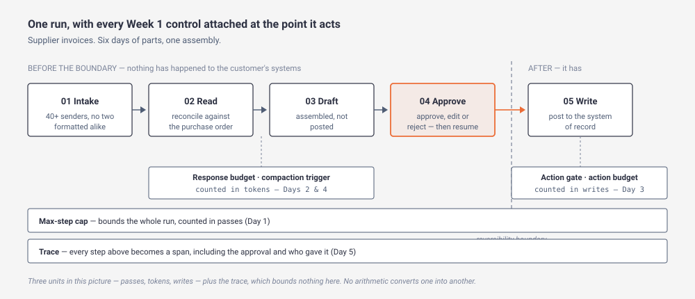
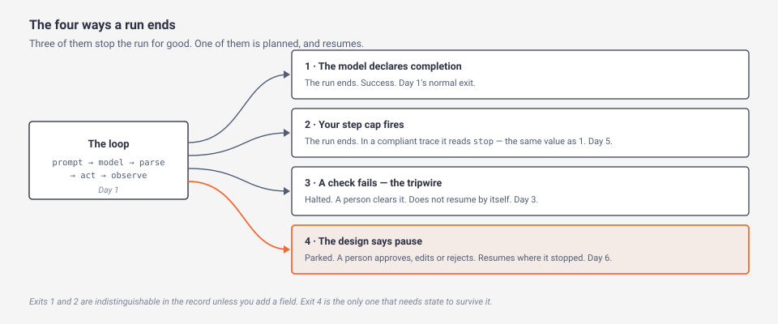

# Day 7 — Week 1 checkpoint

> **The interview question this day answers:**
> "Walk me through the agent you'd build for us, end to end. And tell me what it can't do yet."

## 1. Why this day exists

Nothing new today. Everything today is assembly.

Six days in, you can define a span, derive a compaction trigger, name the four gates and say why a tripwire is not a log line. Asked to walk somebody through one agent, you would still produce a list of six topics in the order you learned them. That sounds like a syllabus, and an interviewer can hear the difference in about fifteen seconds — because a syllabus has no *interfaces*, and interfaces are where the whole conversation goes.

Two specific failures are waiting for you, and both are one question deep.

The first: you describe the system and stop at the point where it works. The interviewer asks *what happens if the approver goes home?* and you have nothing, because the answer is a piece of machinery Week 1 does not contain and you have not noticed that it doesn't.

The second: you quote two numbers you derived on different days, and they are incompatible. A step cap of twenty and a write budget of three are both defensible. Put them on one run and somebody will ask which one binds, and if the honest answer is "they measure different things and I never checked" then both numbers were decoration.

So today does three things. It assembles Days 1–6 into one run you can draw. It walks the connections between them, which is the part no single day could teach. And it makes you say out loud what the week does not yet deliver, with an owner attached to each gap — because a candidate who names his own missing dependency is the only kind who sounds like he has deployed something.

## 2. Explain it like I'm five

You have six part drawings. You do not have a machine.

A part drawing is complete and self-contained. It gives you a dimension, a tolerance, a material and a finish, and a machinist can make the part from it without ever seeing the rest of the assembly. Six part drawings, six machinists, six good parts.

Then somebody asks for the general arrangement drawing — the one that shows the parts together, in place, with the mating faces and the fasteners and the clearances. And that drawing contains information which is nowhere on any of the six, because it is not about the parts. It is about the gaps between them. Whether the shaft clears the housing. Whether the bolt is long enough once the gasket is in. Whether the hole you dimensioned from the left edge on one drawing and from the centre on another actually line up.

That is where a design review spends its time, and everybody who has sat in one knows why. The parts are the easy half. The parts were each checked by somebody competent. What nobody checked is the *stack* — every tolerance in the chain adding up in the worst direction, so six parts that are each inside their band produce an assembly that binds.

The same thing is true of this week, and it is true in the same way. Six days each gave you a number you can defend on its own page. One of those numbers is measured in passes of a loop. One in tokens of text. One in writes to a live system. And one of them is *bounded* by something stranger — minutes of a particular person's working day. They are all correct. Two of them turn out to be inputs to each other, so deriving them separately means deriving them wrong. And the one bounded by a person's day is the one that binds first, which nobody expects, because it is the only constraint in the set that is not about software at all.

Today is the general arrangement drawing. It is also the tolerance stack: not "is each number right?" but "do these numbers compose into a machine?"

*The real concept in plain English: a system is its parts plus its interfaces, and the interfaces are what an interviewer tests.*

## 3. The concept, properly

### Tier 1 — The shape of it

**One run, one picture.** Everything Week 1 taught attaches to a single pass through one process — the supplier-invoice workflow [Day 6](../day-06-real-workflow/) mapped.

*What to notice: three of the four controls at the bottom carry a different unit each — passes, tokens, writes — and the fourth, the trace, carries no unit in this picture because it bounds nothing here. Which of those units binds first, and which pairs of them are secretly one derivation, is Tier 2. The unit that ends up mattering most is not in the picture at all, because it lives in the customer's staffing rather than in your system.*

**The week in one paragraph, which is what you will actually be asked for.** An agent is a loop: assemble a prompt, call the model, parse what came back, run the action it asked for, append the result, go round again ([Day 1](../day-01-agent-loop/)). The actions are tools you designed around the customer's decisions rather than around their vendor's endpoints ([Day 2](../day-02-tool-use/)). Around that loop sit gates — checks at four named points, each of which either alters or halts what passes through ([Day 3](../day-03-guardrails/)). What the model can see each pass is a budget rather than a container, so what goes into the prompt is chosen and most of it does not persist ([Day 4](../day-04-context-and-memory/)). Every step of every run becomes a span in a trace, so one bad run on a Tuesday is a record you can retrieve rather than an argument ([Day 5](../day-05-audit-trail/)). And the whole thing is pointed at one real process, mapped to the resolution where every step names the rule that decides what happens next, with a person approving on the line past which nothing can be undone ([Day 6](../day-06-real-workflow/)).

That is about 170 words and it is the answer to "walk me through your agent" at the resolution the opening minute needs. What follows is what to say when they pick one clause and push.

**The spine to walk it along.** Six days is too many threads to hold. One thread runs through four of them and is drillable to any depth: **how the run ends.**

*What to notice: exits 1 and 2 are indistinguishable in a standards-compliant record unless you add a field of your own, because the standard field reports why the *model* stopped writing that pass and never why the *run* ended. Exit 4 is the only one that needs the run's state to outlive the run, and it is the only one that is planned.*

Pick this thread when you are asked to walk through the system, because it forces you through the loop, the guardrails, the record and the human in one pass, and every step of it is a place an interviewer can dig without leaving the thread.

### Tier 2 — How it actually works

#### The stopping condition, across four days

[Day 1](../day-01-agent-loop/) built the loop and named its exits. The body taught two. Its line-by-line reading of the loop says of the model's completion signal, *"The model ends the loop by saying it's done. The normal exit"*, and of the other end, *"Finishing without the model declaring completion is a failure. Not a shrug — an error with a name."* Day 1's vocabulary entry for `Stopping condition` names a third inside it — an *external interrupt* — without teaching it anywhere.

[Day 3](../day-03-guardrails/) added a way out that Day 1's list does not name. A **tripwire** is what a gate does when a check fails: *"it stops the run"*, and Day 3 is emphatic about what that excludes — not warning and continuing, and not asking the model to have another go. The glossary adds the second half, which matters more than the halt: *"halt the run and hand it to a person."* Like the cap, it is enforced by your code. Unlike the cap, it fires on a check rather than on a count, which means the same run can hit it on pass two or never.

[Day 5](../day-05-audit-trail/) then found the defect that makes this worth talking about at all. In the OpenTelemetry GenAI semantic conventions, a run stopped by your step cap *"stopped for a reason the model never saw"* — the standard's field reports why the *model* stopped writing that pass, which is a different question from why the *run* ended. Day 1's warning, that treating "ran out of steps" as success is a silent failure, is not fixed by the standard. Day 5's conclusion is a build instruction: *finished*, *hit the step cap* and *overflowed the window* have to be one field of your own on the root span, with three distinct values.

[Day 6](../day-06-real-workflow/) supplied the third exit Day 1 had named and left alone. Anthropic's architecture whitepaper describes the loop running *"until the task is completed or it hits a stopping condition"*, and the example it gives of such a condition is *"pause here for human review"* ([Anthropic, *Building Effective AI Agents: Architecture Patterns and Implementation Frameworks*](https://resources.anthropic.com/hubfs/Building%20Effective%20AI%20Agents-%20Architecture%20Patterns%20and%20Implementation%20Frameworks.pdf), checked July 2026). A **human-approval pause** is the external interrupt, and it is the only exit that is *planned* — the only one that operates when things go right.

So the week produces four ways a run ends, not three, and the count is worth getting right because the follow-up is always about which one you can tell apart from which.

| How it ends | Who caused it | What the record shows by default | What a person receives |
|---|---|---|---|
| Model declares completion | The model | Why the *model* stopped writing | The finished result |
| Step cap fires | Your code, on a count | The same field, and nothing in it names the cap | A partial result that looks finished |
| Tripwire | Your code, on a check | A halt, and your own gate's reason | A blocked request to clear |
| Approval pause | Your design, every time | A span carrying who, when, and on what evidence | A drafted action to approve, edit or reject |

Rows two and one are the pair the record cannot separate for you, and that is the single most useful thing in the table. Rows three and four are the pair a candidate most often collapses: asked where the human is, most people describe a tripwire, which is what happens when things go badly, and never name a control that operates when things go well.

#### The four units, and why the numbers do not compose by themselves

Each day handed you a number and a way to arrive at it. Set them side by side and the units are the story.

| Day | The number | Its unit | How you get it |
|---|---|---|---|
| 1 | Max-step cap | passes of the loop | Floor from the task's minimum action count, times two or three for retries and dead ends; then replace the estimate with the step-count distribution of runs that succeeded and sit above its tail |
| 2 | Response budget | tokens — per pass | `(window − base prompt and tool definitions) ÷ passes in a normal run` |
| 3 | Action budget | consequential writes, per run | The writes one finished job genuinely needs, times the batch size *you* choose to allow — and exceeding it is a tripwire, not a silent clamp |
| 4 | Compaction trigger | tokens — of window | `window − largest tool result − output cap` |
| 5 | Payload sampling rate | share of runs | `p ≥ k ÷ (R × f)` — examples wanted, over runs times the failure rate you need to see |
| 6 | Approvals per run | approvals | Floor from the map; ceiling `a ≤ M ÷ (R × t)` — minutes staffed, over runs times minutes of genuine review each |

Five distinct units in six rows — tokens is the only one that appears twice — and three places where the numbers touch, none of which a reader who met the days separately would have.

**Days 2 and 4 are one derivation, not two.** Day 4's compaction trigger takes Day 2's response budget as an input: on Claude Haiku 4.5's 200,000-token window with a 3,000-token base prompt over a ten-pass run, `(200,000 − 3,000) ÷ 10 = 19,700` tokens per pass, and then `200,000 − 19,700 − 4,000 = 176,300`, which is 88% of the window. The second half of that coupling is nastier, and Day 4 states it outright: compaction firing means the run continues *past* the tenth pass, which invalidates the divisor that produced 19,700 in the first place. Derive them against one assumed run or they contradict each other.

**Days 1 and 3 measure different damage and do not convert.** Day 1's cap is real and, in Day 3's words, *"only in units of passes, and a cap of 20 passes permits 20 payments."* A security team asking "what is the worst this could do?" is asking in writes, and the conversion needs a design fact neither number carries — writes are at most passes times writes-per-pass — so quoting the cap answers the security question only if you also state that multiplier. Two numbers, two questions, and the temptation is to answer the second with the first.

**Days 3, 5 and 6 form a chain around the approval.** Day 3's action budget feeds Day 6's approval count: if the budget permits *N* writes per run and the approval count is one, then one approval stands in front of *N* writes, so the screen has to show all *N* — which raises *t*, the minutes of genuine review, and lowers the ceiling. And Day 6's approval span carries the exact arguments the approver was shown, which are **payload** in Day 5's sense, so the approval has to be *exempt* from Day 5's sampling rate rather than subject to it. Sample the approval and the one record an auditor will ask for is the one you threw away.

There is one more, and it runs forward rather than sideways, and it is worth knowing before Week 2 starts: a step you can reliably reverse does not need permission first, so the reliability work ahead can *lower* Day 6's approval floor. The approval count is not a fixed property of the process. It is a function of how much of the process you can undo.

**One more split worth carrying, because it decides what a control is worth.** Half of what you have built is **deterministic** — the same input always produces the same output — and half is not. Your code, your gates, your budgets and your caps are the deterministic half: a write budget of three permits three writes on every run there has ever been. The model is the **non-deterministic** half, and Day 1 showed that this holds even at temperature zero. Every control you name lives in one half or the other, and which half it lives in is the difference between a bound and a bet. A budget enforced by your code is a bound. An instruction in the prompt asking the model to be careful is a bet, however well phrased.

### Tier 3 — What an interviewer digs into

**This day introduces no new control, so it owes no new derivation — it owes you a way to check the six you have.** Two moves, and both are cheap enough to do in a meeting.

**Move one: the unit audit.** Write each number with its unit attached, in the same list. Then, for every pair, ask one question: *is either one an input to the other?* Where the answer is yes, the two have to be derived against one assumed run, and quoting them from different assumptions is the seam. Where the answer is no, say what does *not* convert, out loud, before somebody asks — "the step cap bounds how long this can take; the action budget bounds how much it can break; neither one gives you the other."

Push that audit to its edge and it returns something more useful than a check. Five of the six numbers are denominated in things your software controls — passes, tokens, writes, share of runs — and you can move any of them by changing your design. The sixth, approvals per run, is denominated in approvals, but its *ceiling* is set by **minutes of a particular person's working day**, which none of the five software numbers reaches. On Day 6's own worked case that ceiling is what binds: at 120 invoices a day, 120 staffed minutes and ninety seconds of genuine review, `120 ÷ 180 = 0.67` approvals per run against a floor of one. The two do not meet, and no tuning of the five software numbers moves that result: a step cap of five or fifty changes nothing about how many invoices a clerk can read. The two levers that *do* move it are the screen the approver reads, which lowers *t*, and the scope of the pilot, which lowers *R* — and Day 6 quantifies the first, because the ceiling reaches 1 only if *t* falls to a minute.

That has a consequence for how you open a design conversation. The number most likely to kill the design is the one you cannot derive from anything technical, and it is available in week one for the price of asking how much of whose time you are being given. Ask it first. It is the cheapest finding in the whole design and the most expensive one to discover late.

**Move two: the cut test — say why each component exists, or drop it.** For each of the six pieces, name what breaks if you remove it, in the customer's terms rather than yours. A component whose absence you cannot describe is a component you are carrying because a course taught it to you.

| Remove | And this happens |
|---|---|
| The step cap | A loop that repeats the same thought pays for it every pass, and cost grows with the square of the step count rather than in step with it |
| Tool design | The model gets the vendor's endpoints instead of the customer's decisions, so it takes three passes and two wrong guesses to answer one question |
| The gates | The first supplier email containing an instruction is an instruction, and nothing between the decision and the consequence disagrees |
| Deliberate context | Accuracy drifts down across a long run with no error raised, and the customer reports it as "it used to be better in the mornings" |
| The trace | A customer emails on Friday about Tuesday; you have an argument rather than a record, and cannot tell a wrong answer from a failed tool |
| The approval | An unreviewable action reaches a live system, and the only remaining control is a rule you wrote |

The last two are the ones a cost-conscious customer will challenge, because neither of them makes the demo work — they make the deployment survivable. That is why §8's third answer defends those two by name.

**What the week does not yet deliver, and this is the part to volunteer.** Week 1's goal was that the agent completes one useful workflow and exposes every step. Exposing every step is done, and better than that: you can say what a compliant trace *omits* by default, which is a stronger claim than saying it records everything. Completing the workflow is done as a design and carries three named dependencies it does not satisfy.

1. **State that survives the pause.** LangChain's documentation for **human-in-the-loop** designs — the umbrella term for any system in which a person's decision is part of how the run proceeds, rather than something that happens to its output afterwards — makes this a hard requirement, not a nicety: *"You must configure a checkpointer to persist the graph state across interrupts"* ([LangChain human-in-the-loop docs](https://docs.langchain.com/oss/python/langchain/human-in-the-loop), checked July 2026). Day 4 established that a run's state lives in the context window by default and dies when the run ends. A pause that waits for a clerk who is back on Monday is a run that has to exist for days. Day 4 named the `checkpointer` and described it thinly on purpose; saving state mid-run and picking it up again is Week 2's subject.
2. **Recognising an invoice you have already seen.** The second time the same document arrives, the system has to know. Nothing in Week 1 provides it, and it is Week 2's.
3. **Pulling forty fields out of a screenshot reliably.** Day 6's intake includes screenshots of PDFs, and reading them is not the ordinary code a design like this usually assumes. Week 2's as well.

One more gap is not a dependency but its mirror image, and §6 carries it: the receiving system rejecting the write *after* an approval has been given. Week 1 cannot recover from that either, and it is a large part of why Week 2 exists.

Say all three, and the fourth if you are asked. The reason is not modesty. A design presented as complete gets tested for completeness, and the first test — *what happens if the approver goes home?* — is one you either answered before it was asked or failed in front of somebody.

**Which is where the week's own thesis lands.** The interview this course is built on gives it in three sentences, and `FDE_Report` carries only the first two. At `43:16` (from the transcript, committed to `.agents/transcripts/zXysLUTLjw4.en.auto.vtt`; the captions are auto-generated, so treat the wording as close rather than certified) Vas of Varick Agents finishes it: *"If you're solving for all the exceptions, that's where you are worth something as an agent."* [Day 6](../day-06-real-workflow/) carries all three sentences and the honest note that he says it about failure handling rather than about mapping. The reason it belongs at the end of Week 1 is that everything you have built so far is the **happy path** — the version of a run in which nothing goes wrong — and the third sentence is the one that says so out loud.

**And one question that belongs to nobody yet.** Day 6 names three decisions available at a pause: approve, **edit**, reject. *Edit* means a person replaces the agent's arguments with their own before the action runs, and it is what the human in that process does today — fixing the cost centre, then signing off. What nothing in Week 1 says is what the agent is *told* about it. Does the model learn that its proposal was changed? Do the edited arguments enter the transcript as though the model had written them, so that later passes reason from a decision it never made? Both readings are defensible and this course has not settled it. Raising it is a good use of thirty seconds in an interview, and inventing an answer is not.

## 4. What the resources say

The reading for today is the six days behind you. There is no new source material and no reason to send you back through four hours of essays you have already had digested. One block per day: what it contributes to the single story, and the one thing from it that has to survive into an interview answer.

### Day 1 — The agent loop
**What it contributes:** the mechanism under the word. Five stations, four of which are your code; a transcript that is the agent's entire memory; and the fact that the model has no effectors — it emits a request and your function does the thing, under credentials you issued.
**The one thing that survives:** the workflow-versus-agent judgment, defended rather than asserted. Anthropic's own position is to find *"the simplest solution possible, and only increasing complexity when needed"* ([Building effective agents](https://www.anthropic.com/engineering/building-effective-agents), published 19 December 2024) — and their compression of what an agent is, *"typically just LLMs using tools based on environmental feedback in a loop"*, is a better opening line than anything you could compose, because it deflates the word before the conversation starts — then immediately name which of the five stations are your code rather than the model's, because that is the follow-up.
**Where it is load-bearing today:** the loop is the object every other day attaches to, and the step cap is one of the four units in the unit audit.

### Day 2 — Tool use
**What it contributes:** that the interface between the model and the customer's systems is *prose*. A tool definition is a name, a description and an input schema, and the description is the highest-leverage sentence in the system.
**The one thing that survives:** tools built around the customer's decisions rather than the vendor's endpoints, plus the discipline of quoting MCP's limits rather than its promise. Anyone can say "we'd use MCP"; saying what it does not standardise is what separates you.
**Where it is load-bearing today:** the response budget is the input to Day 4's compaction trigger, which is the first coupling in Tier 2. Also the reason the integration, not the agent, is usually the schedule.

### Day 3 — Guardrails
**What it contributes:** the four gates, and the distinction between a control and a piece of advice. Prompt injection is `LLM01:2025` on OWASP's list, and OWASP's own page says it is unclear whether fool-proof prevention exists, so the day is about bounds instead of detection.
**The one thing that survives:** *"Implement human-in-the-loop controls for privileged operations to prevent unauthorized actions"* — one of the three OWASP mitigations that need nobody to recognise the attack first, alongside least privilege and segregating untrusted content ([OWASP, `LLM01:2025 Prompt Injection`](https://genai.owasp.org/llmrisk/llm01-prompt-injection/), checked July 2026). Leading with the three that hold when detection fails is the credible order.
**Where it is load-bearing today:** the tripwire is the exit that Day 1's list does not name, and the action budget is the unit a security team actually asks in.

### Day 4 — Context and memory
**What it contributes:** that a context window is a budget with diminishing returns rather than a container, and that the degradation has no error attached to it.
**The one thing that survives:** the ability to answer "our accuracy drops as the conversation gets longer" with a mechanism and a number, and to say that compaction bounds the *window* and not the *attention* — so the trigger you derived does not fix the rot.
**Where it is load-bearing today:** it owns the state that a pause needs and does not provide, which is the week's first named dependency. It is also where the `checkpointer` enters the vocabulary.

### Day 5 — The audit trail
**What it contributes:** the difference between a log and a trace, and a span tree in which the record of a run preserves what caused what.
**The one thing that survives:** that the most useful attributes are `Opt-In`, so a fully compliant trace can tell you a tool ran and not what it returned — and that the step cap's exit is `stop`, indistinguishable from success, so three stop reasons have to be a field of your own.
**Where it is load-bearing today:** it is what makes the stopping-condition thread more than a taxonomy, and its sampling rate is the number that must exempt the approval span.

### Day 6 — A real workflow
**What it contributes:** the process map at the resolution you can build against, the reversibility boundary, and the pause as a stopping condition rather than an interface feature.
**The one thing that survives:** the approval count derived from both ends, floor from the map and ceiling from the customer's staffing — and the finding that at 120 invoices a day the two do not meet, which arrives before anything is built and is only cheap then.
**Where it is load-bearing today:** it supplies the one process everything else attaches to, the planned fourth exit, and all three of the week's named dependencies.

**Skip nothing, but reread selectively.** If you have one hour rather than six, reread Day 1's Tier 2 and Day 6's Tier 3. The first is the mechanism every other day assumes; the second is one of two places in the week where a derivation returns an impossible number and the impossibility is the finding — Day 5's payload sampling floor, whose sum returns an impossible rate, is the other.

## 5. Suggested exercise (optional)

Write the README for the system in the diagram — not what each component *is*, but why it exists.

One page. Six entries. Each entry names a component, the failure it prevents, and the number that governs it with its unit. Then, under each one, one sentence on what would break if you removed it, phrased in the customer's terms rather than in the course's.

What doing it teaches you that reading cannot: it is the first time the six days have to occupy one document, and the contradictions surface immediately. You will find yourself writing "the step cap bounds blast radius" and "the action budget bounds blast radius" two entries apart, and having to decide what each one actually bounds. You will reach for a number and find you have it in the wrong unit. That friction is the whole exercise — it is the tolerance stack showing up on paper, which is much cheaper than it showing up in a room.

It also produces something you keep. The same document, expanded with the *why* behind each decision and what you rejected, is the architecture write-up an FDE interview asks for directly; that is the final week's subject, and this page is its raw material.

**Optional — skip it if you're reading only.** But note that this one is writing rather than building, so unlike Week 1's other exercises it is available to you exactly as described, with no setup and nothing to install.

## 6. Where it breaks

Failures of the assembly, not of the parts. Every row here is something that happens when six individually-correct pieces meet.

| Failure mode | What it looks like in production | The mitigation |
|---|---|---|
| **The walk-through is a syllabus** | Asked to describe the system, you list six topics in the order you learned them. It is all true and it has no interfaces in it, so the first "how does that connect to…" question opens air. | Rehearse along one thread — how the run ends — and attach the other five days to it as they come up. Six topics in learning order is a table of contents; one thread with five attachments is a system. |
| **Two numbers that do not compose** | A step cap and a write budget, both defensible, quoted from different assumed runs. An interviewer asks which binds first and the honest answer is that they measure different things. | The unit audit in Tier 3. Where one number is an input to another, derive both against one assumed run; where they are not, say what does not convert. |
| **The run reaches the pause and dies** | The agent drafts the record, opens the approval, and the process holding the run exits. Monday's clerk approves something that no longer exists, or nothing appears at all. | Say out loud that a pause requires durable state, and that Week 1 does not provide it. This is the week's first named dependency, not an implementation detail. |
| **The receiving system rejects the write after approval** | The approval was given on a drafted record; the system of record refuses it — a closed period, a changed code, a duplicate. A person has approved something that did not happen, and the run has no way back. | Nothing in Week 1 recovers from this. Name it as the shape of failure that motivates Week 2, and never present an approved action as a completed one. |
| **The approval is not in the record** | An auditor asks who approved a payment, on what evidence and when. You have a field saying approved. | The approval is a span carrying identity, timestamp, decision and the exact arguments shown. Because those arguments are payload, exempt the approval from the sampling rate rather than subjecting it to it. |
| **The two silent exits look alike** | Your dashboard says every run finished. Some of them ran out of steps and returned a partial answer that reads as finished, because no standard field records that your cap fired. | One field of your own on the root span with three distinct values: finished, hit the step cap, overflowed the window. This is a build instruction, not a preference. |
| **A control you cannot say fires** | "We'd add guardrails." Asked where one sits and what it does when it triggers, you describe an intention. | For every control, name the point it sits at and the behaviour on failure. A check that logs and continues is a log line; a check that halts and hands to a person is a control. |
| **The fluent tourist** | You open with a rehearsed line — models using tools in a loop — and the follow-up finds nothing behind it, which retroactively discounts the opening. | Never deploy a line without immediately naming what it means for the deployment in front of you. The line earns its place by what follows it. |

## 7. Watch this

One video, and one only. A synthesis day that sends you back through four hours you already watched is padding, and the six days carried eleven between them. This one is here because it is the shortest complete statement of the week's own argument, by the engineer who co-wrote the essay the week keeps quoting.

### 1. Barry Zhang (Anthropic) — "How We Build Effective Agents"
**AI Engineer channel · 15 min · [Watch](https://www.youtube.com/watch?v=D7_ipDqhtwk)**

Why this one, again: [Day 1](../day-01-agent-loop/) sent you here for the loop. Watch it now for the *order* — the talk spends its first third arguing against building an agent at all, and its checklist for when one is warranted is four questions rather than a rule of thumb. That ordering is the argument you are being asked to reproduce when somebody says "walk me through your agent", because the credible version starts with why this task deserves one.

**Worth watching:** no chapter markers — watch the whole thing (15 min). Verified July 2026: the video is 15 minutes 9 seconds, published 4 April 2025, and carries no published chapters, so there are no chapter markers to cite.

## 8. Say this in an interview

Three questions. The first is the week's whole point, the second is the one that tests whether you noticed your own gap, and the third is the one most people answer by defending everything.

### "Walk me through the agent you'd build for us."

**Weak:** "We'd build an agent loop with tool calls into your systems, add guardrails for safety, manage the context window carefully, log everything for observability, and put a human in the loop for approvals."

**Strong:** "Take supplier invoices, since that's where the keying is. The agent is a loop: it reads the email, calls tools I've written against your ERP and your purchase-order system, drafts the posting, and stops there. Everything to that point is reversible — nothing has happened to your systems. The posting isn't, so that's where a person approves — on a scoped pilot, because I'll show you in a moment that per-run approval isn't staffable at your full volume — and they can approve, edit or reject; edit matters because fixing the cost centre and then signing off is what your clerk does today. Every step is a span in a trace, including the approval and who gave it. Three numbers bound it: passes per run, consequential writes per run, and approvals per run. And there's one thing I'd flag now rather than later — a pause that waits for a person needs the run's state to survive it, and that's a piece of machinery I'd build before I'd call this production."

**Why the strong one lands:** the weak answer is six nouns in the order they appear on a syllabus, and every one of them invites "what does that mean here?" The strong answer is one run, in the customer's process, with the boundary named and a dependency volunteered. Volunteering the dependency is what makes the rest of it credible, because a candidate who names his own gap has usually met one.

### "What happens if the approver goes home?"

**Weak:** "The run would wait for them — the approval pause holds until they come back."

**Strong:** "That depends on something the design has to provide and doesn't by default. The run's state lives in the context window and dies with the process, so a pause across a weekend needs the state written somewhere durable — LangChain's documentation makes a checkpointer a hard requirement for exactly this reason, not a nicety. Beyond that there's a second question, which is whether the *business* can wait. If median time to decision is six hours and the tail is four days, then the agent's four seconds are irrelevant to your cycle time, and I'd quote you end-to-end time including the wait from the first week rather than the runtime. If the wait is unacceptable, the fix is approving by exception or narrowing the pilot's scope — not asking your team to staff more approving, because getting time back is why we're talking."

**Why the strong one lands:** the weak answer is true and treats a hard requirement as a behaviour it gets for free. The strong one separates the technical dependency from the operational one and gives the customer's own number back to them, which is the move that makes a design conversation feel like it is about their business.

### "Which of these would you drop to ship faster?"

**Weak:** "I'd cut the tracing for the pilot and add observability once it's live — that gets you a working system in half the time."

**Strong:** "Two of them I'd defend and one I'd genuinely trade. The trace and the approval are the two I'd defend hardest, and for opposite reasons: without the trace, the first time you email me about a bad run three days ago I have an opinion instead of a record — and without the approval, an action nobody can undo reaches your live system with only a rule I wrote standing in front of it. The one I'd trade is deliberate context — I'd start with the whole record in the prompt and measure where accuracy falls off, rather than deriving a trigger up front. Tool design is where the schedule actually goes, so cutting that is cutting the project, and the step cap costs an afternoon. If you want a faster pilot I'd narrow the *scope* instead — one supplier group rather than all of them. That changes the arithmetic on the approval count in my favour and cuts the integration work, which is where the weeks are."

**Why the strong one lands:** the weak answer is the trade this reader is most likely to accept, and it is the one that costs most — the trace is what makes the *first* bad run explainable, and there is no retrofitting it onto a run that already happened. The strong answer names one real trade and re-routes to scope, which is the lever a customer actually controls.

**A note on how to use these.** You should recognise these three questions when a customer or an interviewer opens one, and be able to say which piece of the assembly they are testing. Reciting the answers is the failure mode — a rehearsed paragraph with nothing behind it is the fluent tourist, and the follow-up is what exposes it.

## 9. Vocabulary

Today teaches no new concept, so this table is short by design. It carries three terms that Days 1–6 lean on and that nothing in the course defines — found by checking every bolded term across the six days against `GLOSSARY.md` and each day's own table, rather than by reading for them.

| Term | Plain definition | Why an FDE cares |
|---|---|---|
| **Human-in-the-loop (HITL)** | The umbrella term for any design in which a person's decision is part of how the system runs, rather than something that happens to its output afterwards. | It is the phrase everyone in the room will use, and it names a category rather than a design. A customer who says it has told you nothing until you establish which of Day 6's shapes they mean — a hold point or a witness point — and how many per run. |
| **Deterministic / non-deterministic** | Deterministic means the same input always produces the same output. Non-deterministic means it may not, which is true of a model even at temperature zero. | Half of what you design is deterministic — your code, your gates, your budgets — and half is not. Knowing which half a given control lives in tells you whether you have a bound or a bet. |
| **Happy path** | The version of a run in which nothing goes wrong: every system answers, every field is present, no exception arises. | It is the path a demo shows and the path a derivation starts from. The role exists because the other paths are where the work is, and a design justified only on this one is what the course's central thesis is warning about. |

Everything else today is in [`GLOSSARY.md`](../GLOSSARY.md) already, from Days 1–6.

## 10. Test yourself

<b>Q1.</b> Name the four ways a run can end, and say which two are indistinguishable in a standards-compliant record.

The model declaring completion; your step cap firing; a tripwire halting the run on a failed check; and a planned approval pause. The first two are the indistinguishable pair — the standard field reports why the *model* stopped writing a pass, and the cap is enforced by your code, so nothing the model reports mentions it. That is why *finished*, *hit the step cap* and *overflowed the window* have to be one custom field on the root span with three distinct values.

<b>Q2.</b> Why is the approval pause a different kind of thing from a tripwire, and what goes wrong when a candidate conflates them?

A tripwire fires because a check failed: the run halts, a person receives a blocked request to clear, and it does not resume by itself. A pause fires because the design says so every time: the run is healthy and waiting, the person receives a drafted action to approve, edit or reject, and the run continues from where it stopped. Conflating them means that asked *where does a human approve*, you describe what happens when things go badly — and never name a control that operates when things go well, which is the one a customer's risk team is actually asking about.

<b>Q3.</b> Week 1's six numbers carry five different units. Name them, and say why the unit matters more than the value.

Passes of the loop (the step cap), tokens (the response budget and the compaction trigger — the one unit used twice), consequential writes (the action budget), share of runs (the payload sampling rate), and approvals (approvals per run). The unit matters because it decides which question the number answers: the step cap answers "how long can this take?" and the action budget answers "how much can this break?", and converting between them needs a fact neither carries — Day 3's "a cap of 20 passes permits 20 payments" holds only at one write per pass. Quoting a pass count to a security team asking about blast radius is answering a different question than the one asked.

<b>Q4.</b> An interviewer says: "you gave me a response budget and a compaction trigger, and both look defensible on their own. So what did you get wrong?"

That deriving them separately is the mistake, because they are one derivation. The trigger takes the budget as an input — `200,000 − 19,700 − 4,000 = 176,300`, or 88% of the window — and the budget was itself produced by dividing the window across an assumed pass count. Compaction firing means the run continues past that pass count, which invalidates the divisor that produced 19,700. Derive both against one assumed run, or an interviewer finds the seam between two individually-correct numbers.

<b>Q5.</b> A customer says: "so the system is finished — it does the whole invoice process." What do you say?

That it is a complete design with three dependencies it does not yet satisfy, and name them: state that survives the approval pause, recognising an invoice that has already been seen, and reading forty fields off a screenshot reliably. Lead with the first, because a pause that waits for a person is a run that must exist for hours or days, and LangChain's own documentation makes a checkpointer a hard requirement for persisting state across interrupts rather than an optimisation. Presenting it as finished invites the completeness test, and the first question in that test is what happens if the approver goes home.

<b>Q6.</b> On Day 6's worked case the approval arithmetic returns 0.67 against a floor of 1. Which of the week's numbers can you tune to fix it, and what does the answer tell you about design conversations?

None of them. `120 ÷ 180 = 0.67` is minutes of a clerk's day over runs times minutes of genuine review, and the five other numbers are denominated in passes, tokens, writes and share of runs — a step cap of five or fifty changes nothing about how many invoices one person can read. The binding constraint is the only one that is not about software, which means the question most likely to kill the design — how much of whose time am I being given? — is available in week one and costs nothing to ask. Ask it before you draw anything.

<b>Q7.</b> An interviewer says: "You keep saying you'd flag the missing pieces. Isn't that just telling the customer your system doesn't work?"

The opposite: a design presented as complete gets tested for completeness, and that test is one question long. Naming the dependency first means you set the frame — this is what I would build before calling it production — rather than being caught by "what happens if the approver goes home?" It also distinguishes a dependency from a defect: durable state across a pause is a known piece of machinery with a known owner, not a discovered flaw, and saying so is what makes the rest of the design credible rather than optimistic.

<b>Q8.</b> A customer already has "human oversight" on the process they want automated. What have you actually learned, and what do you ask next?

Almost nothing — human-in-the-loop names a category rather than a design. Ask which shape it is: a hold point stops the work until somebody decides, a witness point notifies somebody while the work proceeds, and a daily digest or a dashboard is a witness point whether or not anyone intended it. Then ask how many decisions per case and how much of whose time is staffed for them, because that is the input to the ceiling on approvals — and ask whether anything records who approved what, on what evidence, since replacing an unrecorded approval with a recorded one is a much easier thing to sell than adding a control to a process that had none.

